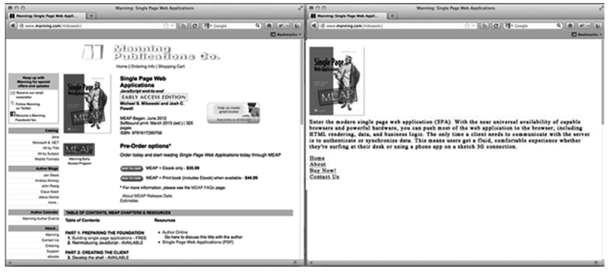
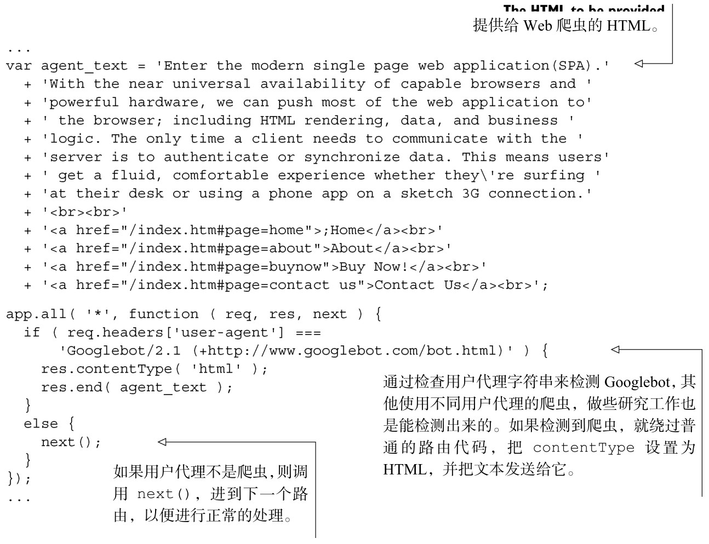

### 
  9.1 单页应用针对搜索引擎的优化

当Google和其他搜索引擎为网站建立索引的时候，并不会执行JavaScript。与传统的网站相比，这似乎对单页应用非常不利。不出现在 Google 上，意味着可能会对业务造成致命的打击，这一令人怯步的缺陷会使非知情者放弃使用单页应用。

从搜索引擎优化（SEO）的角度来说，单页应用实际上要胜过传统网站，因为Google和其他搜索引擎已经意识到了这一挑战。他们为单页应用创建了一套机制，不但索引动态页面，还特别针对爬虫，对页面进行了优化。这一小节重点关注最大的搜索引擎Google，但是其他大型的搜索引擎（比如Yahoo和Bing）也都支持相同的机制。

Google是如何爬取单页应用的

当Google为传统网站建立索引的时候，它的Web爬虫（叫做Googlebot）首先会对顶级URI（如www.myhome.com）中的内容进行扫描，并为之建立索引。当这一步工作完成时，然后它会查找页面中的所有链接，并且也为这些链接指向的页面建立索引。然后它又查找后续页面上的所有链接，依此类推。最终它会为网站以及相关域名下的所有内容建立索引。

当Googlebot尝试为单页应用建立索引的时候，它在HTML中所看到的只有一个空容器（通常是一个空的div或者body标签），所以没什么东西好索引的，也没链接可爬取，然后它就会为该网站建立索引（把它扔进一旁的垃圾箱里面）。

如果这就是故事的结局，那很多Web应用和网站的命运也就终结了。幸运的是，Google和其他搜索引擎已经认可了单页应用的重要性，并提供了工具，允许开发人员向爬虫提供搜索信息，这比爬取传统网站的效果还要好。

要让单页应用可爬取，首先服务器要能区分请求是由爬虫发起的还是用户使用浏览器发起的，并相应地进行响应。当访问者是使用浏览器的用户时，则正常地响应，但对于爬虫，则返回优化后的页面，显示给爬虫的正是我们希望的易于爬虫读取的格式。

就拿我们网站的首页来说，为爬虫优化过的页面是什么样子的？可能有我们希望出现在搜索结果中的logo或者其他主要图片，一些为SEO优化的文本，说明应用是做什么用的，以及一系列HTML链接，指向那些希望Google进行索引的页面。页面中没有CSS样式和复杂的 HTML 结构，也没有 JavaScript 和那些指向网站其他地方的链接，不希望被Google索引（比如法律声明页面，或者是其他那些不希望人们通过Google搜索来访问的页面）。图9-1演示了呈现给浏览器以及呈现给爬虫的页面。

页面上的链接，爬虫使用的地址和用户使用的地址不一样，因为我们在URI锚组件中使用了特殊字符#!（读作hash bang<a class="my_markdown" href="['#anchor13']">[13]</a>）。比如，如果单页应用中链向用户页面的URI是/index.htm#!page=user:id,123，爬虫看到#!后，知道请求的网页URI是/index.htm?_escaped_fragment_=page=user:id,123。知道了爬虫会按照这种模式来请求URI，我们就可以在服务端编好程序，把页面的HTML快照返回给请求，快照一般通过在浏览器中使用JavaScript渲染得到。该快照会被Google索引，只不过用户点击了Google搜索结果列表中的这个快照后，会跳转到/index.htm#!page=user:id,123。单页应用的JavaScript会按预期渲染页面。

这给单页应用开发人员提供了机会，使得他们的网站能同时满足 Google 和用户的特定需求。用不着编写对用户和爬虫都清晰可辨且有吸引力的文案，页面可以分别进行优化，不用互相担心。访问网站的爬虫路径是可以控制的，这就允许我们把用户从 Google 搜索结果页面引导至一组特定的入口页面。对工程师来说，这需要更多的开发工作，但在搜索结果位置和客户维系方面会取得巨大的成功。

在编写本书的时候，Googlebot 自己宣布，作为爬虫，在服务器发送请求的时候会带上用户代理（user-agent）字符串：Googlebot/2.1（+http://www.googlebot.com/bot.html）。在我们的Node.js应用的中间件中，可以检测到这个用户代理字符串，如果和上述用户代理字符串匹配，则发送回针对爬虫优化过的主页。否则，就按正常情况处理请求。或者，可以把它挂靠在路由中间件上，如代码清单9-1所示。

代码清单9-1 在routes.js 文件里面检测Googlebot 并提供另外的内容

这种方法对测试来说似乎挺复杂，因为我们没有Googlebot。Google为此提供了一种服务，公开可用的生产环境网站，它是 Webmaster Tools 的一部分（http://support.google. com/webmasters/bin/answer.py?hl=en&answer=158587），但更简单的测试方法是伪造用户代理字符串。这在以前需要一些命令行技巧，但使用Chrome开发者工具就很简单了，只需要点下按钮、勾选下复选框即可。

（1）点击Google工具栏右上角有三条水平线的按钮，打开Chrome开发者工具，然后选择菜单的工具，点击其中的开发者工具。

（2）在屏幕右下角有一个齿轮图标：点击该图标，会看到一些高级开发者选项，像是禁用缓存，打开XmlHttpRequest的日志。

（3）在第二个选项卡里面，标签名为“Overrides”，点击UserAgent标签旁边的复选框，下拉菜单中有很多用户代理可以选择，Chrome、Firefox、IE、iPad等。Googlebot代理不是默认选项。为了能使用它，选择Other，然后把用户代理字符串复制粘贴到旁边的输入框里面。

（4）现在当前的浏览器标签把自己伪装成 Googlebot 了，当打开我们网站上的任何URI时，将会看到爬虫页面。

很明显，关于对 Web 爬虫要做什么事情，不同的应用会有不同的需求，但总是把一张页面返回给Googlebot可能是不够的。我们也需要决定希望暴露什么页面，并在应用程序中提供方法，把_escaped_fragment_=key=value 这种 URI 映射到我们希望显示的内容。无论如何，本书应该向你提供一些工具，来决定如何最有效地为应用提取爬虫内容。你可能会有奇思妙想，把服务器响应和前端框架结合起来，但这里我们通常采取更简单的方法，为爬虫创建一些自定义页面，把它们放到单独的路由文件中供爬虫使用。

还有很多合法的爬虫，所以在为Google爬虫修改完服务器程序后，也可以进行扩展，把其他爬虫都包括进来。

