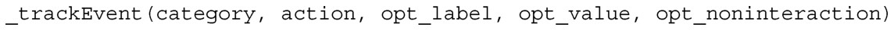
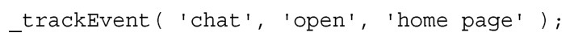
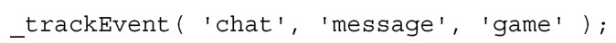

#### 
  9.2.1 站点分析

在Web开发人员的工具集中，有一个重要的工具，它能够分析他们所开发的网站。对于传统网站，开发人员已经逐渐地依赖像Google Analytics和New Relic这样的工具，它们可以提供关于用户如何使用网站的详细分析，会找出应用程序或者业务性能（网站促成销售的效率如何）的所有瓶颈。对单页应用使用相同的工具完全有效，只是方法稍微有点不同。

Google Analytics 提供了很简单的方法来获取统计数据，单页应用的流行程度以及单页应用各种各样的状态，还有网站的流量是从何而来的。可以在传统网站中使用 Google Analytics，在每张HTML页面中粘一段JavaScript代码，做些小修改，对页面进行分类。单页应用也可以使用这种方法，不过这样就只能得到初始加载页面的统计数据。为了能够在单页应用中全面利用Google Analytics，有两种方法可以使用。

（1）使用Google Event 跟踪哈希值的变化。

（2）使用Node.js在服务端进行记录。

1．Google Event

Google早就意识到需要记录页面和对页面进行分类的事件，单页应用的开发还相当新颖，但Ajax已经出现了很长一段时间了（按照Web的年龄，真的很长时间了，1999年就有了<a class="my_markdown" href="['#anchor14']">[14]</a>）。跟踪事件很容易，尽管比跟踪页面浏览（page view）需要更多的手动工作。在传统网站中，JavaScript代码片段会调用_gaq对象的_trackPageView方法。可以传递自定义变量，设置代码片段所在页面的信息。该调用通过请求一张图片并在请求url的后面传递参数，会把信息发送给Google。Google的服务器会使用这些参数，处理页面浏览的信息。使用Google Event的时候会调用_gap对象的另外一个方法：它会调用_trackEvent方法并带上一些参数。然后_trackEvent会加载一张图片，在图片url的最后会带上一些参数， Google会使用这些参数来处理这个事件的信息。

创建和使用事件跟踪的步骤很简单。

（1）到Google Analytics网站上为自己的网站创建事件跟踪。

（2）调用_trackEvent方法。

（3）查看报告。

_trackEvent方法接收两个必需的参数和三个可选的参数：

参数的详细说明如下：

category是必需的，是该事件所属组别的名称。它会出现在报告中，为事件分类。

action是必需的，定义跟踪事件的具体动作。

opt_label是可选参数，用来添加事件的额外数据。

opt_value是可选参数，用来提供事件的数值数据。

opt_noninteraction是可选参数，用来告诉Google在跳出率计算中不要使用这个事件。

比如，在我们的单页应用中，如果希望跟踪用户打开聊天窗口，可以这样调用：

然后上面的调用就会出现在报告中，让我们知道发生过聊天事件，用户打开过聊天窗口，并且用户是在主页上打开聊天窗口的。另外一个调用可能是：

这会记录发生过聊天事件，用户发送过消息，并且是在游戏页面进行的。像传统网站的方法一样，如何组织和跟踪不同的事件由开发人员来决定。为方便起见，不用在客户端的模型中为每个事件编写代码，可以在客户端路由（监听哈希值变化的代码）中插入_trackEvent 的调用，然后把这些变化解析为分类、动作和标签，然后调用_trackEvent方法，把这些变化的内容作为参数。

2．服务端的Google Analytics

如果希望得到“向服务器请求了什么数据”的信息，那么在服务端进行跟踪就很管用，但是它不能用来跟踪那些不会向服务器发送请求的客户端交互，这种交互在单页应用中是很多的。似乎它的用处较少，因为它不能跟踪客户端的动作，但它能跟踪那些越过客户端缓存的请求，这很有用。它能帮助我们查出服务器上运行很慢的请求和其他的行为。尽管这仍然能提供有益的见解，但是如果必须选择一个，我们选择客户端的。

由于 JavaScript 可以在服务器上使用了，似乎我们可以修改 Google Analytics 的代码，用在服务器上。这不但是可能的，而且像很多事情一样是个很不错的主意，已经由社区实现了。快速搜索一下，就能找到由社区开发的 node-googleanalytics 和nodealytics项目。

