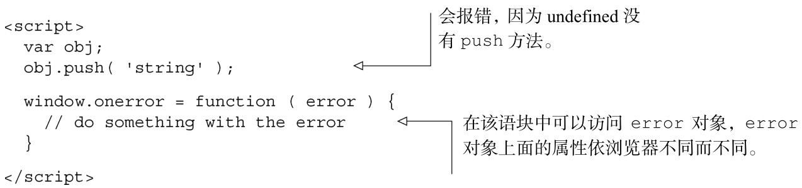
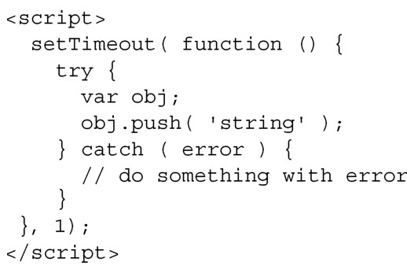

#### 
  9.2.2 记录客户端错误

在传统网站中，当服务器发生错误的时候，会把错误记录到日志文件里面。在单页应用中，当客户端遇到相同错误的时候，没有地方可以记录错误。要么我们自己手动编写跟踪错误的代码，要么向第三方服务寻求帮助。自己处理错误很灵活，想怎么处理都可以，但是使用第三方服务，我们就有机会把时间和资源花费在别的事情上面。除此之外，他们的实现很可能比我们自己花时间实现的要强大得多。这也不是要孤注一掷，我们可以使用第三方服务，如果有些错误想跟踪或者是想升级某个功能点，而第三方服务却没提供这样的方法，那么我们可以自己来实现想要的功能。

1．第三方客户端记录服务

有几个第三方服务可以收集和合计应用产生的错误，并度量应用生成的数据。

Airbrake专注Ruby on Rails的应用，对JavaScript应用的支持还在试验阶段。

Bugsense专注移动应用的解决方案。他们的产品对JavaScript单页应用和原生的移动应用都有效。如果我们有专注于移动端的应用，他们可能是很好的选择。

Errorception致力于记录JavaScript错误，因此它是单页应用客户端不错的选择。他们不会成为Airbrake或者Bugsense，但我们喜欢他们的充沛精力。Errorception有一个开发者博客（ http://blog.errorception.com ），在那里可以得到一些关于JavaScript错误记录的理解。

New Relic很迅速地成了Web应用性能监控的业界标准。它的性能监控包括对请求/响应周期中每一步的错误日志和性能度量，从数据库查询花了多长时间，到浏览器渲染CSS样式花了多长时间。该服务提供了大量令人印象深刻的关于客户端和服务器性能的深刻理解。

在编写本书的时候，我们更倾向于 New Relic 或者 Errorception。New Relic 提供了更多的数据，而在处理JavaScript错误时，我们发现Errorception更出众，也更容易设置。

2．手动记录客户端错误

实际上，上面所有的服务都使用下面的两种方法来发送JavaScript错误。

（1）使用window.onerror事件处理程序来捕获错误。

（2）把代码放在try/catch语块中，把捕获到的错误信息发送给后端。

window.onerror事件是绝大多数第三方应用的基础。运行时错误会触发onerror，编译错误不会。使用onerror有点争议，因为浏览器的支持情况参差不齐 <a class="my_markdown" href="['#anchor15']">[15]</a>，还有潜在的安全漏洞，但它是我们的兵工厂中用来记录客户端JavaScript错误的主要武器 <a epub:type="noteref" href="#anchor16" id="ac16">[16]</a>。

try/catch方法需要把单页应用的主调用放在try/catch语块里面。这样就会捕获单页应用产生的所有同步调用错误，不幸的是，它会阻止错误冒泡到window.onerror事件或者不会在错误控制台中显示错误信息。它不会捕获异步调用中的任何错误，比如事件处理程序中的错误，或者是setTimeout或者setInterval函数中的错误。这意味着需要把异步函数中的所有代码放在try/catch语块里面。

如果所有的异步调用都这么来做，会令人厌烦，并且在控制台中不会显示错误报告。把代码放在try/catch语块里面，也会阻止预先编译该语块中的代码，导致运行变慢。对于单页应用，一个较好的妥协方法是把init调用放在try/catch语块里面，在catch里面把错误输出到控制台，并用Ajax把错误发送出去，然后使用window.onerror来捕获所有的异步错误，并用 Ajax 把这些错误发送出去。不需要手动把异步调用错误输出到控制台，因为它们仍然会出现在控制台中。

现在已经明白了客户端会产生何种错误，我们可以来关注一下如何更快速地把内容传输给网站用户。

