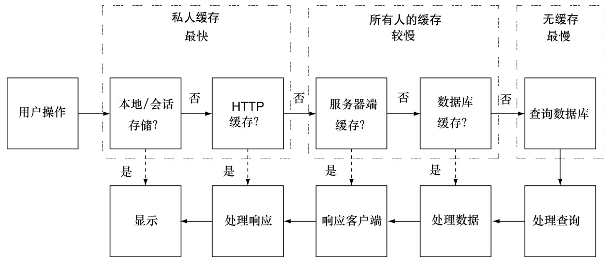

#### 
  9.3.1 缓存时机

每一种缓存都有不同的职责，以不同的方式和客户端交互，从而提升应用的性能。

Web存储把字符串保存在客户端，应用程序可以访问。可以使用它来保存处理好的HTML，HTML是根据服务器上的数据生成的。

HTTP缓存是客户端缓存，它把服务器的响应保存在客户端。为了能正确地控制这种缓存，有很多细节要学习，但在学习完并实现了之后，我们能得到很多免费的缓存。

Memcached和Redis的服务器缓存，经常用于缓存处理过的服务器响应。这是缓存的重要形式，可以为不同的用户保存数据，这样如果一个用户请求了一些信息，下一次其他人请求相同的信息时，它已经被缓存了，节省了一次查找数据库的时间。

数据库缓存，或者叫查询缓存，是数据库用来缓存查询结果的，如果它被打开了，后续相同的查询就会返回缓存的数据，而不是重新去收集数据。

图9-2演示了一个典型的请求/响应周期内的所有缓存时机。我们可以看到每个层级的缓存，如何在不同的阶段，通过简化周期来加快响应的速度。HTTP缓存和数据库缓存的实现最为简单，通常只需要设置一些配置信息，而 Web 存储和服务器缓存较为复杂，需要开发人员更多的精力。

