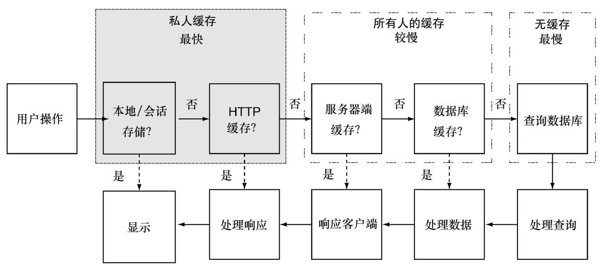
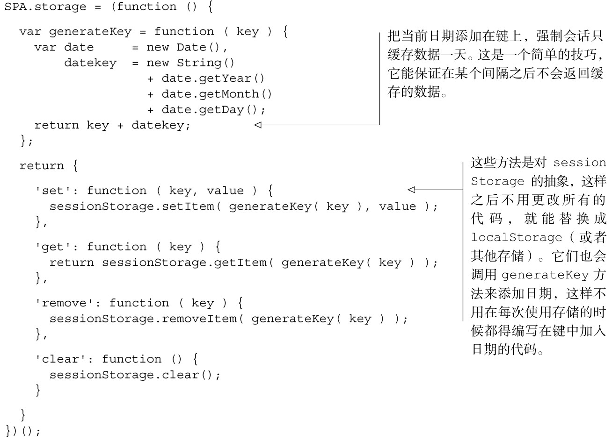

#### 
  9.3.2 Web存储

Web存储，也叫DOM 存储，有两种：本地存储（local storage）和会话存储（session storage）。所有的现代浏览器都支持这两种存储，包括IE8+。它们是简单的键/值存储，键和值肯定都是字符串。会话存储只保存当前浏览器标签会话的数据，关闭浏览器标签会结束会话并清除数据。本地存储会一直把存储缓存着，没有过期时间。不论哪种情况，数据只对保存它的网页有效。对于单页应用来说，这意味着整个网站都能访问存储。使用Web存储的一个极好的方式是，保存处理好的HTML字符串，使得请求能绕过整个请求/响应周期，直接显示结果。图9-3演示了Web存储的细节。

我们使用本地存储来保存不敏感的信息，希望在当前浏览器会话结束后能持久存在。我们使用会话存储来保存当前会话结束后不会持久存在的数据。

由于 Web 存储只能保存字符串的值，所以通常只保存 JSON 或者 HTML。单页应用使用了HTTP缓存，则保存JSON就显得多余，这在下一小节会讨论，但仍然需要进行一些处理。通常保存 HTML 字符串是更好的做法，这样在第一时间就能节省客户端创建它所需的处理。这种存储可以抽象为JavaScript对象，它会为我们处理相关细节。

会话存储只为当前会话保存数据，这样有时过期数据的问题就不用想得太多了，但不总是如此。当我们需要担心过期数据的时候，一个可以使用的强制刷新数据的方法是把时间编入缓存的键（cache key）。如果希望每一天数据就过期，可以在键中加入当天的日期。如果希望每个小时数据就过期，则可以在键中加入当前的小时数。这不能应付每种场景，但它可能是执行层面最为简单的，如代码清单9-2所示。

代码清单9-2 把时间编入缓存的键

