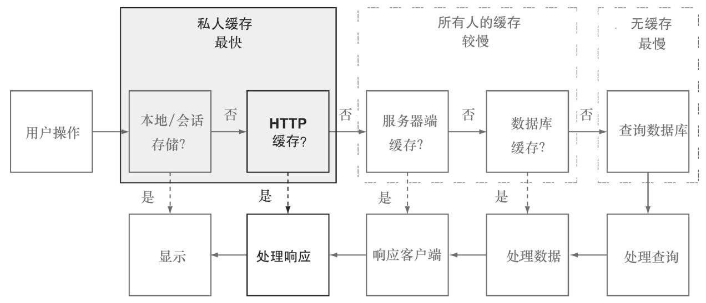
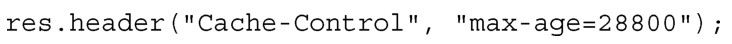
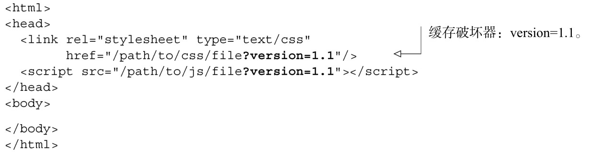

#### 
  9.3.3 HTTP缓存

根据服务器在首部中设置的一些属性，或者是根据行业标准集中的默认缓存指南，当服务器向浏览器发送数据的时候，浏览器就会缓存数据，从而产生了HTTP缓存。然而它比 Web 存储要慢，因为仍然需要处理结果，但是它经常要简单得多，并且仍然比服务端缓存快。图9-4演示了请求/响应周期中的HTTP缓存。

HTTP缓存用于在客户端保存服务器的响应，免去了客户端和服务器之间的来回通信。有两种模式可以遵循。

（1）不向服务器检查新鲜度，直接从缓存中获取。

（2）向服务器检查新鲜度，如果是新鲜的，则从缓存中获取，如果过期了，则从服务器获取。

直接从缓存获取数据而不检查数据的新鲜度是最快的，因为我们放弃了和服务器之间的来回通信。对于图片、CSS和JavaScript文件，这么做是很安全的，但也可以为应用建立这样的机制，这样应用也会把数据缓存一段时间。比如，假设有这样一个应用，它只会在每天的午夜更新某些种类的数据，然后就可以指示客户端在午夜之前可以一直缓存数据。

有时候没有足够的信息来判断数据是不是最新的。这时候可以指示浏览器向服务器核实，看看数据是否仍然是新鲜的。

我们来讨论一下细节，看看这种缓存是如何工作的。客户端要查看服务器响应的首部，这样 HTTP 缓存才会有效果。客户端会查看三个主要的属性：max-age、no-cache 和last-modified。每一个属性都有助于告诉客户端要把数据缓存多长时间。

max-age

为了让客户端使用缓存中的数据，而不用尝试联系服务器，最初响应首部的Cache-Control首部必须设置max-age。这个值告诉客户端在发起另外的请求之前，要把数据缓存多长时间。max-age 的值以秒为单位。这是一个很强大的功能，同时也有潜在的危险。它强大是因为它是最快访问数据的方法，以这种方式来缓存数据，一旦数据加载后应用会运行得非常快。它危险是因为客户端不会再向服务器核实数据的变化，所以在使用之前要考虑周到。

在使用Express的时候，可以设置Cache-Control首部的max-age属性。

一旦以这种方式设置了缓存，则破坏缓存和强制客户端发起新请求的唯一方法是更改文件名。

很明显，每次更改生产环境中的文件名是不现实的。幸运的是，更改传递给文件的参数会破坏缓存。这通常是添加版本号，或者添加每次部署构建系统的增量整数。有很多种实现方法，但我们喜欢的一种是有一个单独的文件，文件里面有增量值，并把这个数字添加在文件名的最后面。由于主页是静态的，我们可以配置部署工具，生成处理好的HTML文件，并在引入文件的最后添加版本号。我们来看一下代码清单9-3所示的示例，看看处理好的HTML中的缓存破坏器（cache buster）是什么样的。

代码清单9-3 破坏max-age缓存

max-age 的另外一种用法是设置为 0，这会告诉客户端，总是要验证内容。当设置为这个值之后，客户端总是会向服务器核实，以确保内容仍然是有效的，而服务器仍然返回304响应，通知客户端数据没有过期，应从缓存中获取。设置max-age=0的一个副作用是中间服务器（在客户端和后端服务器之间的那些服务器）仍然可以用过期缓存来响应，只要它们在响应中设置警告标志即可。

现在，如果我们希望阻止中间服务器使用它的缓存，那么可以看下no-cache属性。

1．no-cache

根据规范的描述，no-cache属性在某种意义上和设置max-age=0非常相似，但效果令人困惑。它告诉客户端在使用缓存中的数据之前，要和服务器重新验证，但是它也告诉中间服务器，它们不能提供过期内容甚至是警告信息。在过去的几年里出现了一个有趣的情况，因为IE和Firefox已经开始把这一设置解释为，在任何情况下都不应该缓存数据。这意味着客户端在保存数据前，甚至不用询问服务器上次接收到的数据是否是新鲜的，客户端甚至永远不会把数据保存到它的缓存里面。使用no-cache首部加载的资源会变得不必要的慢。如果想要的行为是阻止客户端缓存资源，那么应该使用no-store属性。

2．no-store

no-store 属性会通知客户端和中间服务器，不要把这次请求/响应周期中的信息保存在它们的缓存中。尽管这有助于增强这种传输的隐私性，但它决不是完美形式的安全。在正确实现的系统中，对数据的所有跟踪都会丢失，有可能数据会经过不正确或者是恶意编码的系统，容易受到窃听。

3．last-modified

如果没有设置Cache-Control，那么客户端会根据基于last-modified日期的算法，来决定把数据缓存多长时间。通常是自last-modified日期以来的三分之一的时间。因此，如果一个图片文件在三天前被修改了，当请求这张图片的时候，默认情况下，在重新向服务器核实之前，客户端会在缓存中把图片保留一天的时间。这在很大程度上导致了从缓存中获取资源的时间限度的随机性，取决于自文件发布到生产环境后过了多长时间。

关于缓存处理还有很多其他的属性，但是掌握这些基本的属性，将会大大地加快应用的加载时间。HTTP缓存让应用的客户端能够使用之前的资源，不需要重新请求信息，或者是把询问服务器资源是否仍然新鲜的开销降到最低。这会加快应用后续请求的速度，但是由其他客户端发起的相同请求会怎样？HTTP缓存对此无能为力，数据需要被缓存在服务器上。

