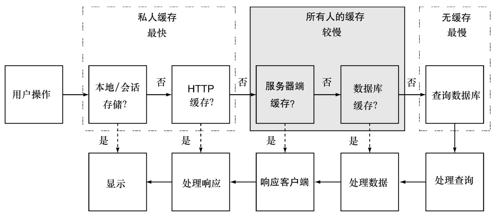
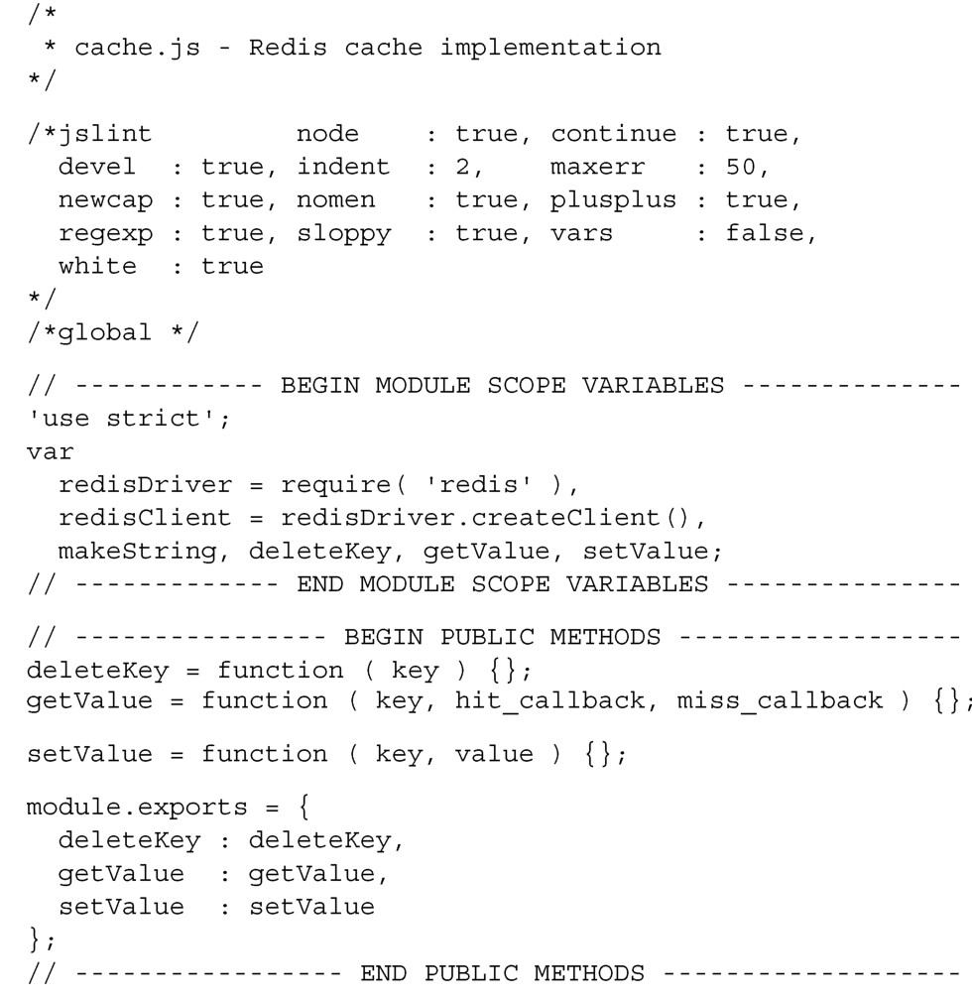
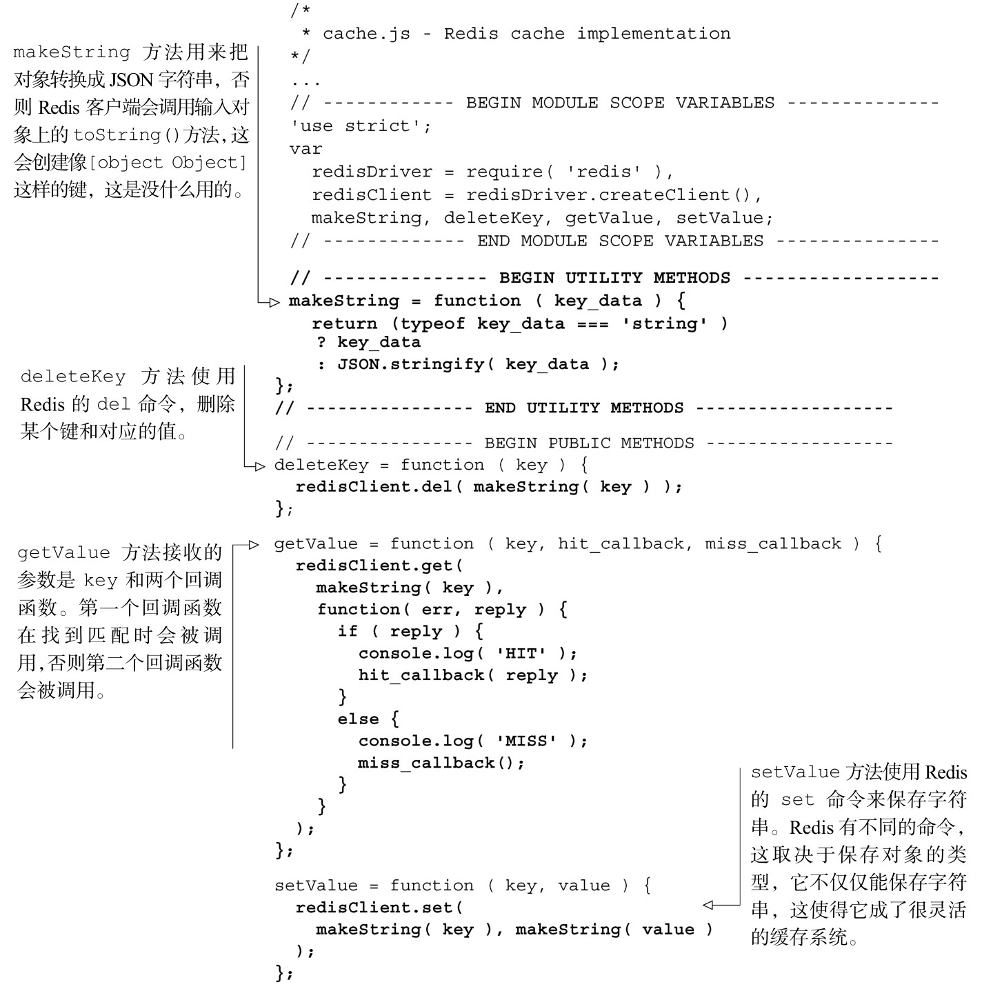
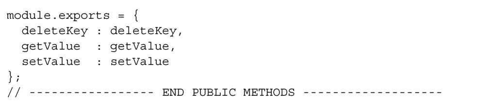
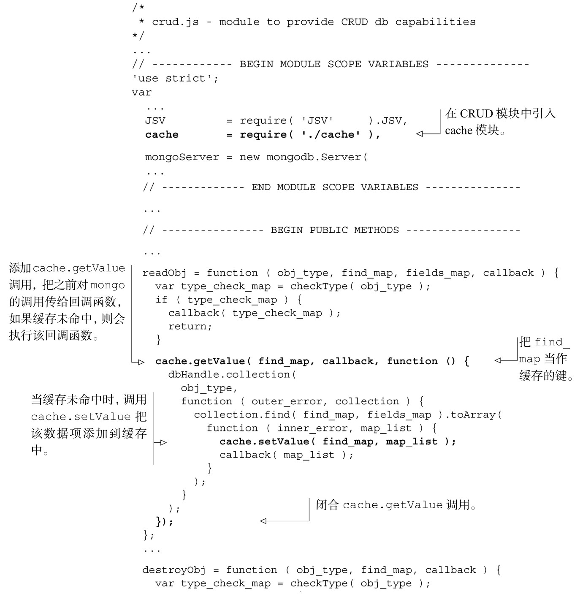
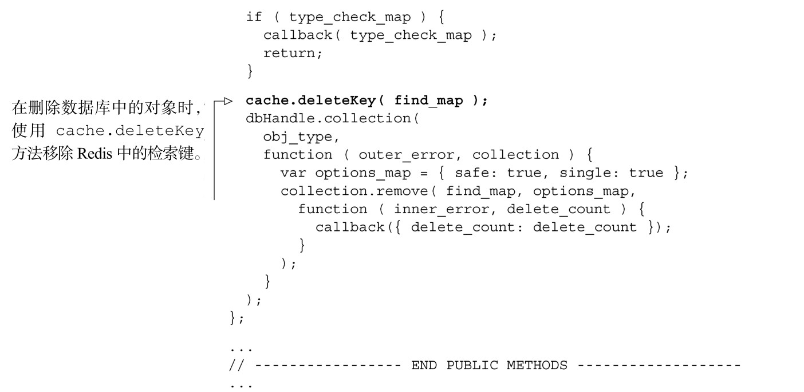

#### 
  9.3.4 服务器缓存

服务器响应客户端请求的最快方法是从缓存中获取动态数据。这会消除查询数据库的时间和把查询结果转换为JSON字符串的时间。图9-5演示了服务器缓存在请求/响应周期内的合适位置。

在服务器上缓存数据的两种流行方法是使用Memcached和Redis。根据memcached.org上写的，“Memcached is an in-memory key-value store for small chunks of arbitrary data<a class="my_markdown" href="['#anchor17']">[17]</a>”。它是为临时缓存从数据库中检索出来的数据、API调用或者处理好的HTML而特别构建的。当服务器内存耗尽的时候，它会按照最近最少使用（LRU）算法，自动开始丢弃数据。Redis是一种高级的键值存储，可以用来保存更加复杂的数据结构，比如字符串、哈希表、链表、集合和有序集合。

缓存的总体思路是减轻服务器负载和提升响应时间。当接收到数据请求的时候，应用程序首先会检查此次查询是否已经保存在缓存里面。如果应用程序在缓存中找到了数据，就把它发送给客户端。如果数据不在缓存中，就会执行相对昂贵的数据库查询，并把数据转换为JSON。然后把数据保存在缓存里面，并把结果发送给客户端。

当使用缓存的时候，我们必须要考虑什么时候需要破坏缓存。只要我们的应用程序向缓存写入数据，那么当数据变化的时候，应用程序可以清除或者重新生成缓存。如果其他的应用程序也会向缓存写入数据，那么也需要它们来更新缓存。有一些变通的方法。

（1）可以在一段时间后使缓存失效，强制刷新数据。如果每小时刷新一次数据，那么一整天相当于有24次的非缓存响应。很明显，这不会对所有的应用都有效。

（2）可以检查数据的上次更新时间，看它是否和缓存时间戳是一样的，或者早于缓存时间戳。这比第一个方案要花费更长的时间来处理，但是花费的时间不会和执行复杂请求的时间一样长，并能保证数据是新鲜的。

我们选择哪种方案取决于应用的需求。

服务器缓存对我们的单页应用来说是大材小用。MongoDB为我们的样本数据集提供了非常好的性能。我们不会处理 MongoDB 的响应结果，仅仅是把它传给了客户端。

那么什么时候应该考虑在Web应用中添加服务器缓存？在发现数据库或者Web服务器成为瓶颈的时候。通常它会减轻服务器和数据库的负载，提升响应时间。在购买昂贵的新服务器之前，当然是值得尝试的。但请记住，服务器缓存需要另外的服务（像Memcached或者Redis），需要对其监控和维护，并且这也会增加应用的复杂度。

Node.js有Memcached和Redis的驱动。我们在应用中添加Redis，使用它来缓存用户数据。可以访问http://redis.io，按照上面的提示把Redis安装到系统中。在安装完并运行起来后，可以使用redis-cli命令打开Redis的shell，确认它是否可用。

我们来更新npm清单，安装Redis驱动，如代码清单9-4所示。更改部分以粗体显示。

代码清单9-4 更新npm 清单，引入redis——webapp/package.json

在开始之前，我们考虑一下使用缓存来做什么事情。想到的两件事情是，设置“键值对”的缓存并按“键”来获取缓存的值。我们也希望能删除缓存的键。于是我们建立node模块，在lib目录中创建cache.js文件，使用node模块模式，编写获取、设置和删除缓存的方法。请看代码清单9-5，看一下 Node.js如何连接 Redis并创建缓存文件的框架。

代码清单9-5 开启redis 缓存——webapp/cache.js

现在开始编写这些方法，完成后的方法如代码清单9-6所示。先编写setValue方法，因为它是最简单的。Redis有很多不同的数据类型（取决于缓存数据的类型），这是很有用的。对于这个示例来说，我们会继续使用基本的字符串键值对。使用Redis驱动来设置值很简单，调用redis.set(key, value)即可。这里没有回调函数，因为我们假定该方法可以工作，让调用工作异步进行，放弃失败的情况。我们可以做更具想像力的事情，在Redis中增加值，以保持对失败情况的跟踪。我们鼓励有兴趣的读者探索一下这个方法。

getValue方法接收三个参数：搜索的key，缓存命中的回调函数（hit_callback）和缓存未命中的回调函数（miss_callback）。当调用这个方法的时候，它请求Redis返回和key关联的值。如果命中（值不是null），则调用hit_callback函数，参数是命中的值。如果未命中（值为 null），则调用 miss_callback。所有查询数据库的逻辑都留给调用者，因为我们希望这里的代码关注的是缓存。

deleteKey方法调用redis.del，传入 Redis的键。我们没有使用回调函数，因为这是异步进行的，并假定它能工作。

makeString工具函数，用于在把键和值呈现给Redis之前，对它们进行转换。我们需要这个方法，否则的话，Redis Node 驱动会使用键和值上的 toString()方法。这会导致产生像[object Object]这样的字符串，这不是我们想要的。

更新后的缓存模块如代码清单9-6所示。更改部分以粗体显示。

代码清单9-6 最终的Redis 缓存文件——webapp/lib/cache.js

现在已经创建了缓存文件，可以在crud.js文件中使用它的功能，添加5行代码即可，如代码清单9-7所示。更改部分以粗体显示。

代码清单9-7 读取缓存——webapp/lib/crud.js

当删除对象的时候，要确保在Redis数据库中移除对象的键。但远远没有这么理想。它无法保证所有的缓存数据实例都会被删除，它只保证移除和用来删除数据项的键所关联的缓存数据。比如，我们会根据ID删除刚刚被解雇的雇员，但是该用户可能仍然可以登入系统，进行大肆破坏，因为可能使用“用户名和密码”的键缓存了用户信息。当更新对象时也会发生相同的问题。

这并不是一个容易解决的问题，也是为什么服务器缓存经常会被推迟使用的理由，直到系统规模变大了才会有必要在这上面投入时间。一些可能的解决方案包括，在一段时间后使缓存失效（把缓存不匹配的概率降至最低）、在删除或者更新用户的时候清除全部的用户缓存（很安全，但会导致更多的缓存未命中）、或者手动跟踪缓存对象（开发人员容易出错）。

服务器缓存有很多的机遇和挑战（关于它足以写一本书），但是希望这里的介绍足以帮助你入门。现在我们来看下最后的缓存方法：在数据库中缓存数据。

