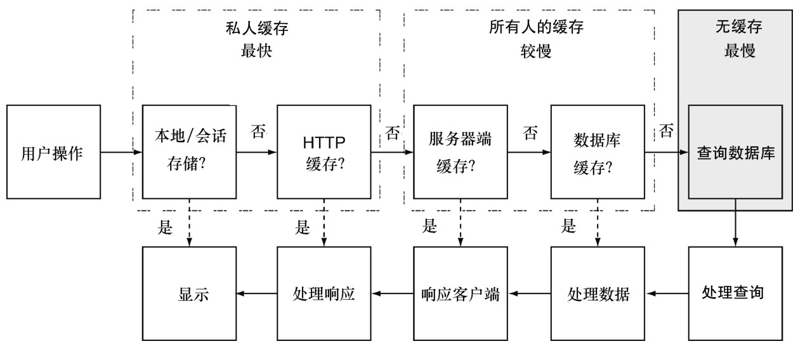

#### 
  9.3.5 数据库查询缓存

当数据库缓存特定查询的结果时，就产生了查询缓存（query caching）。在关系型数据库中，这特别重要，因为需要把结果转变为应用程序能够读取的形式。查询缓存会保存这一转变后的结果。请看图9-6，看看查询缓存在请求/响应周期中的哪个地方。

MongoDB会使用操作系统的文件系统，自动为我们缓存查询结果。MongoDB不会为特定查询缓存结果，它会尝试把整个索引保存在内存中，当整个数据集都能保存在内存中的时候，查询是非常快的。MongoDB，更确切地说是操作系统的内存子系统，会根据服务器的需要，动态地分配内存。这意味着 MongoDB 可以完全使用剩余可用的 RAM，不用猜测分配多少内存，当需要的时候会自动为其他进程释放内存。缓存机制（如最近最少使用算法）是根据操作系统的行为而工作的。

