### 
  附录A JavaScript编码标准

本附录涵盖的内容

探讨为什么编码标准很重要

代码的呈现和文档要一致

变量命名方式要一致

使用名字空间隔离代码

组织文件，确保一致的语法

使用JSLint验证代码

使用体现标准的模板

编码标准是有争议的。几乎每个人都同意你有自己的标准，但对标准应该是什么样的，则似乎很少能达成共识。我们来思考一下为什么编码标准对JavaScript特别重要。

A.1 为什么需要编码标准

给像JavaScript这种松类型（loosely typed）动态语言定义明确的标准，几乎可以肯定，要比给较为严格的语言定义标准来得更加重要。JavaScript 的高度灵活性，可能会使它成为编码语法和实践的潘多拉魔盒。较为严格的语言，本身就具备结构性和一致性，而JavaScript需要准则和应用标准才能达到相同的效果。

我们遵循的标准，许多年以来一直在使用和改进。它相当全面并有内在联系，全书始终都使用这个标准。它在这里的展示不是很简洁，因为添加了很多的解释和示例。大部分的内容已经浓缩成了一张三页的速查表，可以在https://github.com/mmikowski/spa上找到。

我们不十分肯定认为这个编码标准适合每一个人：你应该根据自己的工作，使用或者忽略这个标准。不管怎样，我们希望讨论的思想将会鼓励你回顾自己实际编写的代码。我们强烈建议任何团队，在着手开发大型项目之前，要达成一致的标准，以免经历他们自己的巴别塔。

经验与研究表明，维护代码要比编写代码花费更多的时间。因此，我们的标准倾向于可读性多于编码的速度。我们发现要编写越是容易理解的代码，在最开始就越是需要深思熟虑和良好的结构。

我们已经发现了成功的编码标准。

编码错误的可能性降至最低。

代码适合大规模的项目和团队（一致的、可读的、可扩展的和可维护的）。

鼓励编码的效率、效果和重用。

鼓励使用JavaScript的优点，避免使用它的缺点。

开发团队的每个成员都使用。

马丁·福勒<a class="my_markdown" href="['#anchor1']">[1]</a>曾有句名言：“Any fool can write code that a computer can understand. Good programmers write code that humans can understand. <a epub:type="noteref" href="#anchor2" id="ac2">[2]</a>”。尽管定义明确和内容全面的标准，不能保证编写出来的JavaScript就是人类可读的，但它们确实会有帮助，就像词典和语法指南一样，能保证英语是人类可读的。

A.2 代码布局和注释

以一致和经过深思熟虑的方式来编排代码，是提升代码理解力的最好方法之一。它也是编码标准中争议较大的问题之一<a class="my_markdown" href="['#anchor3']">[3]</a>。所以在阅读这一小节时，你要沉住气。喝一杯无咖啡因的咖啡，来个薄荷茶叶足疗，并打开你的心扉。接下来会很有趣，真的。

A.2.1 编排代码，具备可读性

如果把这本书的所有标题、标点符号、空格和大写都省略，会怎么样？嗯，这本书能提早几个月出版，但是读者会发现它不知所云。或许这就是为什么我们的编辑，坚持让我们在写作的时候，要规定格式和应用约定，以便你们——亲爱的读者，可以很容易地理解书本上的内容。

有两种群体需要理解JavaScript代码：执行它的机器和维护或者扩展它的人类。通常，我们的代码被阅读的次数比编写它的次数要多得多。对代码规定格式和应用约定，以便我们的开发同事（包括几个星期之后的我们自己），能够很容易地理解代码的内容。

1．使用一致的缩进和行长

可能大家都已经注意到，报纸上的文本列都在50～80个字符的长度之间。对人类的眼睛来说，超过 80 个字符的行，看起来会逐渐变得吃力。Bringhurst<a class="my_markdown" href="['#anchor4']">[4]</a>的权威著作《The Elements of Typographic Style》建议，阅读理解的最佳行长（line length）在45～75个字符之间，66个字符的行长被认为是最舒适的。

较长的行在计算机显示器上也很难阅读。如今越来越多的网页都使用多列布局，虽然要很好地实现这种布局的高昂代价也是众所周知的。如果很长的行显示有问题，这是Web开发人员要遭受这种麻烦事的唯一理由（或者如果他们的工资是按小时支付的）。

支持更宽的制表符（4～8 个空格）的人说，这能使他们的代码更加易读。但是他们也经常提倡很长的行，以弥补宽制表符的使用。我们采用其他的方法：短制表符（2个空格）和稍短的行长（78个字符），每一行都更窄一些，重要的内容也更易读一些。使用短制表符也是意识到，像JavaScript这种事件驱动的语言比纯过程语言，缩进要小一些，因为JavaScript有大量的回调函数和闭包。

每级代码缩进两个空格。

使用空格缩进而不是制表符，因为制表符的位置还没有标准。

每行限制为78个字符。

较窄的文档在所有显示器上的效果也更好，允许每个人在两个高分辨率的显示器上，同时打开六个文件视图，或者在笔记本电脑、平板电脑或智能手机上，能很容易地阅读单个文档。较窄的文档清单格式，也非常适合电子阅读器或者印刷书籍，这能使我们的编辑更加开心<a class="my_markdown" href="['#anchor5']">[5]</a>。

2．按段落组织代码

英语和其他书面语言按段落展示来帮助读者理解什么时候一个话题结束了，将要显示的是另外一个话题。计算机语言也从此约定中获益。可以把这些段落标注为一个整体。通过合理地使用空白<a class="my_markdown" href="['#anchor6']">[6]</a>，JavaScript读起来就和精心排版的书本一样。

按逻辑段落组织代码，段落之间要空行。

每一行最多只包含一条语句或赋值语句，但是允许每行同时声明多个变量。

运算符和变量之间要有空格，这样就能更容易地识别变量。

每个逗号之后要有空格。

在段落内，相似的运算符要对齐。

缩进注释，缩进量和所解释的代码相同。

每条语句的最后要有分号。

在一个控制结构中的所有语句要用大括号括起来。控制结构包括for、if和while在内的语法结构。违反该条准则的最常见情形可能是省略单行if语句的大括号。不要这么做（见代码清单A-1）。一直使用大括号，这样添加语句时会很容易，不会意外地引入bug（见代码清单A-2）。

代码清单A-1 不要这样

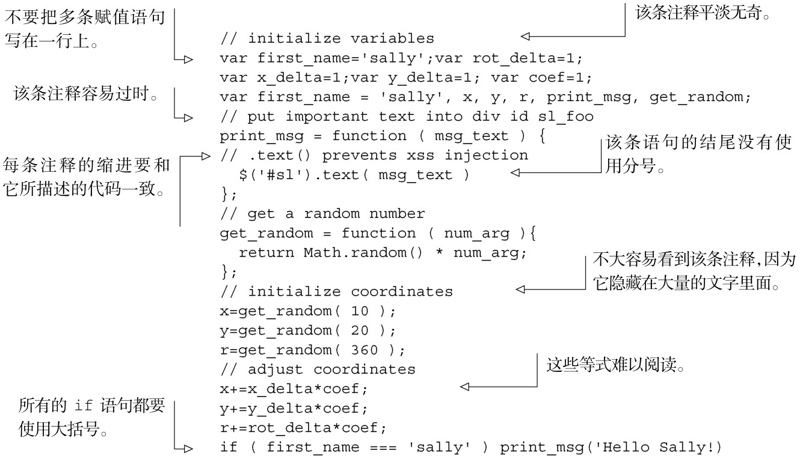
代码清单A-2 而要这样

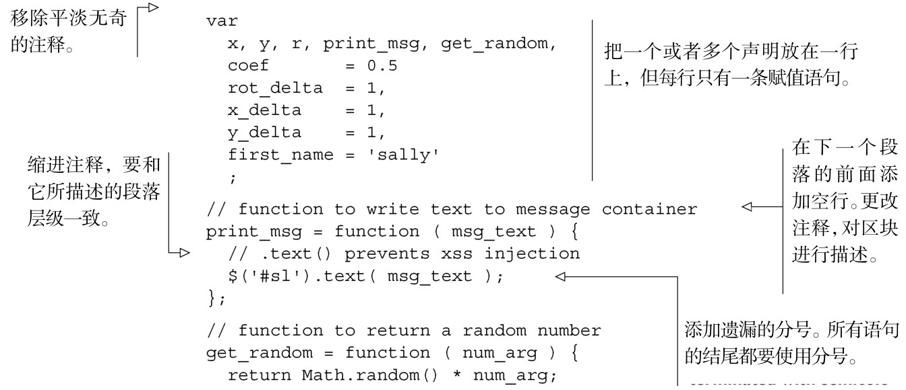
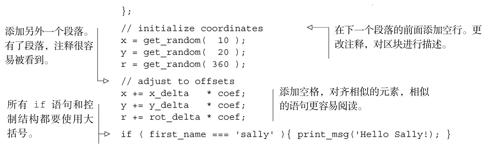
在编排代码的时候，我们要以清晰明白为目标，而不是减少代码的字节数。一旦代码发布到生产环境，在传输给用户之前，JavaScript代码会合并（concatenated）、压缩（minified）以及服务端压缩（compressed）<a class="my_markdown" href="['#anchor7']">[7]</a>。结果，那些用来帮助理解的工具（空白、注释和更具描述性的变量名）对性能毫无影响。

3．换行要一致

如果语句没有超过最大的行长，则应该把它写在一行上。但这往往是不大可能的，所以得把它分成两行或者更多行。下面这些指南将有助于减少错误，提高认知。

在运算符的前面换行，因为人们检查左列的所有运算符是很容易的。

把后续的语句缩进一个层次，比如我们的示例中使用两个空格。

在逗号分隔符的后面换行。

方括号或者括号单独占一行。清楚地表明这是语句的结尾，不会迫使读者横向扫寻分号。

具体示例见代码清单A-3和代码清单A-4。

代码清单A-3 不要这样

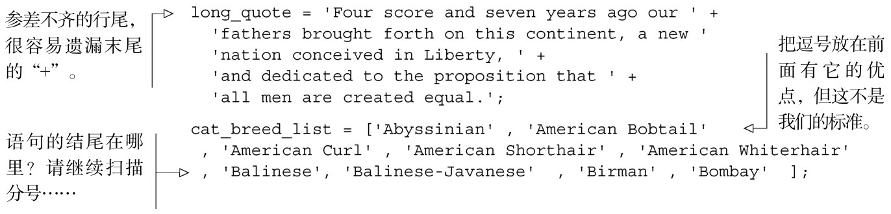
代码清单A-4 而要这样

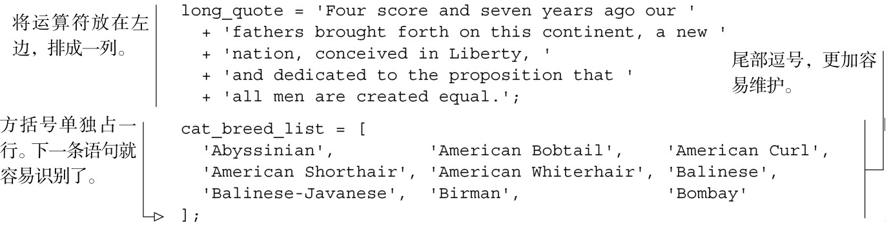
稍后在本附录中，我们将会安装JSLint，它能帮助我们检查语法。

4．使用K&R风格的括号

K&R风格的括号<a class="my_markdown" href="['#anchor8']">[8]</a>可以平衡垂直空间的使用，增加可读性。当格式化对象和映射、数组、复合语句或者调用的时候，应该使用K＆R风格的括号。复合语句是使用花括号括起来的一条或者多条语句。例子包括if、while和for语句。调用（像alert('I have been invoked!' );）是指函数或者方法的调用。

如果可能，就使用单行。比如，当一个很短的数组声明能写在一行上的时候，就没必要把它拆分成三行。

把左括号、左花括号或者左方括号放在开始行的末尾。

在分隔符（括号、花括号或者方括号）的里面把代码缩进一个层级，比如，两个空格。

右括号、右花括号或者右方括号单独占一行，缩进和开始行相同。

具体示例见代码清单A-5和代码清单A-6。

代码清单A-5 不要这样

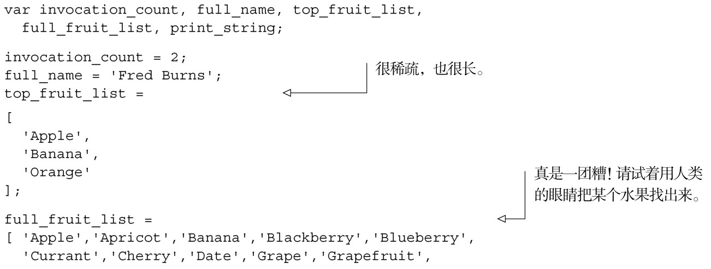
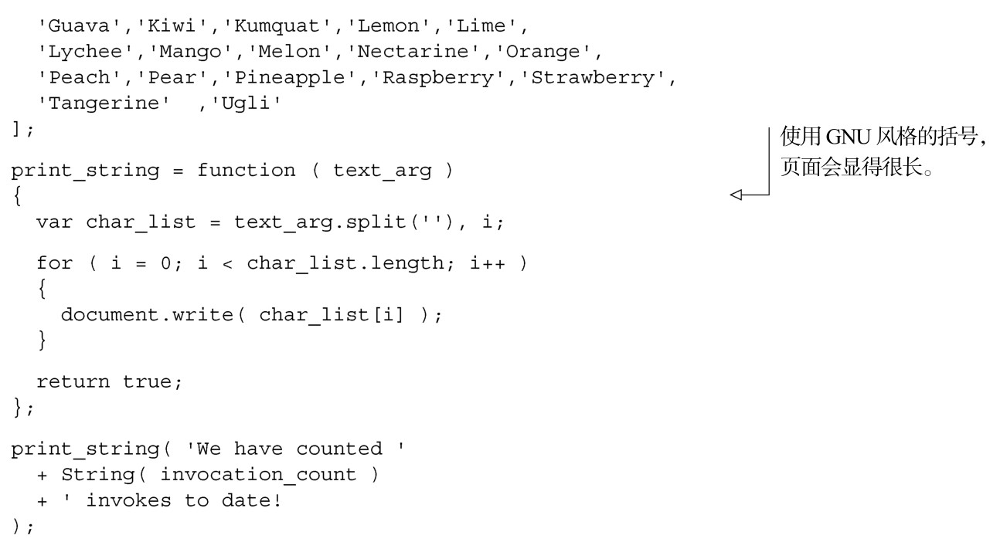
代码清单A-6 而要这样

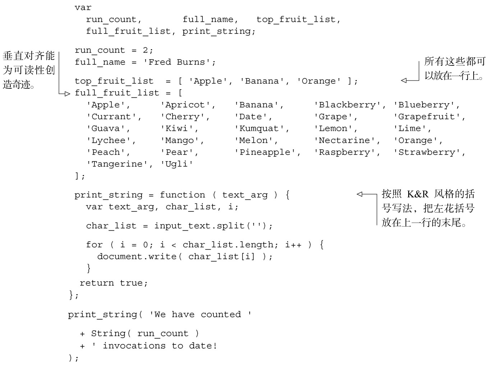
调整元素，垂直排成一列，真的有助于理解，但要是没有强大的文本编辑器的话，也会浪费时间。在对齐值的时候，垂直文本选取（Vim、Sublime、WebStorm 等都有这个功能）是很有用的。WebStorm 甚至提供自动对齐映射值的工具，这是节省时间的好方法。如果你的编辑器不允许垂直选取，我们强烈建议你考虑换个编辑器。

5．使用空格来区别函数和关键字

很多语言有冠词的概念，像an、a或者the这种单词 <a class="my_markdown" href="['#anchor9']">[9]</a>。冠词的目的之一是提醒读者或者听者，下一个单词将是名词或者名词短语。和函数以及关键字一起使用的空格，可以达到类似的效果。

函数名后面没有空格。在函数名和左括号“(”之间没有空格。

关键字后面空一格，然后是左括号“(”。

当格式化for语句的时候，在每个分号的后面空一格。

具体示例见代码清单A-7和代码清单A-8。

代码清单A-7 不要这样

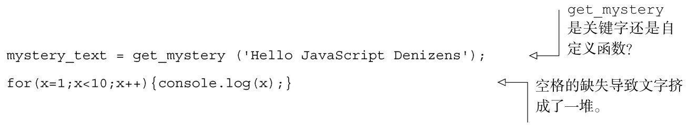
代码清单A-8 而要这样

这一约定在其他动态语言（像Python、Perl或者PHP）中也很常见。

6．引号要一致

我们喜欢单引号作为字符串的定义符号，而不是双引号，因为HTML中标准属性的定义符是双引号。而在单页应用中的HTML通常都是带引号的。使用单引号分隔的HTML，需要较少的转义字符或者编码字符。结果，HTML就更简短、更容易阅读并且出错的可能性更小。具体示例见代码清单A-9和代码清单A-10。

代码清单A-9 不要这样

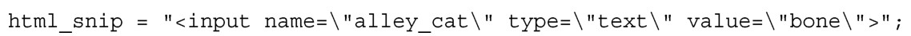
代码清单A-10 而要这样

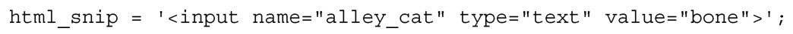
很多语言（像Perl、PHP以及Bash）有插值引号（interpolating quote）和非插值引号的概念。插值引号里面的变量会被替换成它们的值，而非插值引号则不会。一般来说，双引号（"）需要插值，而单引号则不需要。JavaScript的引号不会进行插值，而且使用单引号还是双引号没有什么区别。因此我们的使用习惯和其他流行语言是一致的。

A.2.2 注释说明和文档

注释可能要比它们所解释的代码更加重要，因为它们能传达在其他方面不明显的关键细节。这在事件驱动编程中尤其明显，因为大量的回调函数，导致跟踪代码的执行要耗费掉大量时间。这并不意味着添加更多的注释总是更好的。摆放有策略、信息量大和精心维护的注释，价值是很高的，而杂乱无章文不对题的注释，还不如没有的好。

1．解释代码策略

我们的标准旨在将注释的数量最小化，将注释的价值最大化。通过约定来减少注释，尽可能地让代码进行自我说明。通过将注释和它们所描述的段落对齐，并确保它们的内容对读者是有价值的，从而使注释的价值最大化。具体示例见代码清单A-11和代码清单A-12。

代码清单A-11 不要这样

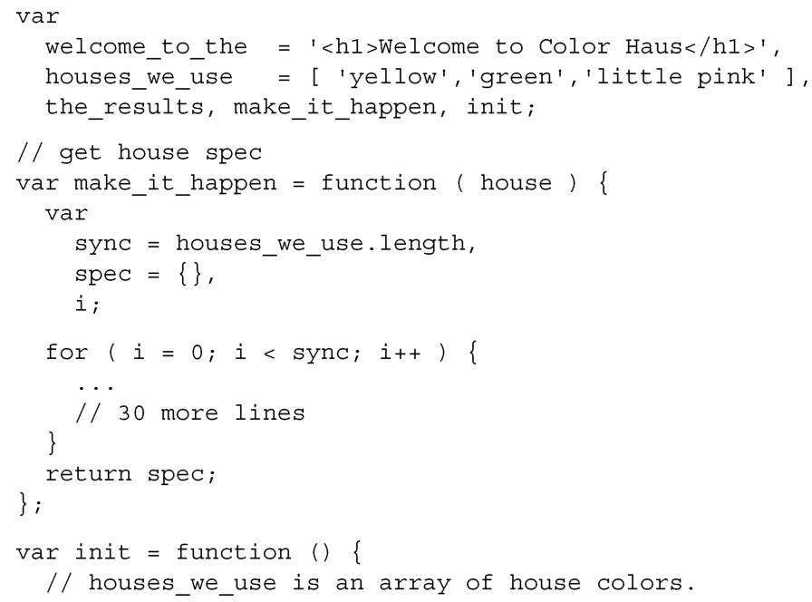
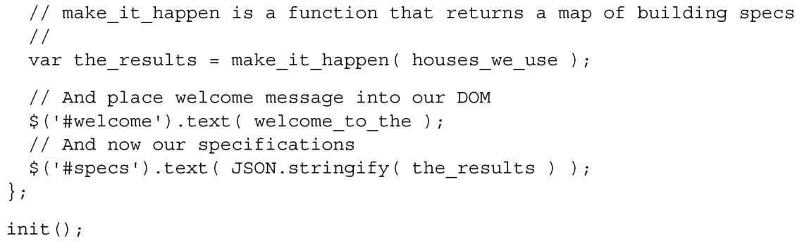
代码清单A-12 而要这样

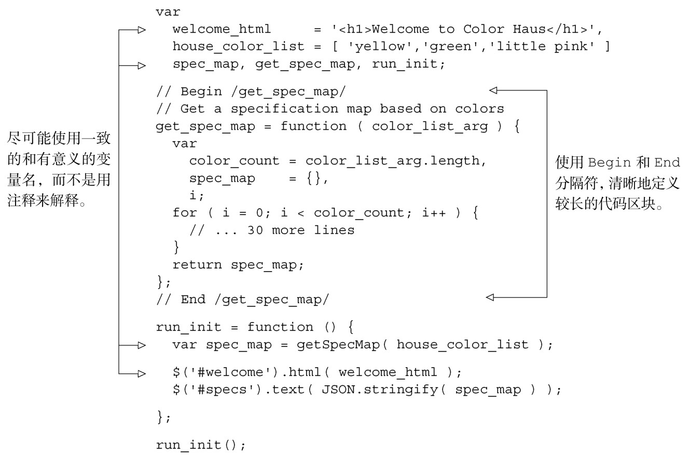
一致的、有意义的变量名，能提供更多的信息，需要的注释很少。“变量命名”小节在本附录的稍后会有介绍，但我们先看一些最重要的点。所有指向函数的变量，第一个单词都是动词：get_spec_map、run_init。其他变量的命名，要有助于理解它们的内容：welcome_html是一段 HTML 字符串， house_color_list 是一组颜色名称， spec_map 是规格（specifications）的映射。这有助于减少需要添加或者维护的注释数量，使得代码容易理解。

2．给API和TODO添加文档

注释也能为代码提供更为正式的文档。然而需要警惕的是，总体架构的文档不应该埋藏在数十个JavaScript文件的某一个之中，应该把它放在专门的架构文档里面。但是函数或者对象API的文档，可以并且通常应该放在代码的旁边。

解释所有重要的函数，说明它的目的，使用的参数或者设置（setting），它的返回值，以及所有抛出的异常。具体示例见代码清单A-13。

如果禁用了代码，要解释为什么，使用这种格式的注释：//TODO date username–comment。在判断注释新鲜度的时候，用户名和日期是很有价值的，也可以使用自动化工具，在代码库中的TODO项上，自动填上用户名和日期。具体示例见代码清单A-14。

代码清单A-13 给函数添加API 文档的示例

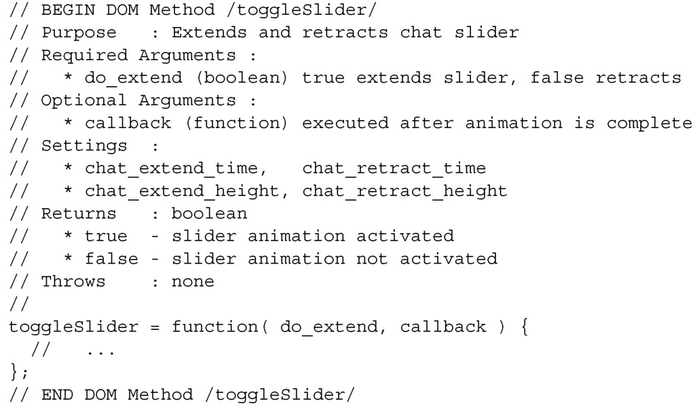
代码清单A-14 禁用代码的示例

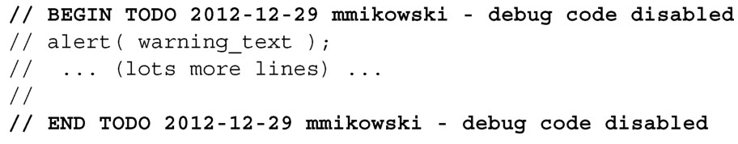
有些人会说，你应该直接把代码删了，如果再需要的话，就从源代码管理工具里面恢复。但是我们发现，把很可能会再次用到的代码注释掉，比寻找最初禁用代码的那个版本然后再合并回来，来得更加有效。在代码被禁用了一些时日后，就可以安全删除了。

A.3 变量名

你是否注意到，书上经常会在代码清单中引入专门的命名约定。比如，你会看到这样的行：person_str ='fred';。作者经常会这么做，因为他不想插入一个很笨拙的提醒，之后需要花费时间和精力来回想变量表示什么意思。变量名是能自我说明的。

每个人在编码的时候，都会使用命名约定，不管他们是否意识到这一点<a class="my_markdown" href="['#anchor10']">[10]</a>。一个好的命名约定，当团队的所有成员都理解并使用它的时候，能发挥巨大的价值。当他们这么做的时候，就能从枯燥的代码跟踪和费力的注释维护当中解放出来，把精力都集中在代码的目标和逻辑上面。

A.3.1 使用命名约定，减少并改进注释

对于企业级JavaScript应用，一致的和描述性的名字是非常重要的，因为它们能大大地加快认知的速度，也有助于避免常见的错误。考虑代码清单A-15和代码清单A-16所示的完全有效的实际JavaScript代码。

代码清单A-15 示例A

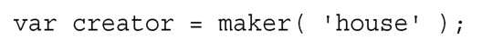
现在使用命名约定将它重写，之后马上会对它进行讨论：

代码清单A-16 示例B

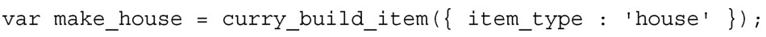
当然是示例B更具描述性。根据我们的约定，能看出以下信息。

make_house是一个对象构造器。

调用的函数叫做柯里化函数<a class="my_markdown" href="['#anchor11']">[11]</a>，它使用闭包来维护状态并返回一个函数。

调用的函数接收字符串参数，表示类型（type）。

变量的作用域是局部的。

现在，我们通过观察示例A中的代码上下文，能想像得出它之中的所有细节。为了跟踪所有的函数和变量，可能需要花费掉5、30或者60分钟时间。在维护这段代码或者要和这段代码打交道的时候，得把所有的东西记在心里面。我们不仅会浪费时间，而且可能会忘记最初到底是想干嘛来着。

每次有新的开发人员来维护这段代码时，都要支出这笔本可避免的费用。请记住，在几个星期以后，这段代码，对任何开发人员（包括原作者）来说实际上都是新的。很显然，这是非常低效的，也容易出错。

我们来看一下，在示例A中，需要使用多少注释才能提供和示例B一样多的信息量，如代码清单A-17所示。

代码清单A-17 有注释的示例A

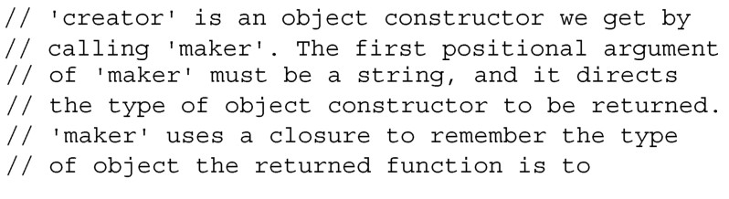
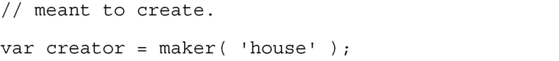
加了注释的示例A，不但比示例B显得更为冗长，而且需要更多的时间编写，很可能是因为我们设法传递和命名约定一样多的信息量。情况会越来越糟糕：经过一段时间以后，注释容易变得不准确，因为代码改变了，开发人员变得懒惰了。假如几个星期之后，我们决定更改一些名字，见代码清单A-18。

代码清单A-18 更改变量名之后，有注释的示例A

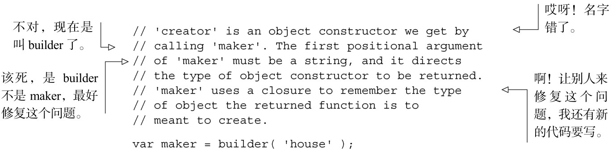
哦，天哪，我们刚更改了变量名，却忘记更新注释中引用这些变量名的地方。现在的注释完全错了并且容易误导别人。不但是这样，而且所有这些注释使得代码难以理解，因为代码清单长了9倍。没有注释是最好的。相比之下，如果我们想更改示例B中的变量名，见代码清单A-19。

代码清单A-19 更改变量名之后的示例B

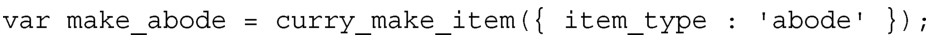
上面的修改是非常正确的，因为没有注释需要修改。这表明，深思熟虑的命名约定，是原作者给代码自动添加文档的非常棒的方法，描述更加精确，没有几乎不可能维护的杂乱注释。它有助于加快开发的速度、提升质量并且方便维护。

A.3.2 使用命名指南

变量名可以传达很多信息，上面我们已经列举过了。来看一些我们发现的很有用处的指南。

1．使用常见字符

虽然许多团队认为把变量命名为queensrÿche_album_name是合适的，但是那些试图在他们的键盘上寻找ÿ键的人会持有不同的和非常消极的观点。最好是把变量名限定在世界上大多数键盘都有的字符上。

变量名使用a～z、A～Z、0～9、下划线和$符号。

变量名不要以数字开头<a class="my_markdown" href="['#anchor12']">[12]</a>。

2．传达变量作用域

我们的 JavaScript 文件和模块是一一对应的，和 Node.js 类似（稍后本附录会详细讲解）。我们发现，在区分整个模块可见的变量和有更多作用域限制的变量时，这会很有用。

当变量作用域是整个模块时使用驼峰式（模块名字空间的所有地方都可以访问该变量）。

当变量作用域不是整个模块时使用下划线<a class="my_markdown" href="['#anchor13']">[13]</a>（模块名字空间内的某个函数的局部变量）。

确保所有模块作用域内的变量至少有两个音节，这样作用域就清晰了。比如，不要使用叫做config的变量，可以使用更具描述性的和明显是模块作用域的configMap。

3．要意识到变量类型是很重要的

只是因为JavaScript允许反复无常的变量类型，并不意味着你就应该这么做。考虑代码清单A-20给出的示例。

代码清单A-20 隐式类型转换

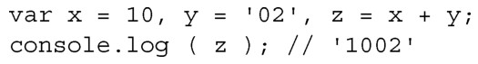
在上面的示例程序中，JavaScript把x转换成字符串，然后和y（02）连接，得到的结果是字符串1002。这很可能不是真正的意图。由于类型转换，也可能会有更加深刻的影响，如代码清单A-21所示。

代码清单A-21 类型转换的“阴暗面”

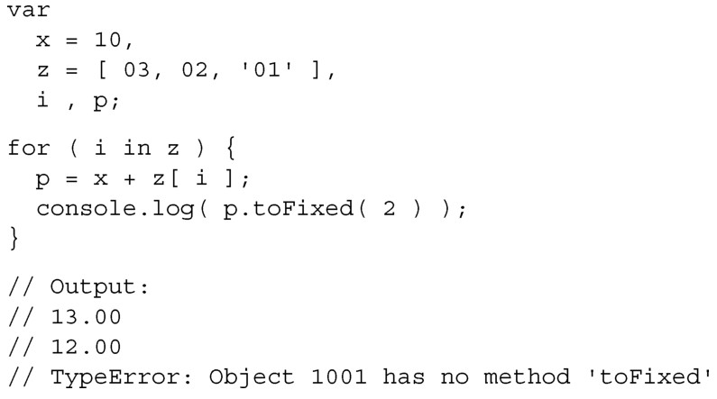
我们发现像上面这种类型转换，无意的情况要比有意的情况多得多，这经常会导致查找和解决bug变得很困难。我们很少故意更改变量的类型，因为（还有其他的原因）这么做几乎总是很混乱，或者是难以维护，没什么好处<a class="my_markdown" href="['#anchor14']">[14]</a>。因此，在命名变量的时候，我们经常希望传达变量所能拥有的值的类型。

4．命名布尔变量

当布尔值表示状态的时候，我们使用单词is，比如，is_retracted或者is_stale。当使用布尔值来表示行为的时候（如函数中的参数），我们使用单词do，像do_retract或者 do_extend。当使用布尔值来表示所有权的时候，我们使用 has ，比如， has_whiskers或者has_wheels。表A-1列举了一些示例。

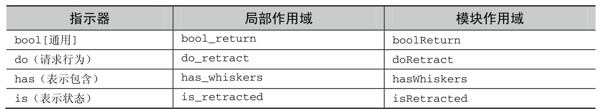
5．命名字符串变量

先前的示例表明，如果知道正在使用的是字符串变量，这是很有好处的。表A-2是我们通常使用的字符串指示器的统计表。

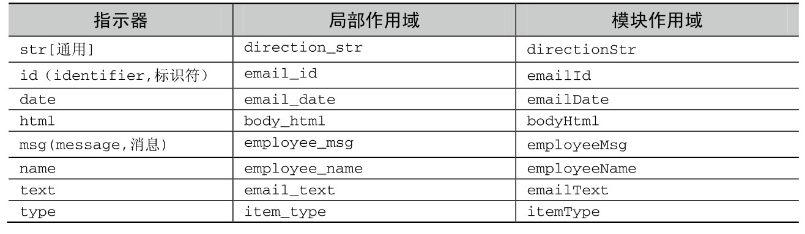
6．命名整型变量

JavaScript 支持的变量类型当中没有整数，但有很多实际情况，只有提供整数，编程语言才能正常地工作。比如，在迭代数组的时候，如果索引是浮点数，则不能正常工作：

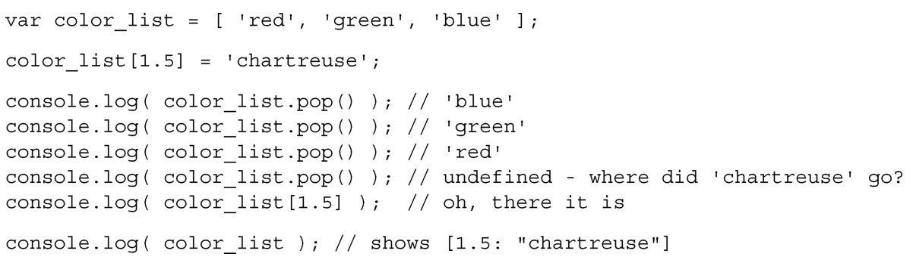
其他内置操作也预期接收整数值，像字符串的substr()方法。所以当使用整数是很重要的时候，可以使用指示器，如表A-3所示。

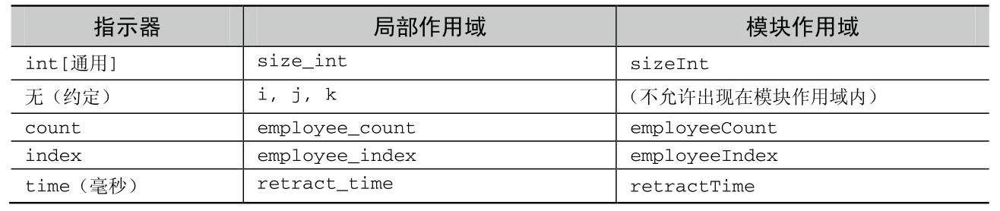
7．命名数字变量

如果需要明白“正在处理的是非整型数字”是很重要的话，可以使用其他指示器（参见表A-4）。

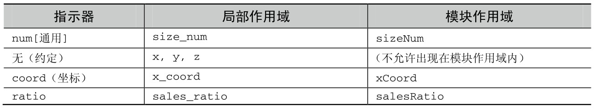
8．命名正则变量

我们通常喜欢给正则变量加上前缀regex，如表A-5所示。

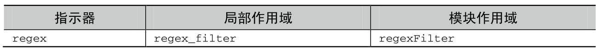
9．命名数组变量

下面的一些指南，我们发现在命名数组变量时很有用。

数组变量名应该是单名词加上单词“list”。

对于模块作用域数组的变量，我们喜欢“名词-List”的形式。

表A-6列举了一些示例。

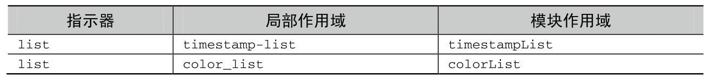
10．命名映射变量

JavaScript没有正式的map数据类型，它只有对象。但是我们发现，在区分只用来保存数据的简单对象（map）和功能完整的对象的时候，就显得很有用处。映射的结构和Java中的映射（map）、Python 中的字典（dict）、PHP 中的关联数组（associative array）以及Perl的哈希（hash）类似。

当给映射变量命名的时候，我们通常希望强调开发人员的意图，在名字中使用单词“map”。通常，结构是名词加上单词map，并且总是单数。请见表A-7中的映射变量名的示例。

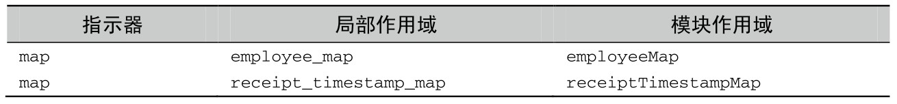
有时候，映射的键有特殊的含义或者功能。此时，可以在名字中进行暗示，比如， receipt_timestamp_map。

11．命名对象变量

对象通常是对“现实世界”的具体模拟，我们相应地为它们命名。

对象变量应该是名词，加上可选的修饰符：emplyee或者receipt。

确保模块作用域的对象变量名具有两个或者两个以上的音节，这样作用域就清晰了：storeEmployee或者salesReceipt。

jQuery对象有前缀$。目前这种约定很常见，在单页应用中，jQuery对象（有时候叫集合）很普遍。

表A-8列举了一些示例。

如果预期jQuery集合包含多个元素，则使用复数。

12．命名函数变量

函数通常执行对象上的某个操作。因此我们总是喜欢把表示“操作”的动词作为函数名的前半部分。

命名函数应始终遵循动词加名词的形式，比如，get_record或者empty_cache_map。

模块作用域的函数应始终包含两个或两个以上的音节，这样作用域就清晰了：getRecord或者emptyCacheMap。

动词含义要一致。表A-9列举了一些常见动词的一贯含义。

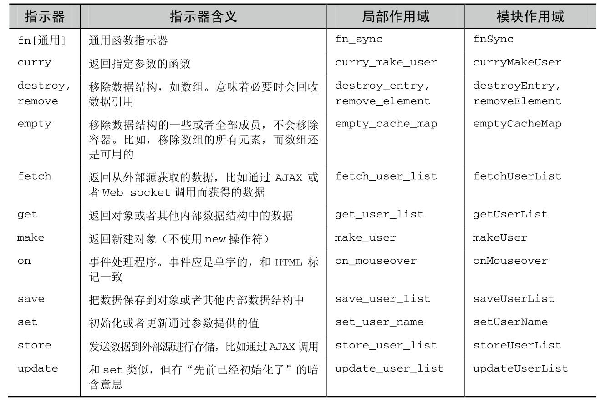
我们看到了构造动词make，fetch/get和store/save之间的区别，尤其是在跨团队沟通意图的时候颇具价值。同时，使用onEventname格式的事件处理程序，变得越来越常见和有用。通用形式是on<eventname><modifier>（on<事件名><修饰符>），其中修饰符是可选的。请注意，我们使用的事件名是单字的。比如，是 onMouseover，不是onMouseOver，或者是on_dragstart，不是on_drag_start。

13．命名未知类型的变量

有时候，我们实际上不知道变量包含的数据类型是什么。有两种情况很常见。

编写多态函数（接收多种数据类型的函数）。

接收的数据来自外部数据源，比如AJAX或者Websocket订阅。

此时，变量的主要特点是数据类型的不确定性。我们选定了一种写法，确保在变量名中包含了单词data（见表A-10）。

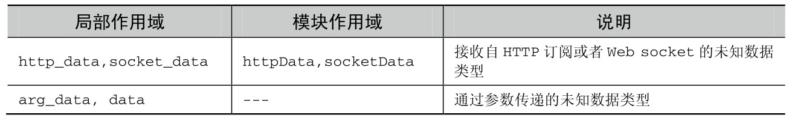
现在已经回顾了命名指南，我们来应用这些指南。

A.3.3 应用命名指南

我们来比较一下应用命名指南之前和之后的对象原型，见代码清单A-22和代码清单A-23。

代码清单A-22 不要这样

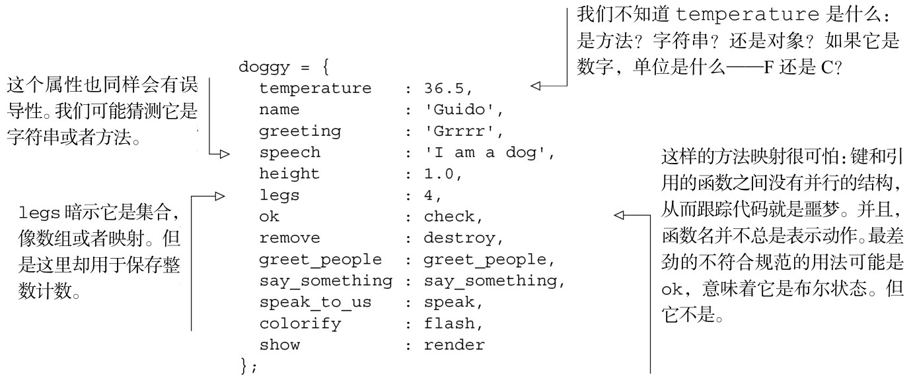
代码清单A-23 而要这样

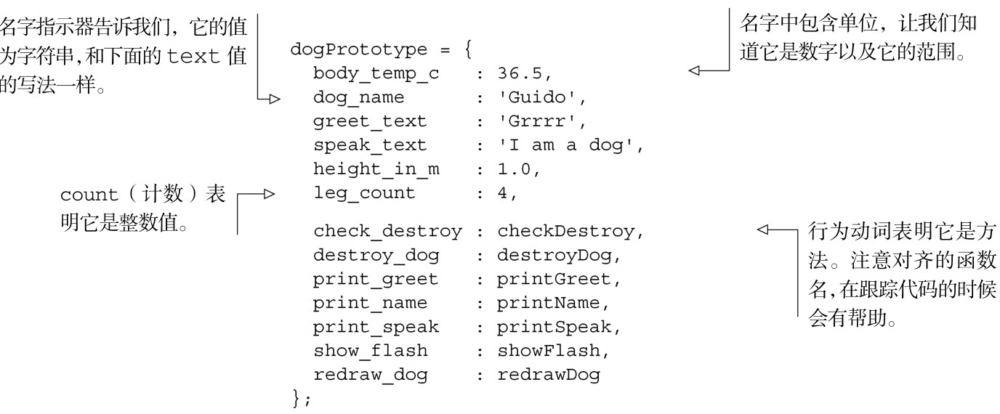
上面的两个示例是两张示例页面中的代码片段：listings/apx0A/bad_dog.html 和listings/apx0A/good_dog.html，在本书的代码资源中可以找到这两个文件。鼓励你下载并对它们进行比较，看看哪个示例更全面和更具维护性。

A.4 变量声明和赋值

可以将函数指针、对象指针、数组指针、字符串、数字、null 或者 undefined 赋给变量。一些JavaScript实现可能会在内部区分整数、32位有符号整数和64位双精度浮点数，但没有正式的接口可以执行此种分类。

创建新对象、映射或者数组的时候，使用{}或者[]代替new Object()或者new Array()。记住，映射是简单的只包含数据而没有方法的对象。如果需要使用对象继承，请使用第2章和本附录A.5小节演示的createObject工具方法。

使用工具方法复制对象和数组。当把简单变量（像布尔值、字符串或者数字）赋给其他变量的时候，会复制它们的值。比如，new_str=this_str，会把底层数据（这里是字符串）复制给new_str。当把JavaScript中的复杂变量（像数组和对象）赋给其他变量的时候，并不是复制它们的值，而是复制数据结构的指针。比如，second_map=first_map，结果second_map和first_map指向的数据是相同的，并且任何对second_map的操作都会在first_map体现出来。正确地复制数组和对象，不一定是显而易见或者容易的。为此我们极力推荐使用精心测试过的工具方法，比如jQuery所提供的方法。

一开始就在函数作用域内，使用单个var关键字，显式地声明所有的变量。JavaScript 通过函数来限定变量作用域，没有提供块作用域（block scope）。因此 ，如果在函数中的任意地方声明变量，在调用函数的时候，立即就会被初始化，值为 undefined。把所有的变量声明放在前面，就是意识到了这种行为。这也会使代码更容易阅读，更容易发觉未声明的变量（这种变量绝不可接受）。

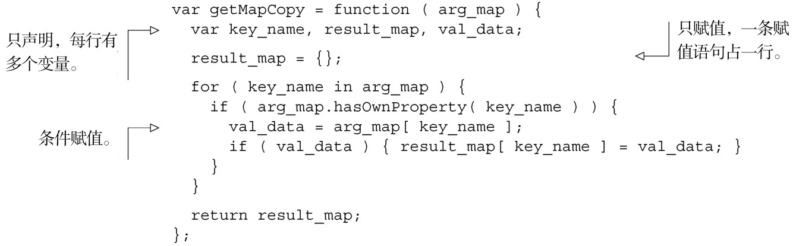
声明变量和对它赋值不一样：声明会通知 JavaScript 引擎，变量存在于作用域中。赋值是为变量提供值（取代undefined）。为了方便起见，可以使用var语句合并声明和赋值的过程，但这不是必需的。

不要使用块，因为JavaScript没有提供块作用域<a class="my_markdown" href="['#anchor15']">[15]</a>。在块中定义变量，会使那些有丰富的C家族语言经验的程序员感到困惑。请在函数作用域中声明变量。

把所有函数赋给变量。这进一步巩固了JavaScript把函数当作第一类对象的事实。

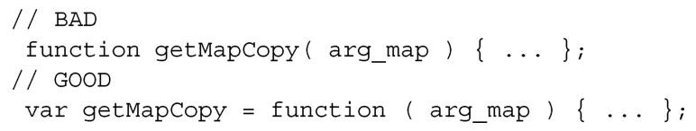
当函数需要三个以上的参数时，使用具名参数（namedarguments），因为位置参数<a class="my_markdown" href="['#anchor16']">[16]</a>的含义很容易忘记，并且也不能进行自我说明。

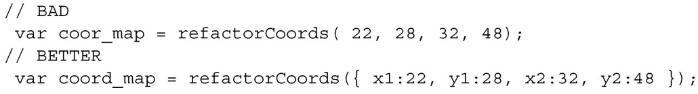
每条变量赋值语句占用一行。尽可能按字母或者逻辑来排序。多个声明可以放在单行上：

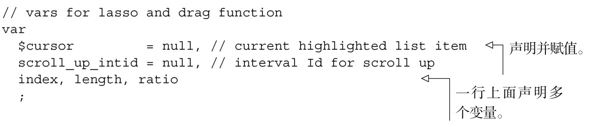
A.5 函数

函数在JavaScript中起着核心的作用：它们组织代码、为变量作用域提供容器，并提供用于构造基于原型的对象的执行环境。因此尽管对函数的指南不多，但我们对它们已经很亲切了。

使用工厂模式构造对象，因为它更好地说明JavaScript对象实际上是如何工作的，这种方式很快，可以提供像类一样的功能，比如对象计数。

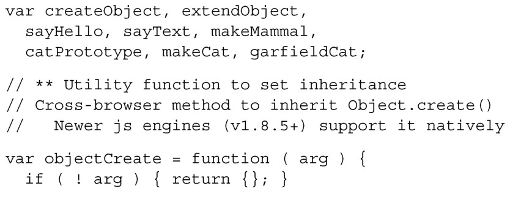
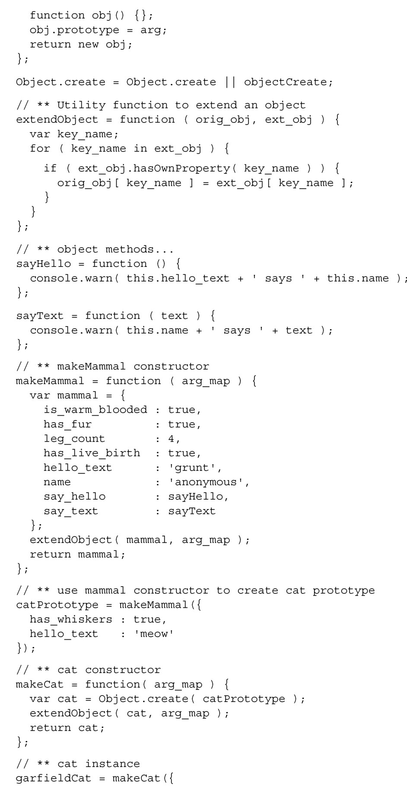
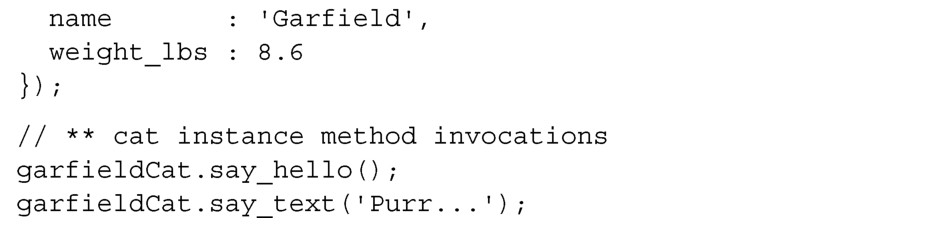
避免伪类对象构造器，即不要使用new关键字来构造伪类。如果在调用这种构造器时，没有使用new关键字，就会破坏全局名字空间。如果一定要使用这种构造器，就把首字母大写，这样就可以意识到它是伪类对象构造器。

所有的函数在使用之前都要先声明。记住，声明函数和把值赋给它们是不同的。

当函数被立即调用的时候，用括号将它包起来，这样就清楚地知道，值是函数运行的结果，而不是函数自身：spa.shell=(function(){...}());

A.6 名字空间

很多早期的JavaScript代码比较简单，单独在一张页面上使用。这些脚本可以（而且经常就是这么做的）使用全局变量，而不会有什么影响。但是随着JavaScript应用的蓬勃发展和第三方类库的普遍使用，别人想要全局变量i的可能性会急剧上升。当两个代码库声明了相同的全局变量时，地狱之门也随之打开 <a class="my_markdown" href="['#anchor17']">[17]</a>。

只使用单一的全局函数，把其他所有变量的作用域限制在该函数里面，就可以极大地减少这种问题，如下所示：

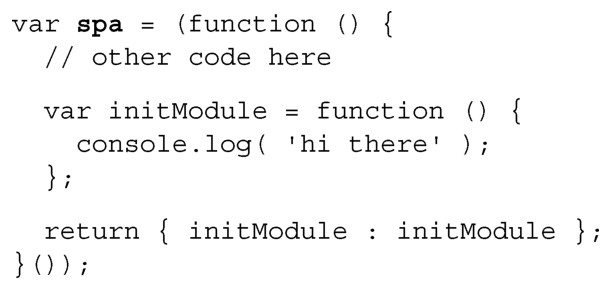
我们把这个单一的全局函数（在这个示例中是spa）叫做名字空间。赋给它的函数，在加载的时候就会执行，当然所有在该函数里面赋值的局部变量，在全局名字空间中是不可访问的。注意我们让initModule方法对外可见。所以其他代码可以调用初始化函数，但它不能访问其他的东西。并且必须使用spa前缀：

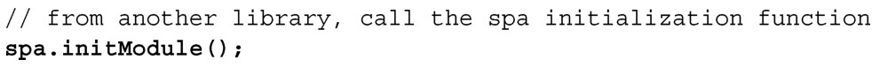
可以把名字空间再细分，这样就不会被迫用单个文件来装载50KB的应用。比如，可以创建spa、spa.shell和spa.slider这样的名字空间：

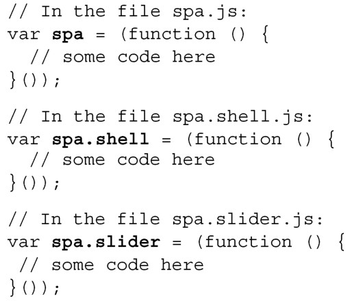
名字空间是创建可维护的JavaScript代码的关键所在。

A.7 文件名和布局

名字空间是文件命名和布局的基础。下面是通用指南。

使用jQuery来操作DOM。

在构建自己的插件（像jQuery插件）之前，先研究一下有没有第三方代码库。“集成成本和臃肿的应用”与“标准化和代码一致性的好处”，要做到平衡。

避免在HTML中嵌入JavaScript。使用外部库的方式。

在上线之前，对JavaScript和CSS进行压缩（minify）、混淆和gzip压缩。比如，在上线准备期间，使用 Uglify 来压缩和混淆 JavaScript ，在传输时使用Apache2/mod_gzip对文件进行gzip压缩。

JavaScript文件指南如下。

在HTML中，先引入第三方JavaScript文件，这样它们的函数都有值了，我们的应用就随时可以使用这些函数。

接着引入我们自己的JavaScript文件，按名字空间的顺序引入。比如，如果根名字空间spa还没被加载，那么不能加载spa.shell名字空间。

所有JavaScript文件的后缀都为.js。

把所有的静态JavaScript文件保存在叫做js的目录下。

根据名字空间来命名JavaScript文件，每个文件一个名字空间。示例：

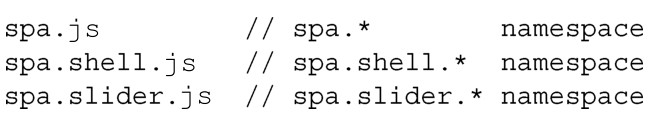
使用模板来创建所有的JavaScript模块文件。本附录的最后有一个模板文件。

JavaScript文件与CSS文件和类名之间，保持平行结构。

为会生成HTML的每个JavaScript文件创建一个CSS文件。示例：

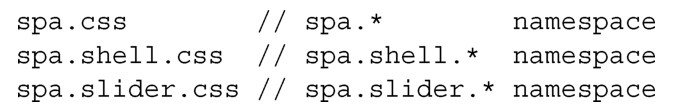
所有CSS文件的后缀都为.css。

把所有的CSS文件保存在叫做css的目录下。

给CSS选择器加上模块名前缀。这种做法能极大地有助于避免和第三方模块的意外冲突。示例：

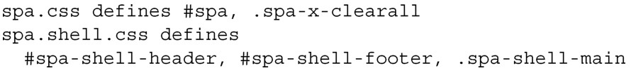
状态指示器使用<名字空间>-x-<描述符>和其他共享的类名。例如，spa-x-select和spa-x-disabled。把上面这些选择器放在根名字空间样式表里面，比如spa.css。

上面这些是简单指南，容易遵循。这种组织化和一致性使得理解CSS和JavaScript之间的关系也就容易得多了。

A.8 语法

本节研究JavaScript的语法和一些我们遵循的指南。

A.8.1 标签

语句的标签（label）是可选的。只有下面这些语句需要加标签：while、for和switch。标签应该总使用大写，而且应该是单名词：

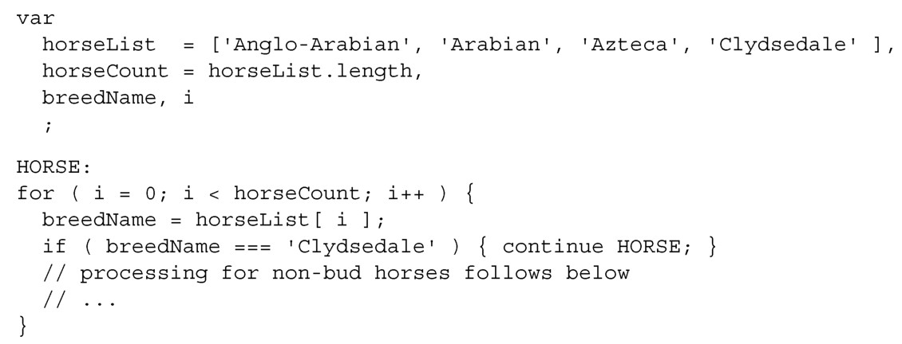
A.8.2 语句

下面列出了常见的JavaScript语句和我们的使用建议。

1．continue

除非使用了标签，否则我们就会避免使用 continue 语句，要不然控制流程容易变得难以理解。continue后面跟上一个标签，也使continue更具“弹性”。

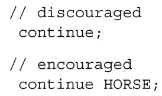
2．do

do语句的形式应该如下：

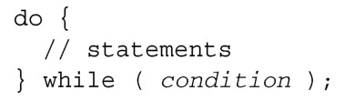
do语句的结尾总是加上分号。

3．for

for语句的形式，应该是下面所演示的其中之一：

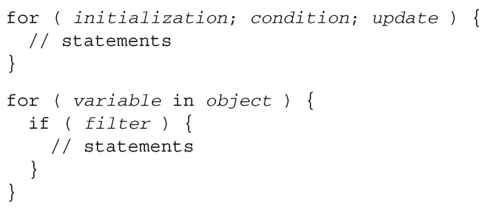
第一种形式应该用于数组，循环迭代的次数是可知的。

第二种形式应该用于对象和映射。注意，在对象原型上添加的成员（属性和方法），会包含在枚举当中。使用hasOwnProperty方法，可以筛选出真正的属性：

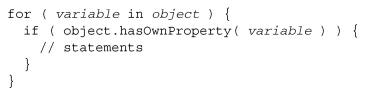
4．if

if语句的形式，应该是下面演示的其中之一。else关键字应另起一行：

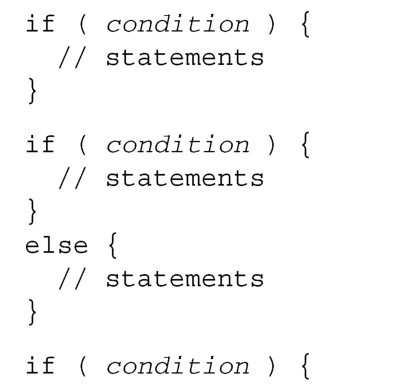
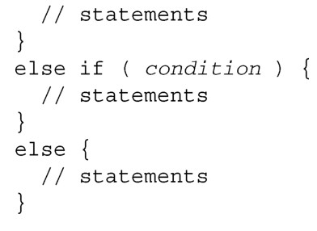
5．return

return语句的返回值，不应该加括号。为了避免自动插入的分号，返回值表达式必须和return关键字在同一行上。

6．switch

switch语句的形式应该如下：

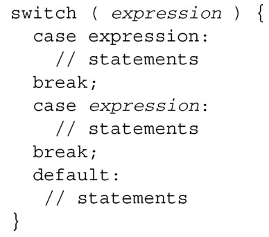
每组语句（default 除外）要以 break、return 或者 throw 结尾，使用贯穿（fall-through）的时候要非常小心，并加以注释，甚至应该重新考虑是否需要它。以简洁性换取可读性，真的值得吗？很可能不值得。

7．try

try语句的形式，应该是以下形式的其中之一：

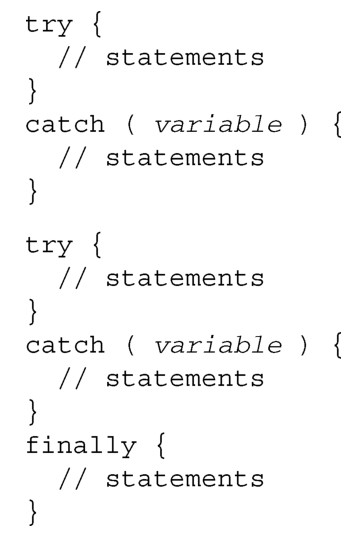
8．while

while语句的形式应该如下：

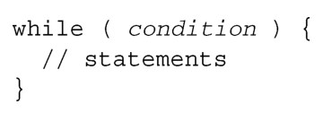
应该避免使用while语句，因为它们容易产生死循环的情况。赞成只要可能就使用for语句。

9．with

应该避免使用with语句。使用object.call()家族方法，在调用函数的时候修改this的值。

A.8.3 其他语法

当然，除了标签和语句，JavaScript还有很多的内容。下面是一些我们会遵循的其他指南。

1．避免逗号运算符

避免使用逗号运算符（在for循环结构中会看到）。这并不适用逗号分隔符，它用于对象字面量、数组字面量、var语句和参数列表。

2．避免赋值表达式

在if和while语句的条件部分，避免使用赋值表达式（不要编写if(a=b){...,因为不清楚是想测试相等，还是赋值）。

3．总是使用===和!==比较运算符

使用===和!==运算符总是更好的。==和!=会进行类型转换。尤其不要使用==来比较“假值”。我们的JSLint配置不允许类型转换。如果你想测试某个值是“真”还是“假”，使用下面的结构：

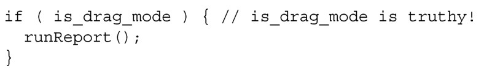
4．避免混乱的加号和减号

请小心，在+之后不要跟随+或者++。这种模式很混乱。在它们之间插入括号，让你的意图变得清晰。

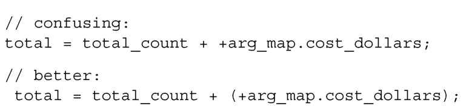
这就能防止把++错看成++。该指南对减号也同样适用。

5．不要使用eval

请当心，eval有魔鬼的外号。不要使用Function构造器。不要向setTimeout和setInterval传递字符串。把JSON字符串转换成内部数据结构，要使用解析器，不要使用eval。

A.9 验证代码

JSLint是一款JavaScript验证工具，由Douglas Crockford编写和维护。它很受欢迎，在定位代码错误并确保基本指南得以遵循时，非常有用。如果你正在编写专业级的JavaScript，应该使用JSLint或者类似的验证工具。它帮助我们避免了许多种bug，极大地缩短了开发时间。

A.9.1 安装 JSLint

下载最近的jslint4java发布版本，比如https://code.google.com/p/jslint4java/上的jslint4java-2.0.2.zip。

按照你所使用平台的说明，进行解压和安装。

如果使用的是OS X或者Linux

可以移动 jar 文件，比如sudo mv jslint4java-2.0.2.jar /usr/local/lib/，然后在/usr/local/bin/j slint里面创建下列包装器（wrapper）：

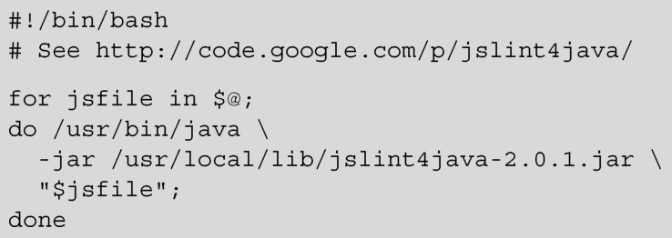
确保jslint是可执行的：sudo chmod 755 /usr/local/bin/jslint。

如果你安装了Node.js，可以安装另外一个版本，像这样：npm install -g jslint。这个版本运行快得多，但这本书中的代码清单没有用它测试过。

A.9.2 配置 JSLint

我们的模块模板包含了JSLint的配置。我们使用下面这些设置来匹配编码标准。

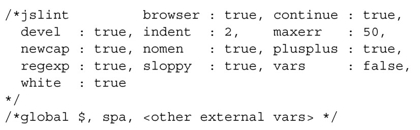
browser:true——允许与浏览器相关的关键字，像document、history、clearInterval等。

continue:true——允许continue语句。

devel:true——允许与开发相关的关键字，像alert、console等。

indent:2——缩进为2个空格。

maxerr:50——超过50个错误后，终止JSLint。

newcap:true——允许构造函数首字母非大写。

nomen:true——不允许在两边（最前或者最后）悬挂下划线符号（_）。

plusplus:true——允许++和--。

regexp:true——允许很有用但有潜在危险的正则表达式结构。

sloppy:true——不需要use strict编译指令。

vars:false——每个函数作用域内，不允许有多个var语句。

white:true——禁用JSLint的格式化检查。

A.9.3 使用 JSLint

当希望检查代码正确性的时候，可以在命令行中使用JSLint。语法为：

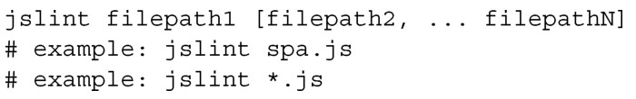
我们已经编写了一个git的提交钩子脚本（hook），在允许提交到代码库之前，会测试所有更改的 JavaScript 文件。可以把下面的 shell 脚本添加到 repo/.git/hooks/pre-commit。

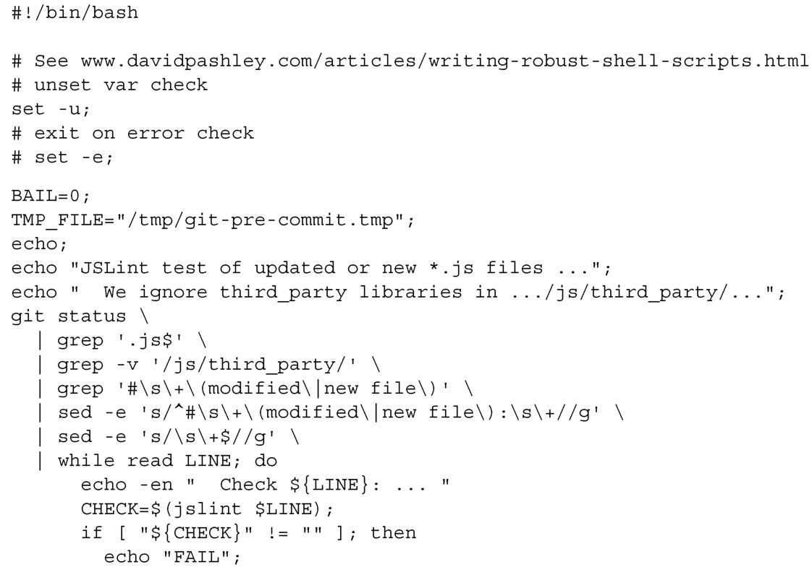
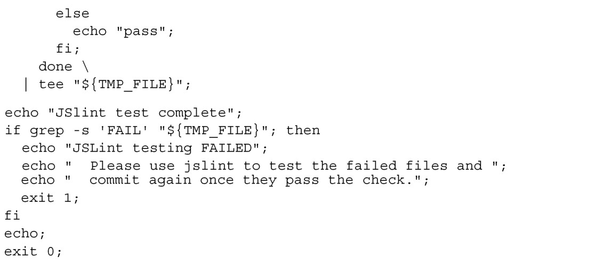
你可能需要根据自己的用途，对它进行修改。另外，请确保它是可执行的（在Mac或Linux中，chmod 755 pre-commit）。

A.10 模块模板

经验表明，模块按一致的区块来划分，是很有价值的做法。它能帮助我们理解和浏览代码，提醒我们要以良好的方式来编码。代码清单A-24显示的模板是从很多项目的上百个模块中提炼出来的，里面是一些示例代码。

代码清单A-24 推荐的模块模板

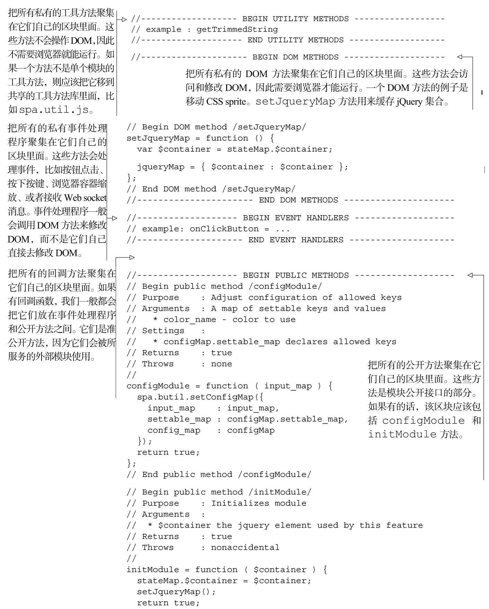
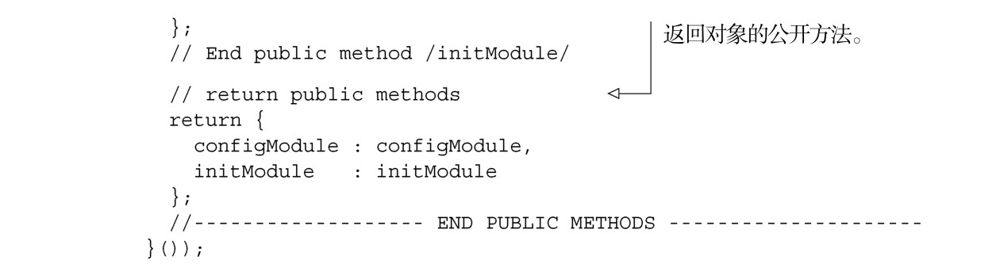
A.11 小结

好的编码标准，是一个或多个开发人员最有效地工作所必需的。我们提出的标准很广泛且有凝聚力，但我们承认它可能不适合每个团队。不管怎样，希望这会鼓励读者，思考约定是如何解决或缓解这些常见问题的。我们强烈建议任何团队在着手大型项目之前，要达成一致的标准。

阅读代码的次数要比编写它的次数多得多，所以要优化代码的可读性。我们把每行的字符数限制为78个，使用两个空格的缩进。我们不允许使用制表符。我们按逻辑区块来划分代码行，这能使读者理解我们的意图，换行也使用一致的风格。使用K&R风格的括号，使用空格来区分关键字和函数。定义字符串字面量的时候，我们喜欢使用单引号。我们支持使用约定而不是注释来传达代码是干什么的。具有描述性的和一致的变量名是传达我们意图的关键所在，不用过度地使用注释。当在写注释的时候，我们按区块的策略来为之添加文档。重要的内部接口则使用一致的文档。

我们防止其他脚本通过名字空间，和代码发生不必要的交互。使用自执行函数来提供名字空间。对根名字空间进行了细分，以便组织代码并提供合理的文件大小和作用域。我们的每个JavaScript文件都只包含单个名字空间，它们的文件名反映了它们提供的名字空间。我们为CSS选择器和文件创建了并行的名字空间。

我们安装并配置了 JSLint。我们的代码，在允许它被提交到代码库之前，总是应用JSLint进行验证。我们使用一致的验证设置。我们演示了一个模块模板，它体现了很多我们提出的约定，并在头部引入JSLint设置。

编码标准意味着，通过共同语言和一致的结构，把开发人员从无意义的工作中解放出来。允许他们把创新精神放在重要的逻辑上面。一个好的标准能提供清晰明了的意图，对大型项目的成功至关重要。

注　释

<a class="my_markdown" href="['#ac1']">[1].马丁·福勒（Martin Fowler，1963——），生于英格兰沃尔索耳，是一个软件开发方面的著名作者和国际知名演说家，专注于面向对象分析与设计、统一建模语言、领域建模以及敏捷软件开发方法，包括极限编程。——译者注</a>

<a class="my_markdown" href="['#ac2']">[2].“任何傻瓜都能写出计算机可以理解的代码。优秀的程序员能编写人类可以理解的代码。”——译者注</a>

<a class="my_markdown" href="['#ac3']">[3].关于是否只使用tab，开发者大军们狂热的网络论战士，已经花费了无数个小时（如果你需要更多的证据，请在网上搜索“tabs versus spaces”）。</a>

<a class="my_markdown" href="['#ac4']">[4]. RobertBringhurst，加拿大诗人、作家、排版设计者。《The Elements of Typographic Style》是一本关于字体、字形的参考读物，更多信息请参考http://en.wikipedia.org/wiki/Robert_Bringhurst。——译者注</a>

<a class="my_markdown" href="['#ac5']">[5].本书代码清单的行长、实际上限制为了72个字符，丢失了最后6个字符，令人不快。</a>

<a class="my_markdown" href="['#ac6']">[6].空白(white space)是空格、换行或者制表符的任意组合。但不要使用制表符。</a>

<a class="my_markdown" href="['#ac7']">[7].通常说的“合并压缩JavaScript代码”中的“压缩”是指minified，即移除空行、空格等内容。而compressed指的是服务端的压缩，比如gzip。——译者注</a>

<a class="my_markdown" href="['#ac8']">[8].K ＆ R指的是《The C Programming Language》（《C 程序设计语言》）这本书。K和R是此书两位作者（Brian Kernighan 和Dennis Ritchie）名字的首字母。这里指的是C语言风格的括号写法。——译者注</a>

<a class="my_markdown" href="['#ac9']">[9]. 冠词（article）是印欧语系和闪含语系的诸语中，位于名词或名词词组之前或之后，在句子里主要是对名词起限定作用的词。冠词是一种虚词。在汉语（粤语和吴语除外，这两门汉语量词作定冠词）、日语等语言中没有与之相对应的词性。更多信息请参见http://zh.wikipedia.org/wiki/冠词。——译者注</a>

<a class="my_markdown" href="['#ac10']">[10].有点像“if you choose not to decide you still have made a choice”（不做决定也是一种决定）（Rush乐团的歌曲“Freewill”，《Permanent Waves》专辑，1980年发行）。</a>

<a class="my_markdown" href="['#ac11']">[11]. 在数学和计算机科学中，柯里化（currying），是指把接收多个参数的函数，变换成接收单个参数函数的技术。更多信息请参考http://zh.wikipedia.org/wiki/柯里化。——译者注</a>

<a class="my_markdown" href="['#ac12']">[12]. 这里不是“要和不要”的问题，而是“能和不能”的问题。JavaScript中合法的标识符和绝大多数语言一样，不能以数字开头。虽然以数字开头的标识符理论上完全没问题，但在进行词法分析的时候，必须回溯才能确定到底是标识符还是数字。在规定标识符不能以数字开头后，区分是标识符还是数字就很容易了。——译者注</a>

<a class="my_markdown" href="['#ac13']">[13]. 和驼峰式（Camel case）对应，它有一个名不见经传的名字：Snake case（不妨称之为卧蛇式）。更多信息请参见http://en.wikipedia.org/wiki/Snake_case。——译者注</a>

<a class="my_markdown" href="['#ac14']">[14]. 较新版本的Firefox 的JavaScript即时编译器（JIT compiler）意识到了这一事实，使用了一种叫做类型推断（type inference）的技术，在实际代码中获得了20%～30%的性能提升。</a>

<a class="my_markdown" href="['#ac15']">[15]. 大多数时候这么说是对的，但Firefox中的JavaScript（从1.7 版本开始），引进了let语句，可以使用它来提供块作用域。但是它还未被所有主流浏览器支持，因此应该忽略它。</a>

<a class="my_markdown" href="['#ac16']">[16]. 位置参数（positional arguments），顾名思义，参数的值是由它所在的位置（在函数形参列表中的位置）决定的。——译者注</a>

<a class="my_markdown" href="['#ac17']">[17]. 作者曾经开发过一个应用，其中的一个第三方类库突然错误地声明了全局变量util（他们本应该使用JSLint……）。虽然我们的应用只有三个名字空间，其中一个就是util。这个冲突使得我们的应用崩溃了，我们花费了四个小时来诊断，对问题做了变通方案。很明显我们都没那么开心。</a>

