### 
  附录B 测试单页应用

本附录涵盖的内容

设置测试模式

选择测试框架

安装nodeunit

创建测试集

修改单页应用的模块，添加测试设置

本附录以在第8章中编写的代码为基础。在开始前，你应该有了第8章的项目文件，我们将在其中添加文件。建议把第8章的整个目录结构复制一份，放到新的“appendix_B”目录中，在新的目录中更新文件。

我们是测试驱动开发的拥趸，曾参与过疯狂的项目，所有的测试都是自动生成的。使用排列工具，自动生成数以千计的回归测试，这些回归测试仅仅是描述API和它们的预期行为。如果某位开发人员修改了代码，在提交到代码库之前，必须通过回归测试。在引入新的API时，开发人员在配置中添加描述，然后就会自动生成成百上千的新测试。这种做法的结果是超凡的质量，因为代码覆盖率很高，很少有任何形式的回归。

虽然喜欢这种回归测试，但是我们不渴望在本附录能达到这种程度。我们只有足够的空间和时间帮你把脚弄湿 <a class="my_markdown" href="['#anchor1']">[1]</a>，但不能帮你洗澡。我们将创建测试模式，讨论它们的用法，然后使用jQuery和测试框架创建测试集。我们的测试工作比在实际项目中要晚，我们喜欢在编码的同时编写测试，因为这有助于解释清楚代码应该做什么。似乎是为了证明这一点，在编写本附录的时候，我们发现并解决了两个问题 <a epub:type="noteref" href="#anchor2" id="ac2">[2]</a>①。现在我们来讨论希望给单页应用添加的测试模式。

B.1 设置测试模式

在开发单页应用的时候，我们至少使用四种不同的测试模式。这些模式通常应该按下面的顺序使用。

不用浏览器，使用伪造数据测试Model（模式1）。

使用伪造数据，测试用户接口（模式2）。

不用浏览器，使用真实数据测试Model（模式3）。

使用真实数据，测试Model和用户接口（模式4）。

我们需要能够很容易地在测试模式之间进行切换，这样就可以快速地诊断、隔离并解决问题。这个目标的一个必然结果是，所有的模式应该使用相同的代码。我们希望不用浏览器就能运行测试（模式1和3），也希望在浏览器中运行测试（模式2和4）。

图B-1演示了“不用浏览器，使用伪造数据测试Model（模式1）”所用到的模块。首先应该使用这种测试模式，以便确保Model的API和预期设计的完全一样。

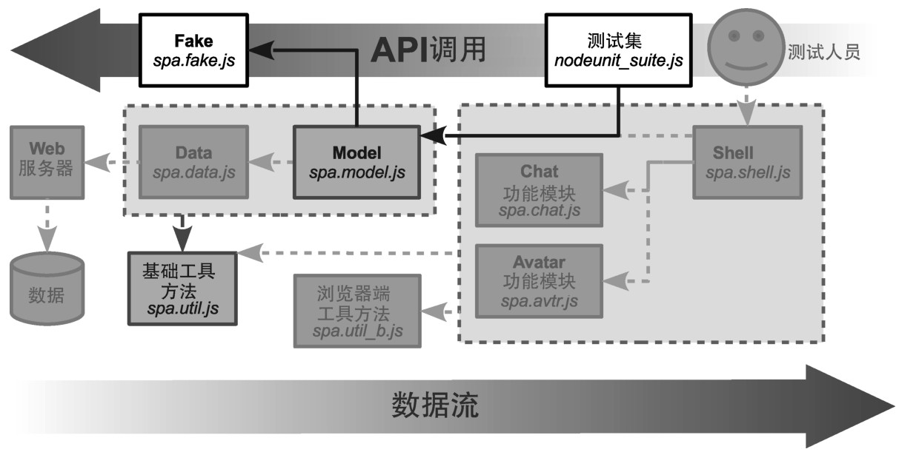
图B-2 演示了“使用伪造数据，测试用户接口（模式2）”所用到的模块。这是一个很好的模式，在测试过Model之后，可以隔离视图和控制器相关的bug。

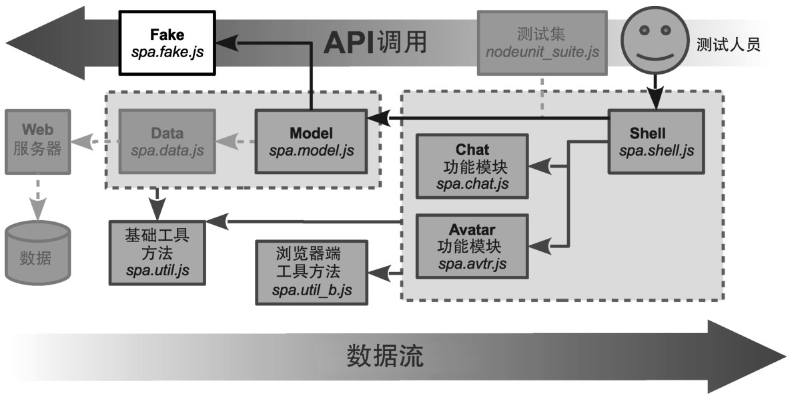
图B-3演示了“不用浏览器，使用真实数据测试Model（模式3）”所用到的模块。这有助于隔离服务器API的问题。

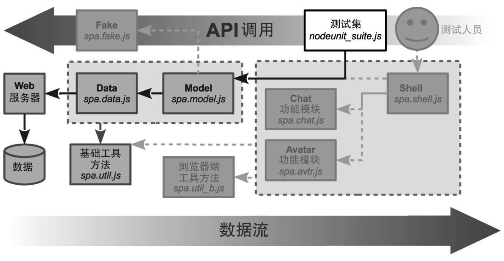
图B-4 演示了“使用真实数据，测试用户接口（模式4）”所用到的模块。这允许用户测试整个流程（full stack），实际上就是整个应用。测试爱好者们（或者像我们这种有志向成为测试爱好者的人）把这叫做集成测试。

如果其他模式的测试工作做得很到位，就可以使得在模式4中发现的问题数量降至最小。一旦真的在模式4中发现了问题，我们应该使用更简单的模式对它进行隔离，从模式1开始。如果能很有效地解决问题，模式4就像月亮：一个有趣的观光胜地，但你不会想住在那里。

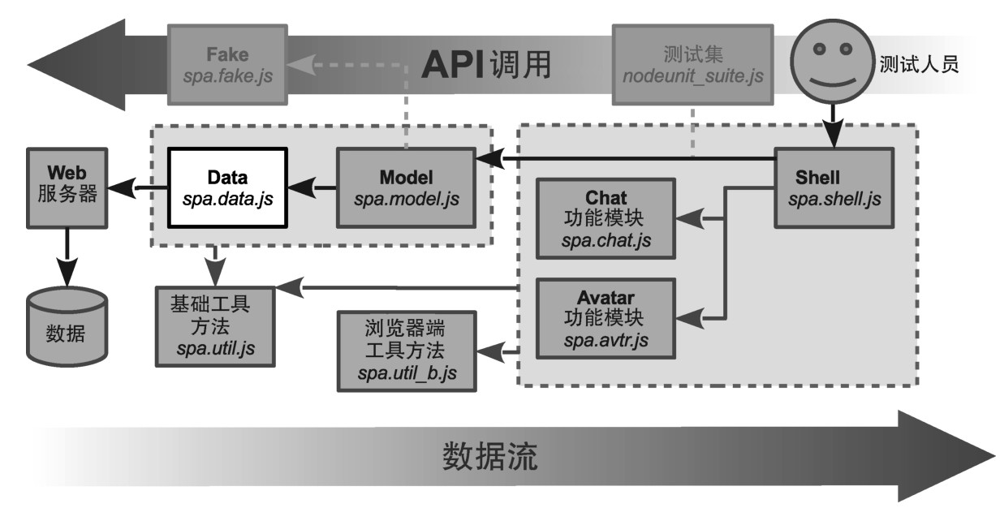
在本节中，我们将做些必要的更改，以便可以在浏览器界面中使用真实的和伪造的数据（模式2和4）。下面是需要做的工作。

创建Model的spa.model.setDataMode方法，在伪造数据和真实数据之间进行切换。

更新Shell，在初始化期间，检查URI查询参数fake的值。有了这个值后，然后使用spa.model.setDataMode方法，设置数据模式。

向 Model 中添加 spa.model.setDataMode 方法是很容易的，因为只需更改模块作用域变量isFakeData。代码清单B-1演示了更新的地方。更改部分以粗体显示。

代码清单B-1 向Model 中添加setDataMode——webapp/public/js/spa.model.js

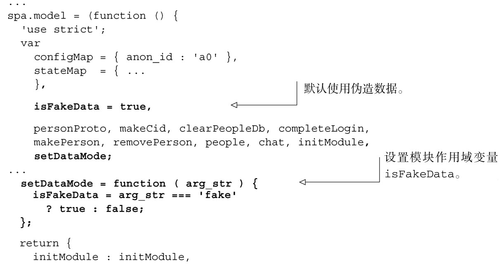

接下来是修改 Shell ，在初始化时读取 URI 查询参数，然后调用 spa.model. setDataMode（刚添加的方法）。这个更改就像是动了次外科手术，如代码清单B-2所示。更改部分以粗体显示。

代码清单B-2 在Shell 中设置数据模式——webapp/public/js/spa.shell.js

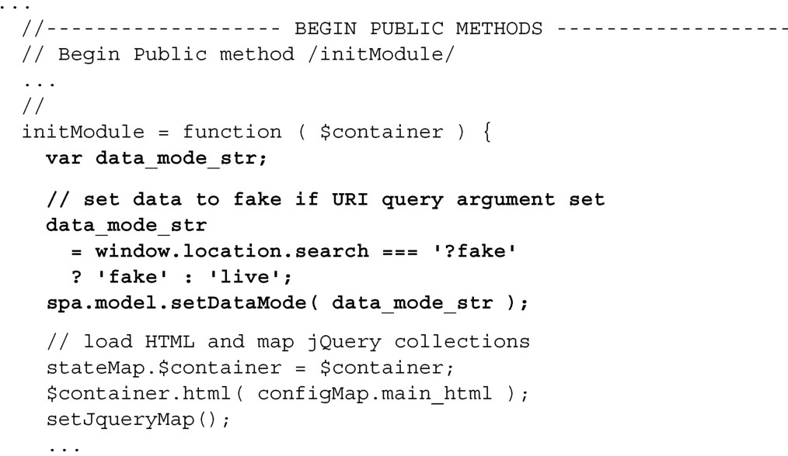
首先进到webapp目录安装模块（npm install），然后启动node应用（node app. js）。打开带fake标志的浏览文档时（http://localhost:3000/spa.html?fake）时，接口会使用伪造的数据（模式2）<a class="my_markdown" href="['#anchor3']">[3]</a>。如果打开不带fake标志的浏览文档（http://localhost:3000/spa.html），则会使用真实数据（模式4）。在后面的小节中将讨论如何不在浏览器中测试单页应用（模式1和3）。首先，来选定测试框架。

B.2 选择测试框架

我们已经设计了单页应用的架构，所以不使用浏览器就可以很容易地测试Model。我们发现当Model运作得完全和设计一样时，修复用户接口bug的开销就显得微不足道。我们也发现人类在测试接口时，经常（但不总是）比测试脚本来得更加高效。

我们将使用Node.js（而不是浏览器）来测试Model。这允许我们在开发期间和部署前，很容易并自动地运行测试集。因为不依赖浏览器，测试的编写、维护和扩展就更简单了。

Node.js有很多测试框架，已经过多年的使用和优化。挑一个直接使用而不是自己进行开发，是明智的选择。下面列出的是一些因为这样或者那样的原因而觉得有趣的测试框架<a class="my_markdown" href="['#anchor4']">[4]</a>。

jasmine-jquery——可以“监视”jQuery事件。

mocha——流行的，和nodeunit类似，但测试报告要更好。

nodeunit——流行的，简单却强大的工具。

patr——使用promise（和jQuery的$.Deferred对象类似）进行异步测试。

vows——流行的异步BDD<a class="my_markdown" href="['#anchor5']">[5]</a>框架

zombie——流行的、基于Webkit引擎的无头浏览器<a class="my_markdown" href="['#anchor6']">[6]</a>，可以测试完整的应用。

zombie兼容并包，目标是测试用户界面和Model。它甚至引入了自己的Webkit渲染引擎实例，这样测试就可以检测渲染后的元素了。在这我们不会追逐这种测试，因为它很昂贵，并且安装、设置和维护都很繁琐（这只是附录，不是另一本书）。尽管我们发现jasmine-jquery和patr很有趣，理由在上面已经列出了，但我们觉得它们没达到我们需要的支持层级。mocha和vows很流行，但我们希望先从更简单的开始。

这样一来只剩下nodeunit了，它很流行、强大、简单并且和我们的IDE集成得非常不错。我们来安装nodeunit。

B.3 安装nodeunit

在可以安装nodeunit之前，需要确保已经安装了在第7章中概述的Node.js。当Node.js可以使用时，为了准备好nodeunit来运行测试集，需要安装两个npm包。

jquery——需要安装Node.js版本的jQuery，因为我们的Model使用了全局自定义事件，这需要jQuery和jquery.event.gevent插件。安装这个包会提供模拟的浏览器环境，这是额外的好处。所以如果想测试DOM操作的话，是可以做到的。

nodeunit——这会提供nodeunit的命令行工具。当运行测试集的时候，我们将使用nodeunit命令，而不是node命令。

我们想在系统范围内安装这些包，这样所有的Node.js项目就可以使用它们。以根用户（或者如果是Windows，则是管理员）的身份，使用-g开关来安装这些包。代码清单B-3所示的命令对Linux和Mac有效。

代码清单B-3 安装系统范围内可用的jQuery和nodeunit

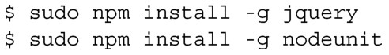
请注意，你可能需要通过设置NODE_PATH环境变量，告诉执行环境在哪找到系统中的Node.js库。在Linux或者Mac中，在～/.bashrc文件中添加下面的内容就行了：

这将确保每次打开新的终端会话时，都会设置NODE_PATH<a class="my_markdown" href="['#anchor7']">[7]</a>。现在已经安装了Node.js、jQuery和nodeunit，我们来准备要测试的模块。

B.4 创建测试集

使用第6章中的已知数据（多亏Fake模块）和精心定义的API，我们已经具备了成功测试Model的所有要素。图B-5演示了我们测试Model的计划<a class="my_markdown" href="['#anchor8']">[8]</a>。

在可以开始测试之前，需要让Node.js来加载模块。接下来就做这一工作。

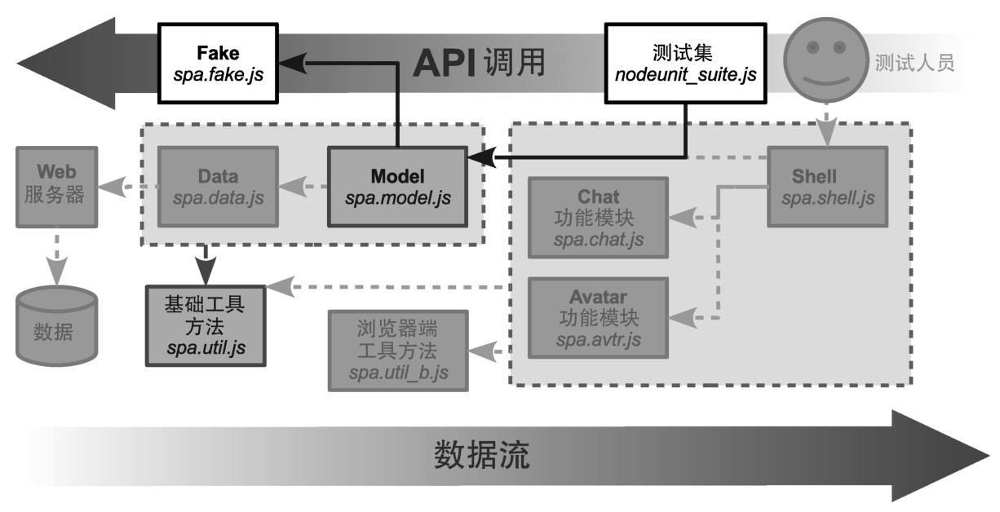
B.4.1 使用 Node.js 加载模块

Node.js处理全局变量的方式和浏览器不同。不像浏览器中的JavaScript，Node.js文件中的变量默认就是局部的。实际上，Node.js把所有的库文件封装在一个匿名函数里面。让变量跨模块可用的方法是，把它作为一个顶级对象的属性。Node.js 中的顶级对象不是浏览器中的window对象，它叫做——且听我说——global。

我们设计的模块，是用在浏览器中的。但它们设计精巧，只需些许修改，就可以在Node.js 中使用。我们是这么做的：整个应用运行在单个名字空间（对象）spa 中。所以如果在加载模块之前，在Node.js测试脚本中声明一个global.spa属性，那么所有的事情都会按预期工作。

现在，在一切东西从我们的短期记忆中消失之前，我们来开始编写测试集webapp/public/nodeunit_suite.js，如代码清单B-4所示。

代码清单B-4 在测试集中声明名字空间——webapp/public/nodeunit_suite.js

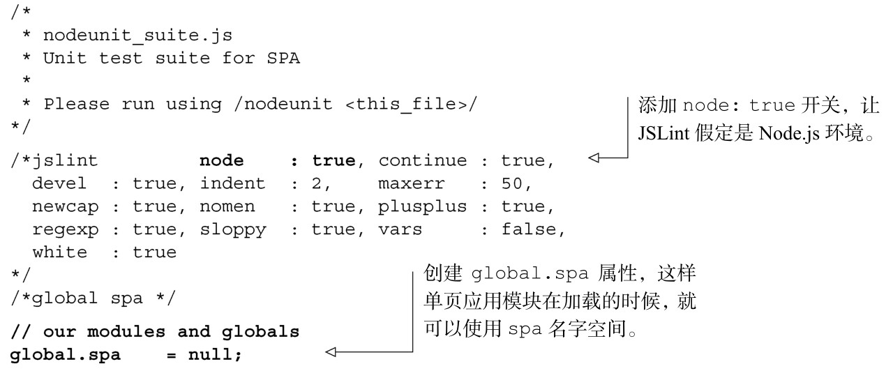
我们只需修改根JavaScript文件（webapp/public/js/spa.js），就可以完成模块的加载。修改后允许测试集使用正确的全局spa变量，如代码清单B-5所示。更改部分以粗体显示。

代码清单B-5 修改单页应用的根JavaScript 文件——webapp/public/js/spa.js

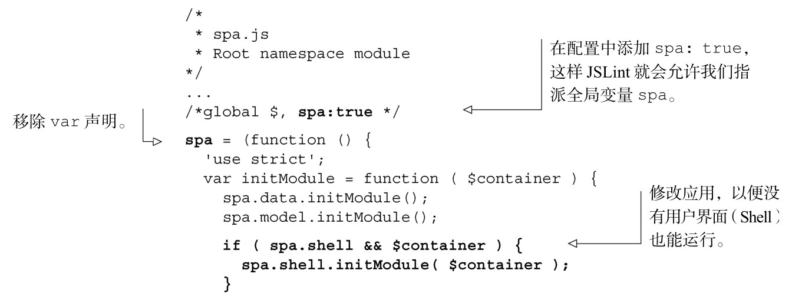
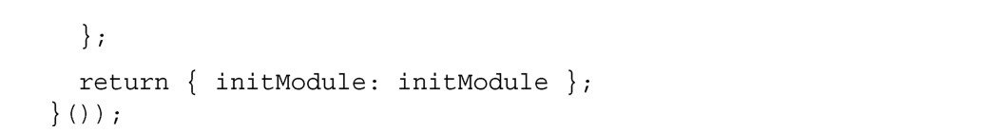
现在已经创建了global.spa变量，我们可以加载模块了，和在浏览文档中的做法很像（webapp/public/spa.html）。首先加载第三方模块，像jQuery和TaffyD B，并确保它们的全局变量也是可用的（如果一定想知道的话，它们是 jQuery、$和 TAFFY）。然后加载jQuery 插件，再然后是单页应用的模块。我们不会加载 Shell 和功能模块，因为测试 Model时不需要它们。当这些想法仍旧在我们的意识中逗留的时候，我们来更新单元测试文件，如代码清单B-6所示。更改部分以粗体显示。

代码清单B-6 添加库和模块——webapp/public/nodeunit_suite.js

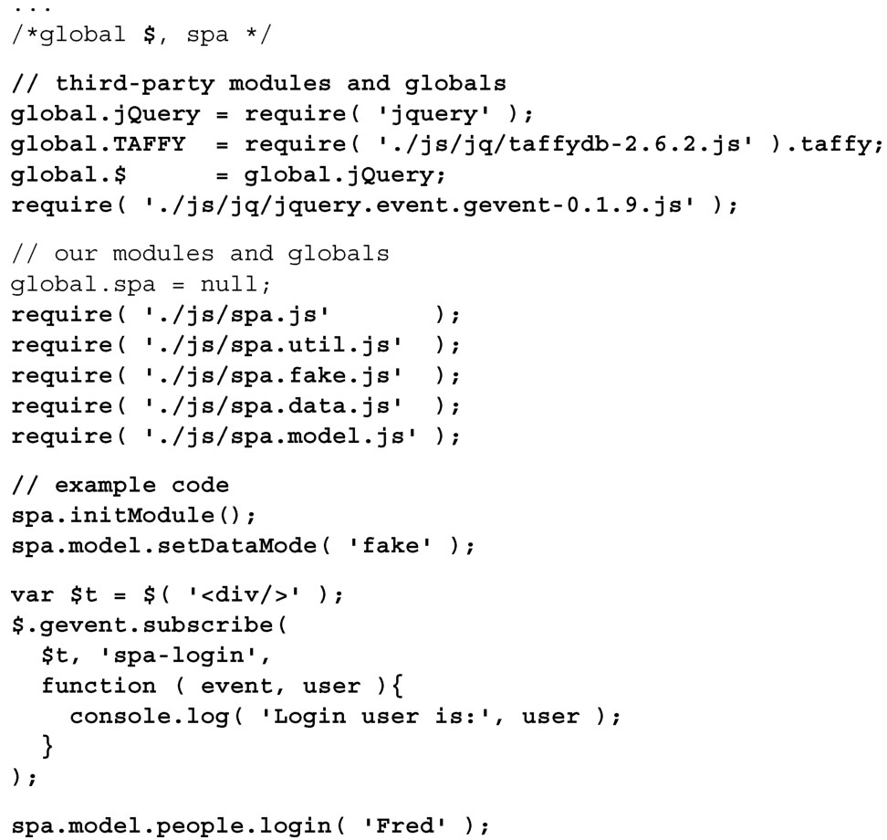
我们在代码清单的最后还颇具野心地偷偷写了个很简短的测试脚本。尽管希望最后使用nodeunit来运行这个文件，我们首先使用Node.js来运行这个文件，确保它正确地加载了库。事实上，当使用Node.js运行测试集的时候，我们看到的内容是这样的：

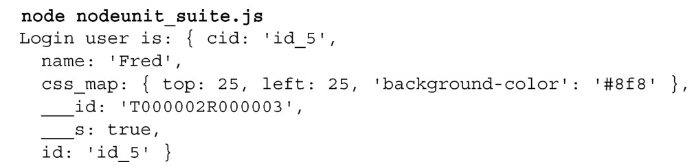
如果你正在运行示例，请耐心等待。在看到输出之前需要花费三秒钟，因为 Fake 模块在完成登入请求之前，会暂停这么长的时间。在输出内容后，还需要花费八秒钟时间，以便Node.js结束运行。这是因为Fake模块在模拟服务器的时候，使用了计时器（计时器是用setTimeout和setInterval方法创建的）。在这些计时器完成之前，Node.js会认为程序“正在运行”，不会退出。之后我们还会讨论这个问题。现在先熟悉一下nodeunit。

B.4.2 创建单个 nodeunit 测试

现在Node.js已经加载了库文件，我们可以专注于创建nodeunit测试。首先我们来熟悉一下nodeunit。运行成功测试的步骤如下。

声明测试函数。

在每个测试函数中，使用test.expect(<count>)告诉test对象，预期有多少个断言（assertion）。

在每个测试中运行断言，比如test.ok( true );。

在每个测试的最后，使用test.done()告诉test对象，测试已完成。

导出按顺序运行的测试结果清单。每个测试都是在前面的测试完成后才开始运行的。

使用nodeunit<filename>，运行测试集。

代码清单B-7演示了使用上面这些步骤创建单个测试的nodeunit脚本。请阅读注释，它们提供了有用的见解。

代码清单B-7 第一个nodeunit 测试——webapp/public/nodeunit_test.js

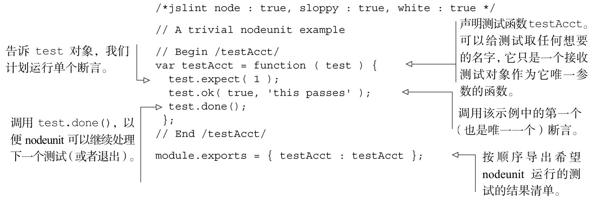
当运行nodeunit nodeunit_test.js 时，会看到下面的输出信息：

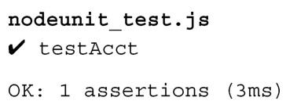
现在我们结合nodeunit的经验，对想要测试的代码进行测试。

B.4.3 创建第一个真实的测试

现在我们将把第一个测试示例转换成真实的测试。可以使用nodeunit和jQuery的Deferred对象，避开测试事件驱动代码的陷阱。首先，我们依赖这一事实：只有当前一个测试通过执行test.done()来声明它已完成时，nodeunit才会继续运行新的测试。这样测试就更容易编写和理解。其次，可以使用jQuery中的Deferred对象，只有在所需的单页应用的登入事件发布之后，才调用test.done()。然后让脚本继续运行下一个测试。我们来更新测试集，如代码清单B-8所示。更改部分以粗体显示。

代码清单B-8 第一个真实的测试——webapp/public/nodeunit_suite.js

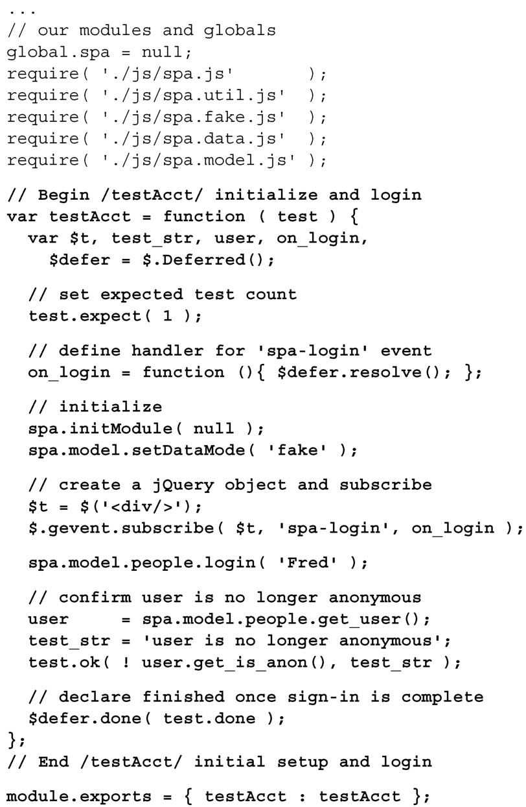
当运行nodeunit nodeunit_suite.js 时，我们会看到以下输出信息：

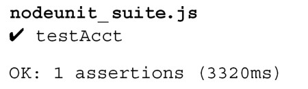
现在已经成功实现了单个测试，我们来制定出希望出现在测试集中的测试，并讨论如何确保按正确的顺序来执行这些测试。

B.4.4 映射事件和测试

在第5章和第6章中手动测试Model时，在输入下一个测试之前，自然而然会等待某个处理过程的完成。这对人类是显而易见的：在可以测试消息传输之前，必须等到登入成功为止。但对测试集来说却不用这样。

我们必须制定事件和测试的序列，以便测试集顺利地运行。编写测试集的一个好处是，它可以让我们更全面地分析和理解代码。有时候与运行测试相比，编写测试可以发现更多的bug。

我们先设计测试集的测试计划。把虚构用户 Fred 当作测试 Model，通过他来对整个单页应用进行测试。下面是想让Fred做的事情（附带标签）。

testInitialState——测试Model的初始状态。

loginAsFred——登入Fred，在登入完成前测试用户对象。

testUserAndPeople——测试在线用户列表和用户详情。

testWilmaMsg——接收来自Wilma的消息并测试消息详情。

sendPebblesMsg——把听者更改为Pebbles，并向她发送消息。

testMsgToPebbles——测试发送给Pebbles的消息内容。

testPebblesResponse——测试Pebbles发送的响应消息内容。

updatePebblesAvtr——更新Pebbles的头像数据。

testPebblesAvtr——测试更新Pebbles的头像。

logoutAsFred——登出Fred。

testLogoutState——在登出之后，测试Model的状态。

我们的测试框架和nodeunit，会按上面显示的顺序来运行测试，只有在前面的测试声明它已完成时，才会继续运行下一个测试。这种机制对我们有利，因为我们想确保在运行某个测试之前，特定的事件已经发生。比如，在测试在线用户列表之前，我们希望发生用户登入事件。我们来制定测试计划，包括在继续每个测试之前需要发生的事件，如代码清单 B-9 所示。请注意，测试名称和我们计划中的标签正好匹配，它们是给人阅读的。

代码清单B-9 详细描述包含阻塞事件的测试计划

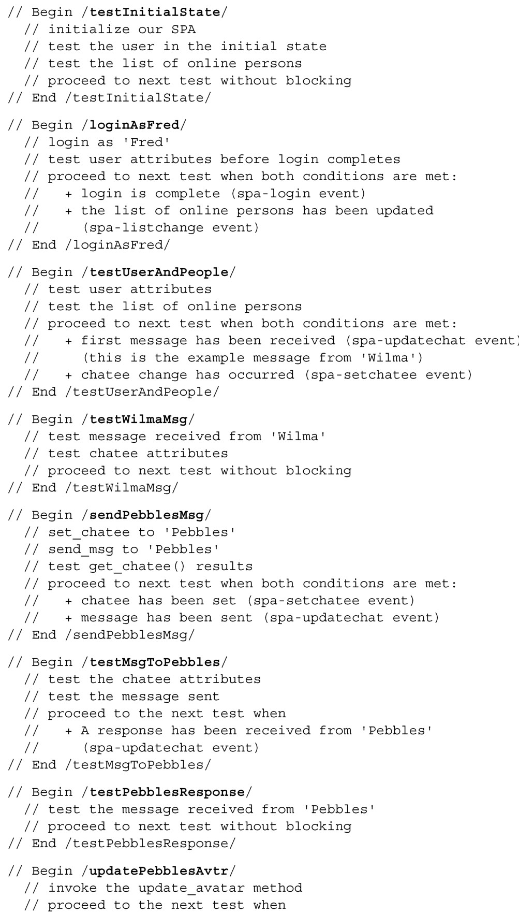
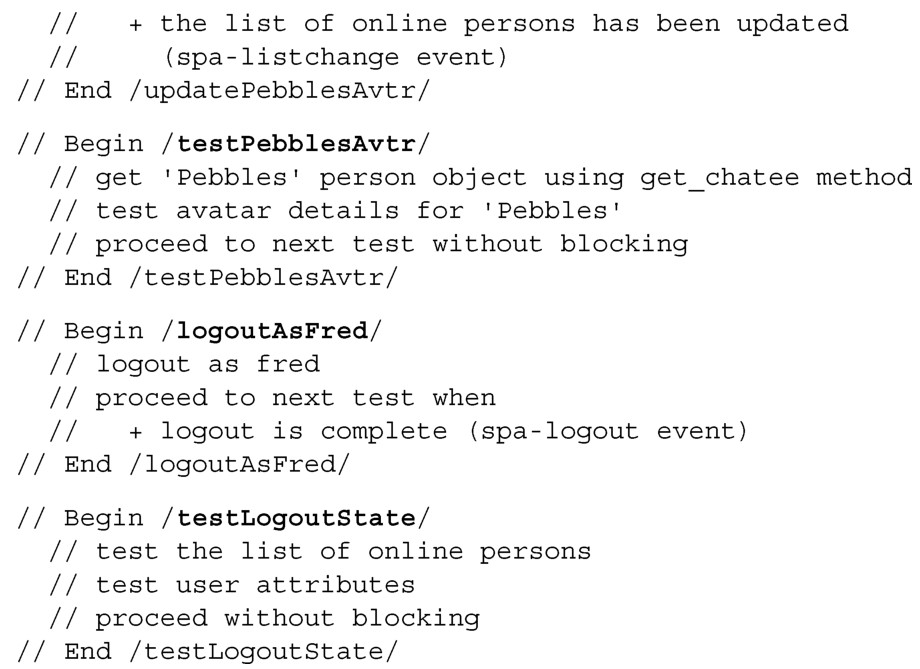
这个计划是线性的，容易理解。在下一节中，我们将实现这个计划。

B.4.5 创建测试集

现在可以添加一些工具方法，逐渐地向测试集中添加测试。为了检查进展，每一步我们都会运行测试集。

1．添加初始化状态和登入的测试

我们会先在测试集中编写一些工具方法，添加三个测试：检查Model的初始状态，让Fred登入，然后检查用户和人员列表属性。我们发现这些测试通常分为以下两类。

（1）验证测试：许多断言（像 user.name === 'Fred'）用来检查程序数据的正确性。这些测试通常不会阻塞。

（2）控制测试：会执行操作，像登入、发送消息或者更新头像。这些测试很少有很多的断言，并且经常会阻塞进程，直到基于事件的条件满足为止。

我们发现最好是拥抱这种自然的划分，相应地命名测试。验证测试命名为test<something>，控制测试根据它们所做的事件进行命名，像loginAsFred。

loginAsFred测试需要完成登入，在允许nodeunit继续运行testUserAndPeople测试之前，需要更新在线用户列表。这是通过让 jQuery 集合$t 绑定 spa-login 和spa-listchange事件处理程序来完成的。测试集使用jQuery的Deferred对象来确保这些事件发生在loginAsFred执行test.done()之前。

我们来更新测试集，如清单B-10所示。像往常一样，请阅读包含了额外信息的注释。代码清单B-9是为测试计划创建的注释，更改部分以粗体显示。

代码清单B-10 添加前两个测试——webapp/public/nodeunit_suite.js

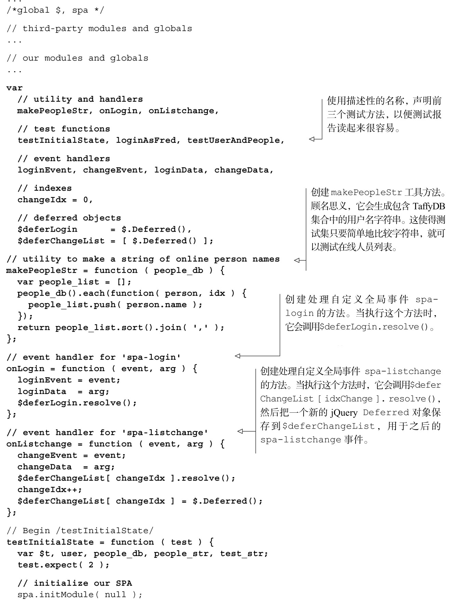
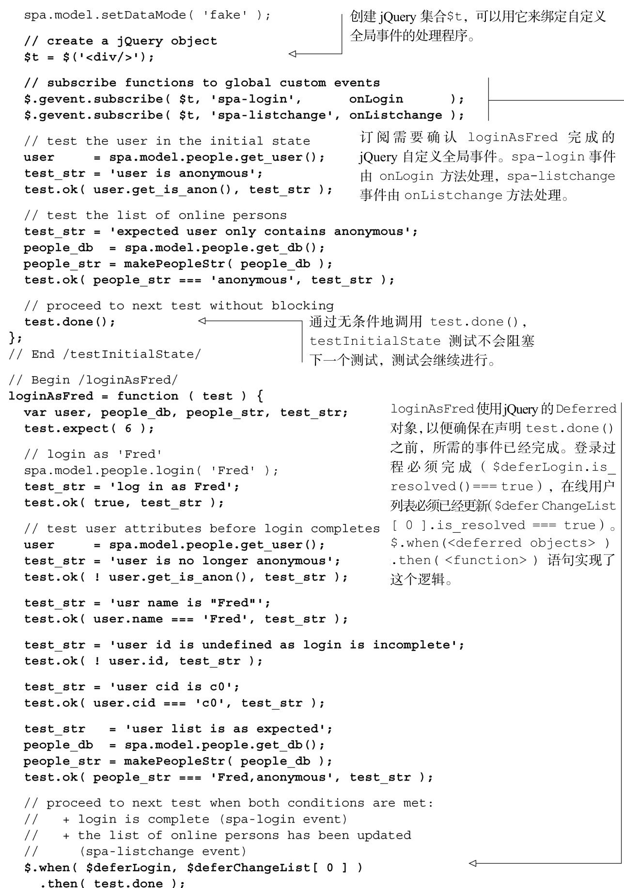
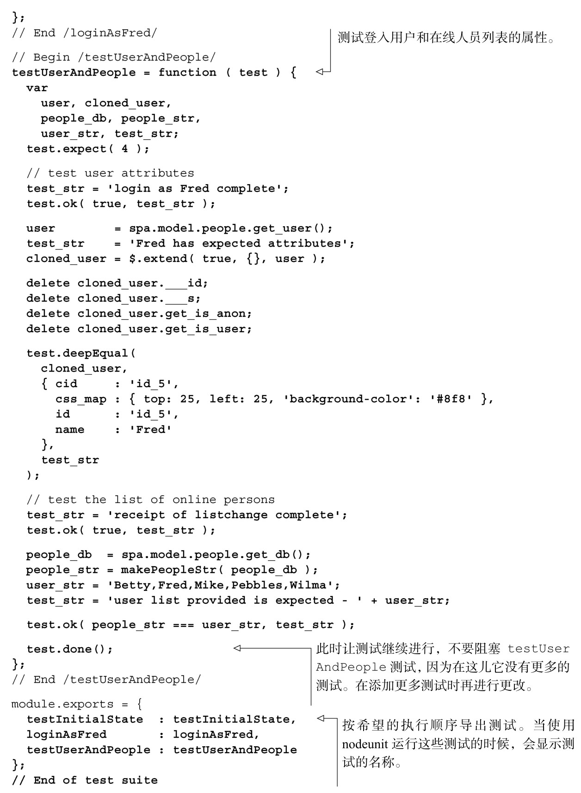
当运行测试集时（nodeunit nodeunit_suite.js），会看到以下输出信息：

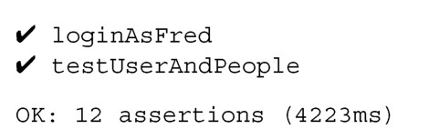
在可以操作控制台之前，测试集花费了大约12秒钟时间，因为JavaScript需要等待激活计时器（active timer）的完成。不用担心这事，在完成测试集的时候就不会有这个问题了。现在我们来添加消息处理的测试。

2．添加消息处理的测试

现在我们将添加测试计划中接下来的4个测试。这些测试是很好的逻辑组合，因为它们全部都在测试发送和接收消息的问题。测试包括testWilmaMsg、sendPebblesMsg、testMsgToPebbles和testPebblesResponse。我们觉得这些名字很好地概括了每个测试是干什么的。

在添加测试时，我们需要更多的jQuery Deferred对象，以便确保测试的连续执行。代码清单B-11演示了这一实现。请阅读注释，它们详细描述了如何完成对新测试的阻塞。所有的更改以粗体显示。

代码清单B-11 添加消息处理的测试——webapp/public/ nodeunit_suite.js

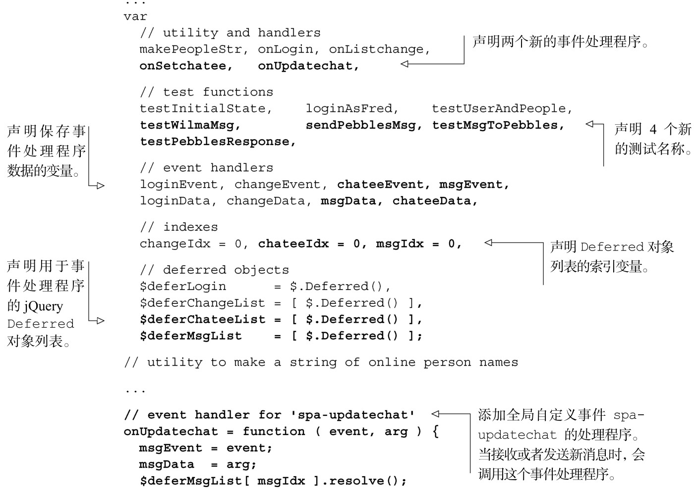
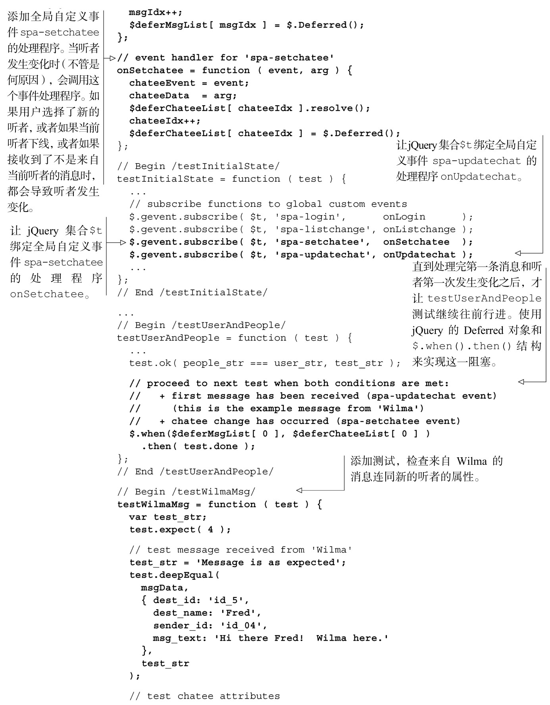
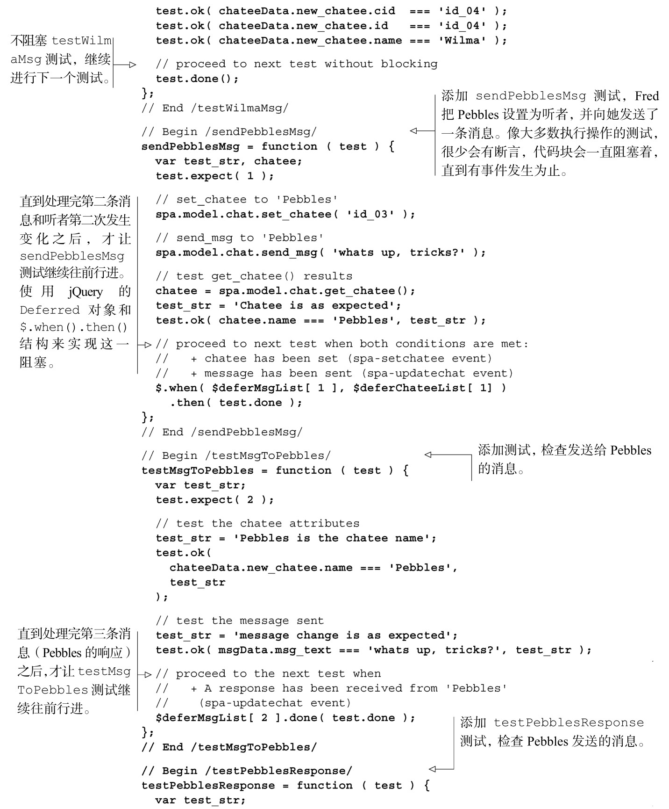
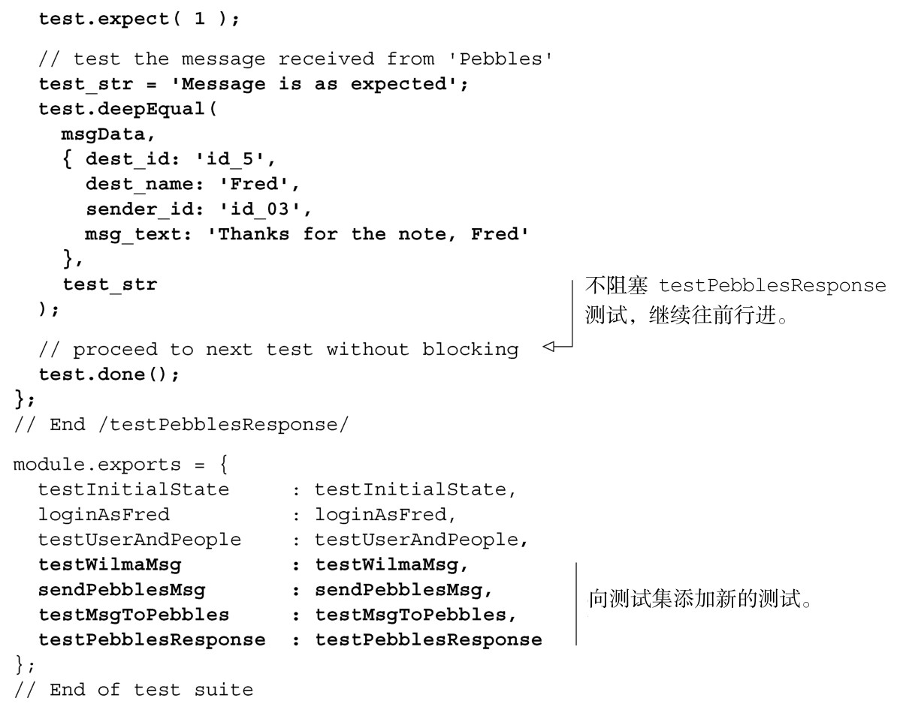
当运行测试集时（nodeunit nodeunit_suite.js），会看到以下输出信息：

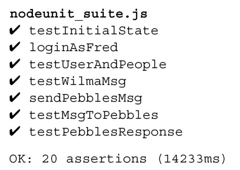
从运行测试集到返回至控制台，花费的时间和前面的一样长，但现在我们看到了新的测试。具体来说，现在测试集会先等待，然后测试 Wilma 发送给用户的消息。现在我们来添加更多的测试，从而完成测试集的编写。

3．添加头像、登出和登出状态的测试

现在我们将添加计划中剩余的4个测试，从而完成测试集的编写。我们还是使用Deferred对象，以便确保在允许从这一个测试行进到另一个测试之前，接收了某些事件。代码清单B-12演示了附加的测试。更改部分以粗体显示。

代码清单B-12 附加测试——webapp/public/nodeunit_suite.js

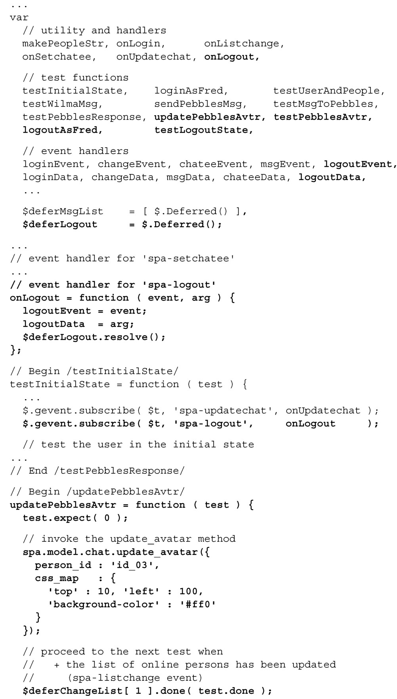
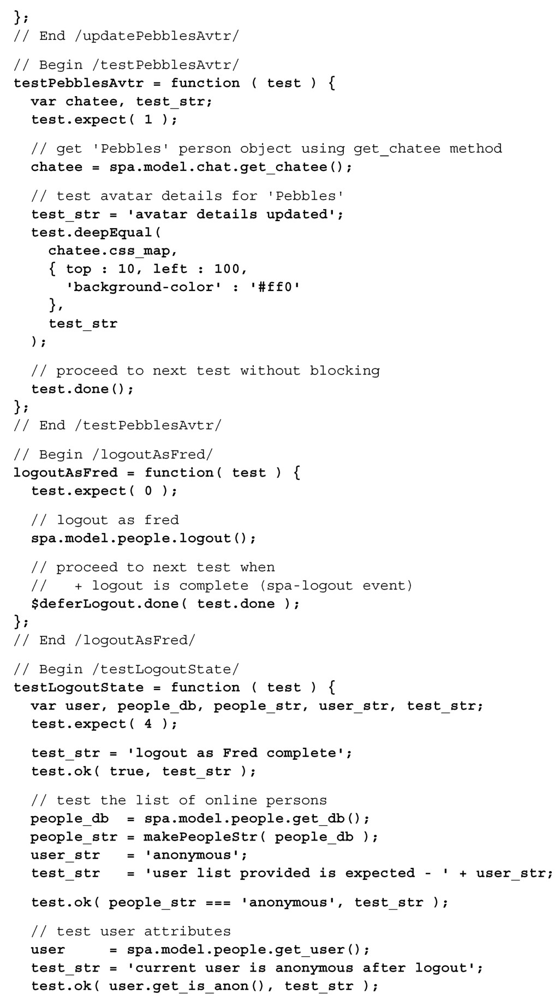
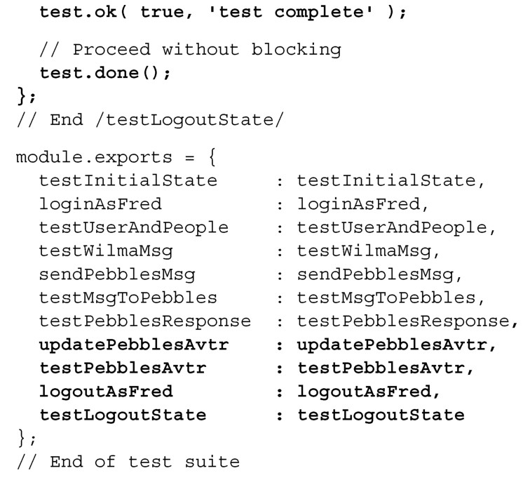
当运行测试集时（nodeunit nodeunit_suite.js），会看到以下输出信息：

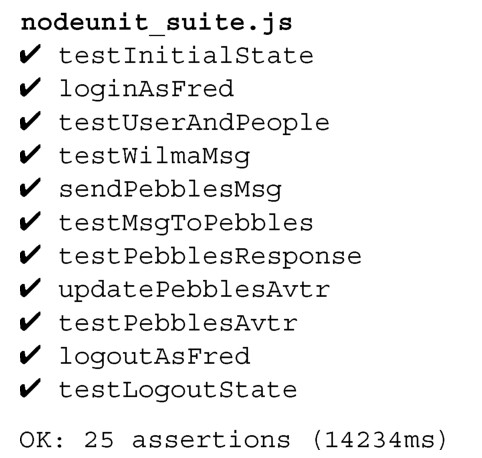
根据计划，我们已经完成了测试集的编写。在更新至代码库之前（回想一下“提交钩子”），可以自动地运行这个测试集。这种做法并不会延缓我们的步伐，而是会防止回归和保证质量，从而加快我们的开发进度。这是产品质量设计的示例，而不是产品测试的“完成”。

还剩下一个很耀眼的问题：当前的测试集一直没有退出。当然，终端显示已经完成了25个断言，但是控制权一直没有返回给终端和其他调用进程。这阻止了测试集的自动运行。在下一节，我们将会讨论为什么会发生这种情况，以及我们对此能做什么事情。

B.5 修改单页应用模块，以便测试

Node.js（和与之相关的nodeunit）遇到的一个麻烦问题是：它如何知道什么时候测试集运行完了？这是计算机科学中经典的停机问题<a class="my_markdown" href="['#anchor9']">[9]</a>的例子，这在所有的事件驱动语言中是很重要的。一般来说，当Node.js发现没有代码可以执行和没有待处理的事务时，就会认为应用程序已完成运行。

到目前为止，我们的代码被设计成连续使用，除了关闭浏览器标签以外，没有考虑退出的条件。当测试人员使用模式2（在浏览器中使用伪造数据进行测试）并登出的时候， Fake模块会启动setTimeout方法，期待另外用户的登入。

我们的测试集，像某些类型的电影，需要明确的结束。因此，如果我们打算看到测试集结束的终止信号（SIGTERM）或者终止进程（SIGKILL），需要使用测试设置（testsetting）<a class="my_markdown" href="['#anchor10']">[10]</a>。测试设置是一种配置或者测试所需的指令，但“线上产品”不需要使用。

正如你所料，我们宁愿不需要什么测试设置，这样就能阻止它们引入它们自己的bug。有时候，它们也是不可避免的。在这种情况下，我们需要测试设置来停止Fake模块不断地产生计时器。这将允许测试集退出，这样就可以使用脚本自动运行测试集并解释结果。

可以执行下面的步骤，阻止Fake模块在登出之后重新启动计时器。

在测试集中，在登出调用方法中添加true参数，像这样：spa.model.people (true)。这个指令（我们叫做do_not_reset 标志）会通知Model，在登出之后，我们不希望它重置值然后为其他人的登入做好准备。

在Model的spa.model.people.logout方法中，接收可选的do_not_reset参数。把这个值作为单个参数传递给chat._leave方法。

在Model的spa.model.chat._leave方法中，接收可选的do_not_reset参数。在向后端发送leavechat消息时，把这个值作为数据传递给后端。

更改Fake（webapp/public/js/spa.fake.js）模块，确保leavechat回调函数把接收到的数据当作do_not_reset标志。当leavechat回调函数看到接收到的数据的值为true时，它就不会在登出后重新启动计时器。

虽然这比我们希望的工作多很多（我们追求的是没有额外的工作），但是这只需要对3 个文件进行微小的修改。先修改测试集，然后向登出方法调用中添加 do_not_reset指令，如代码清单B-13所示。添加的一个单词显示为粗体。

代码清单B-13 在测试集中添加do_not_reset 指令——webapp/public/nodeunit_suite.js

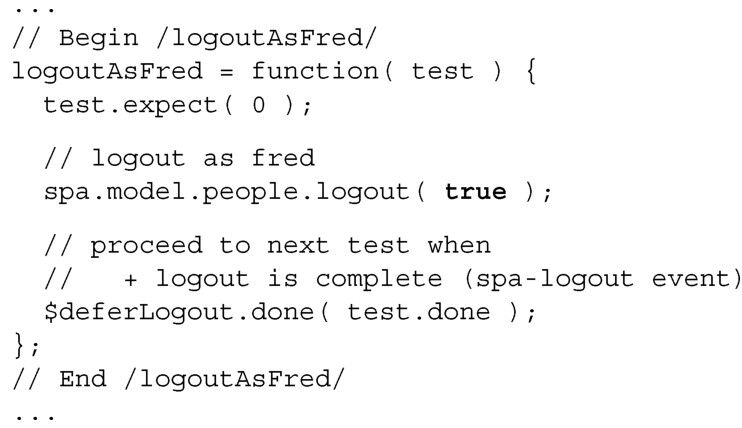
现在我们在Model中添加do_not_reset参数，如代码清单B-14所示。更改部分以粗体显示。

代码清单B-14 在Model 中添加do_not_reset 指令——webapp/public/js/spa.model.js

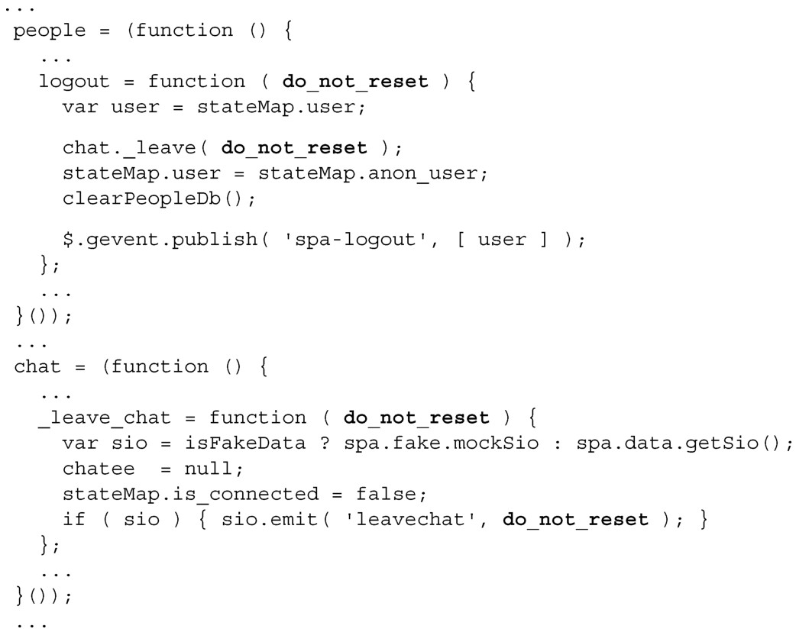
最后我们来更新Fake模块，当发送leavechat消息时，需要考虑do_not_reset指令，如代码清单B-15所示。更改部分以粗体显示。

代码清单B-15 在Fake 模块中添加do_not_reset 指令——webapp/public/js/spa.fake.js

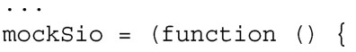
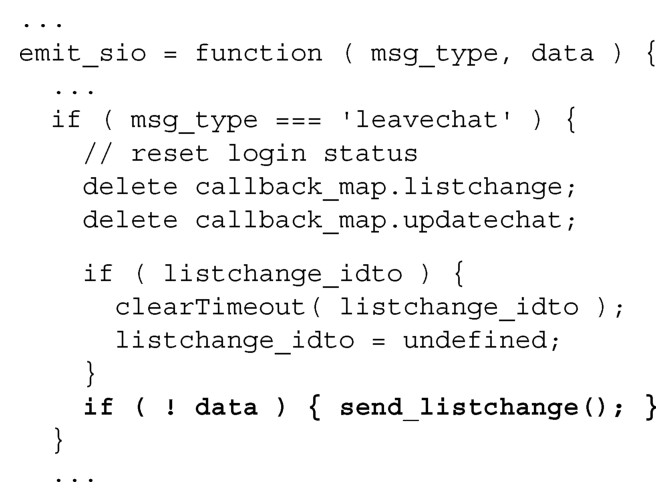
更新完之后，可以运行nodeunit nodeunit_suite.js，观察测试集的运行和退出：

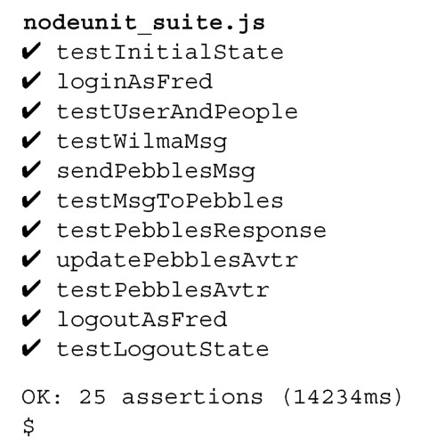
测试集的退出码<a class="my_markdown" href="['#anchor11']">[11]</a>是断言失败的次数。因此，如果所有的测试都通过了，退出码是0（在Linux和Mac上，使用echo $?可以查看退出码）。脚本可以利用这个退出状态（以及其他输出）来做些事件，比如阻止构建的部署，或者是向相关的开发人员或者项目经理发送邮件。

B.6 小结

测试是帮助我们更快和更好地开发的手段。一个运行良好的项目，从一开始就有多种测试模式的设计，编写测试代码，有助于快速有效地诊断和解决问题。几乎每个人都会在某个项目中工作一段时间，其中的每一个进步似乎都有与之对应的失败产物，而这些失败的产物以前是可以工作的。一致的、早期的和精心设计的测试，可以防止回归和加快开发进度。

本附录演示了4种测试模式，讨论了如何创建它们以及何时使用它们。我们选择了nodeunit作为我们的测试框架。我们不需要使用Web浏览器就能测试Model。当创建测试集时，我们使用jQuery的Deferred对象和测试指令，确保测试按正确的顺序运行。最后，演示了如何修改模块，以便可以在测试环境中成功地运行测试。

希望我们的介绍对你有所启发，并能给你带来灵感。快乐地测试吧！

注　释

<a class="my_markdown" href="['#ac1']">[1].“帮你把脚弄湿（get your feet wet）”的意思是“带你入门”。——译者注</a>

<a class="my_markdown" href="['#ac2']">[2]. 如果你一定要知道的话，它们是：（1）在登出的时候，在线人员列表没有正确地清除；（2）在听者的头像被更新后，调用spa.model.chat.get_chatee()会返回过时的对象。这两个bug都已经在第6章中修复。</a>

<a class="my_markdown" href="['#ac3']">[3].是的，我们知道解析查询参数是临时技巧。在线上环境中，我们会使用更健壮的程序库。</a>

<a class="my_markdown" href="['#ac4']">[4]. 详细清单请参见https://github.com/joyent/node/wiki/modules#wiki-testing。</a>

<a class="my_markdown" href="['#ac5']">[5]. BDD（behaviour driven development），行为驱动开发。——译者注</a>

<a class="my_markdown" href="['#ac6']">[6]. 无头浏览器（headless browser），即没有用户界面的浏览器。可以和普通浏览器一样访问页面，但是给其他程序使用的。——译者注</a>

<a class="my_markdown" href="['#ac7']">[7]. 若只针对当前运行的终端会话有效，请输入exportPATH=/usr/lib/node_modules。取决于Node.js是如何安装的，路径可能会不同。在Mac上，你可以试一下/usr/local/share/npm/lib/node_modules。</a>

<a class="my_markdown" href="['#ac8']">[8]. 有心的读者会注意到这张图是先前显示过的一张图的完美复制品，每个像素都一样，会说我们偷懒了。真希望我们是按书稿的长度来获得报酬的……</a>

<a class="my_markdown" href="['#ac9']">[9]. 通俗的说，停机问题（halting problem）就是判断任意一个程序是否会在有限的时间之内结束运行的问题。更多信息请参考http://zh.wikipedia.org/wiki/停机问题。——译者注</a>

<a class="my_markdown" href="['#ac10']">[10]. 清楚地说明一下：我们需要退出这个程序，因为自动化提交钩子会依赖对退出代码的分析。没有退出，意味着没有退出代码，这意味着没有自动化，这当然是无法接受的。</a>

<a class="my_markdown" href="['#ac11']">[11]. 退出码（exit code），也叫退出状态（exit status），在计算机领域中指一个子进程（或被调用方）运行结束时向其父进程（或调用方）返回的一个相对小的值。在Windows中的命令提示符中，可以使用echo %errorlevel%查看退出码。更多信息请参见http://zh.wikipedia.org/wiki/退出状态。——译者注</a>

