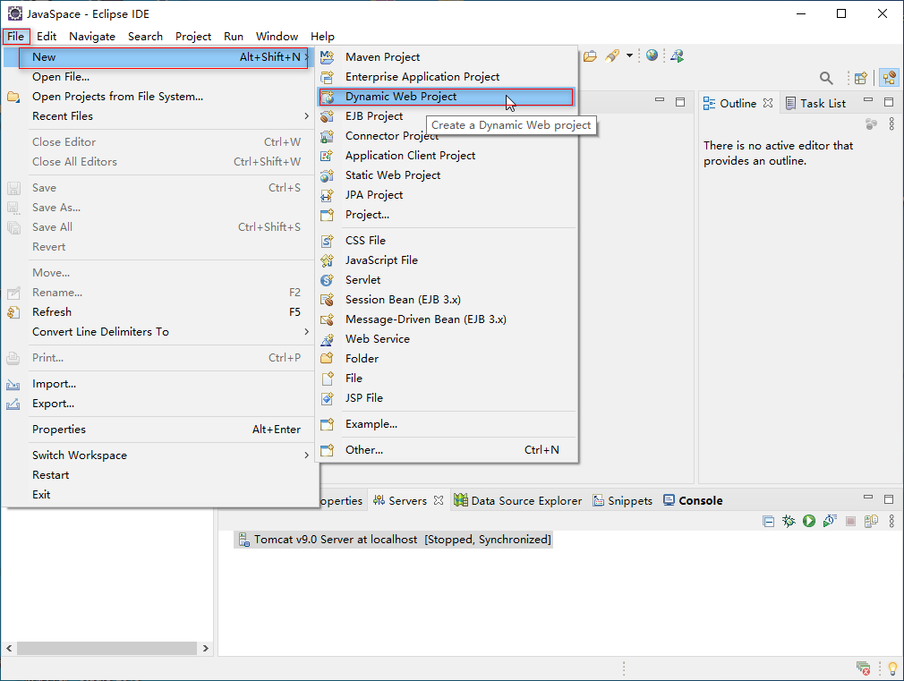
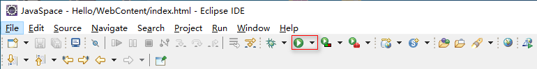
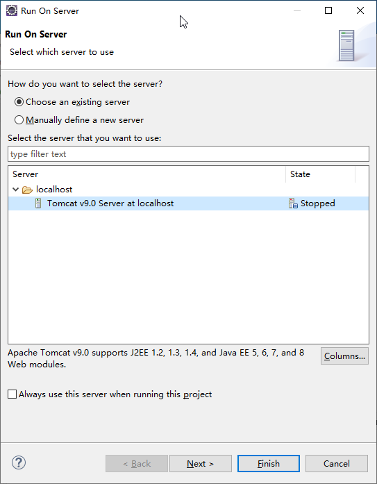

> 注意：要在 Eclipse 中创建 JavaWeb 项目，需要先再 Eclipse 中添加 Tomcat 服务，具体添加方法请参阅《[Eclipse配置Tomcat](../../Common/Eclipse配置Tomcat.md)》。

1. 选择 `File` -> `New` -> `Dynamic Web Project`。

   

2. 在弹出的对话框中，在 Project name 输入框中输入项目名，点击 `Finish` 按钮即可。

3. 在项目中 WebContent 目录下创建 index.html 文件。

   ```html
   <!DOCTYPE html>
   <html>
   <head>
   <meta charset="UTF-8">
   <title>Insert title here</title>
   </head>
   <body>
   	<h1>Hello World!</h1>
   </body>
   </html>
   ```

4. 点击运行按钮。

   

5. 在弹出的对话框中选择 Tomcat 服务器，然后点击 `Finish` 按钮即可运行 JavaWeb 应用了。

   

6. 打包 JavaWeb 项目

   在项目名上，右击选择 `Export` -> `WAR File` 菜单，可以将 JavaWeb 项目打包成 war 文件，将该文件发布到 webapps 目录下，Tomcat 会在启动时自动解压 war 包。