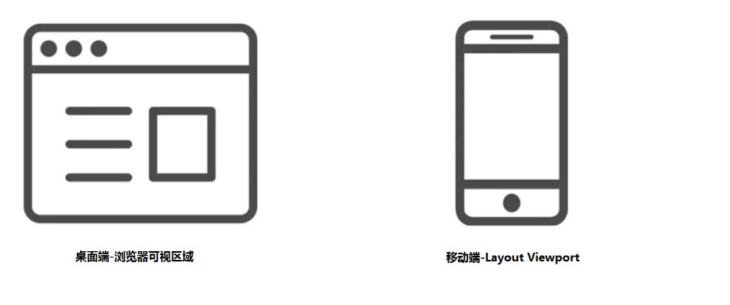
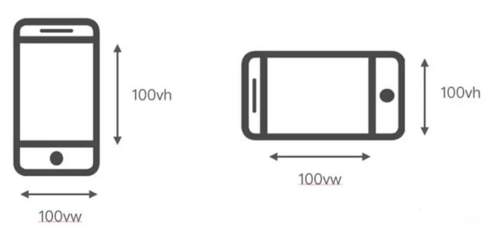

<center><font size="5"><b>vw、vh自适应布局单位解释</b></font></center>

**视口单位(Viewport units)**

什么是视口？ 

在PC端，视口指的是在PC端，指的是浏览器的可视区域；

而在移动端，它涉及3个视口：Layout Viewport（布局视口），Visual Viewport（视觉视口），Ideal Viewport（理想视口）。

视口单位中的“视口”，PC端指的是浏览器的可视区域；移动端指的就是Viewport中的Layout Viewport。

 根据[CSS3规范](https://drafts.csswg.org/css-values-3/#viewport-relative-lengths)，视口单位主要包括以下4个：

   1.vw：1vw等于视口宽度的1%。

   2.vh：1vh等于视口高度的1%。

   3.vmin：选取vw和vh中最小的那个。

   4.vmax：选取vw和vh中最大的那个。

 vh and vw：相对于视口的高度和宽度，而不是父元素的（CSS百分比是相对于包含它的最近的父元素的高度和宽度）。1vh 等于1/100的视口高度，1vw 等于1/100的视口宽度。

比如：浏览器高度950px，宽度为1920px, 1 vh = 950px/100 = 9.5 px，1vw = 1920px/100 =19.2 px。

vmax相对于视口的宽度或高度中较大的那个。其中最大的那个被均分为100单位的vmax。

vmin相对于视口的宽度或高度中较小的那个。其中最小的那个被均分为100单位的vmin。



**vh/vw与%区别**



请看下面简单的例子：

```html
<!DOCTYPE html>
<html lang="en">

<head>
    <meta charset="UTF-8">
    <meta name="viewport" content="width=device-width, initial-scale=1.0">
    <meta http-equiv="X-UA-Compatible" content="ie=edge">
    <title>VW&VH</title>
</head>
<style>
    * {
        padding: 0;
        margin: 0
    }

    .left {
        float: left;
        width: 50vw;
        height: 20vh;
        background-color: blue;
        text-align: center;
        line-height: 20vh;
        font-size: 3rem
    }

    .right {
        float: right;
        width: 50vw;
        height: 20vh;
        background-color: green;
        text-align: center;
        line-height: 20vh;
        font-size: 3rem
    }
</style>

<body>
    <div class="left">left</div>
    <div class="right">right</div>
</body>

</html>
```


 