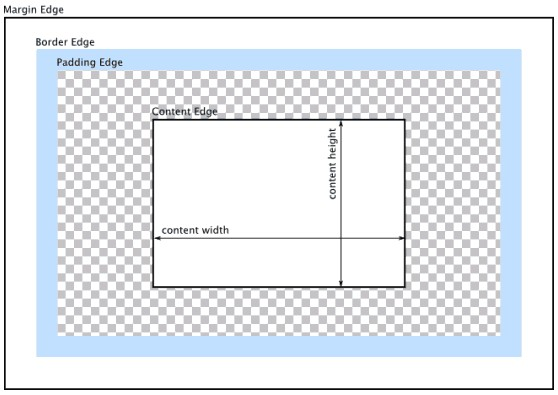
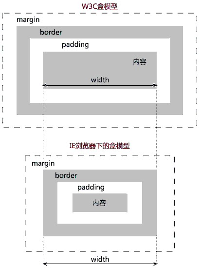

<center><font size="5"><b>关于 box-sizing 属性的理解</b></font></center>

##### 一、盒子模型

`CSS` 盒子模型有四条边：外边距边（margin)、内边框边(border)，内填充边（padding）、内容边（content)，四条边由内到外吧它划分为四个区域：内容区域、内边距区域、边框区域和外边距区域。



- **内容区域（content area** ）是包含元素真实内容的区域。
- **内边距区域（padding area）** 延伸到包围padding的边框。如果content area设置了背景、颜色或者图片，这些样式将会延伸到padding上。
- **边框区域（border area** ）是包含边框的区域，扩展了内边距区域。
- **外边距区域（****margin area）**用空白区域扩展边框区域，以分开相邻的元素。

通过CSS属性（width、height、padding、border和margin）来控制它们的尺寸。

##### 二、box-sizing

**1. box-sizing 的值**

```css
box-sizing: content-box|border-box|inherit;
```

| 值          | 描述                                                         |
| ----------- | ------------------------------------------------------------ |
| content-box | 这是由 CSS2.1 规定的宽度高度行为。宽度和高度分别应用到元素的内容框。在宽度和高度之外绘制元素的内边距和边框。 |
| border-box  | 为元素设定的宽度和高度决定了元素的边框盒。就是说，为元素指定的任何内边距和边框都将在已设定的宽度和高度内进行绘制。通过从已设定的宽度和高度分别减去边框和内边距才能得到内容的宽度和高度。 |
| inherit     | 规定应从父元素继承 box-sizing 属性的值。                     |

微信小程序默认是 content-box。

**2. box-sizing  的作用**

box-sizing的作用就是告诉浏览器，使用的盒子模型是 W3C 盒子模型（content-box），还是 IE 盒子模型（border-box）。

a. 当 box-sizing 的值为 content-box （默认值）时，其尺寸计算公式为：

```
width = content_width
height = content_height
```

b. 当box-sizing 的值为 border-box 时，其尺寸计算公式为：

```
width = content_width + padding_left + padding_right + border_left_width + border_right_width
height = content_height + padding_top + padding_bottom + border_top_width + border_bottom_width
```



> IE6、IE7 为 W3C 盒子模型。

**3. 对于 box-sizing 属性值的选择**

在项目里，究竟该使用哪种盒模型？我也不知道啊

在MDN上有这样一句话：

> Some experts recommend that web developers should consider routinely applying box-sizing: border-box to all elements.
>
> 一些专家甚至建议所有的Web开发者们将所有的元素的 box-sizing 都设为 border-box。

Twitter的开源框架Bootstrap3就全局设置了box-sizing: border-box，由此可见IE盒模型的是比较受欢迎的。

>补充：
>
>W3C在CSS3中，加入了 calc() 函数。
>
>CSS函数`calc()`可以用在任何一个需要``、``, ``、``、``、或``的地方。有了`calc()，`你就可以通过计算来决定一个CSS属性的值了。
>
>```
>/* property: calc(expression) */
>width: calc(100% - 80px);
>```
>
>使用 calc() 函数，我们可以在 content-box 里实现 border-box，相对的，在 border-box 里实现 content-box 也是可以的。