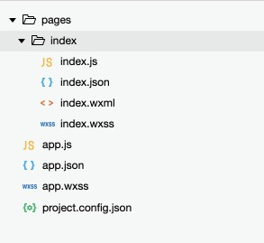

<center>
  <font size="5">
  	<b>”徒手“创建小程序</b>
  </font>
</center>

1. 创建项目目录

这里以 `E:\weixin\ManualCreateApp` 为例。

2. 按下图所示的目录结构创建文件



3. 打开 app.json ，写入以下代码（**json文件中是不能包含注释的，下面的注释在代码中需要去掉**）：

```json
{
  "pages": [
    /* 指定默认启动页面地址 */
    "pages/index/index"
  ]
}
```

4. 打开 index.wxml，写入以下代码：

```xml
<view bindtap="countClick">我是 index 页面，你点击了 {{count}} 次</view>
```

5. 打开 index.js 文件，写入以下代码：

```javascript
Page({
  data: {
    count: 0
  },
  countClick: function() {
    this.setData( {
      count: this.data.count + 1
    })
  },
})
```

6. 打开微信开发者工具，填写 `AppId` 和项目名称，点击`选择`按钮添加项目，项目目录选择刚才创建的目录 ``E:\weixin\ManualCreateApp` ，点击`添加项目` 完成添加。