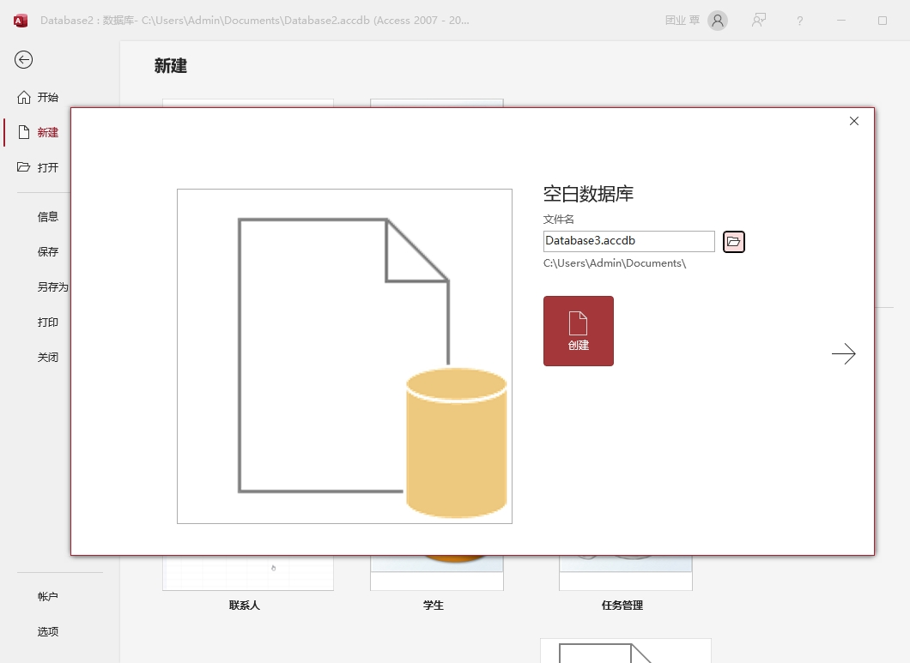

要从头创建一个新数据库，可以按照以下步骤进行操作：

（1）点击 "文件" 菜单，然后点击 "新建" 按钮；

（2）在屏幕右边点击 "空白数据库" 项，然后再弹出的对话框的文件名输入框中输入新数据库的名称；

（3）单击 "浏览" 图标，选择放置数据库的文件路径；

（4）单击 "确定" 按钮关闭浏览窗口；

（5）单击 "创建" 按钮。

> 注意：数据库的名称需要遵循以下规则：
>
> 数据库名称包含最多 255 个字符；
>
> 数据库名称可以包含空格，但是应该避免特殊的符号，例如星号、分号和逗号等。