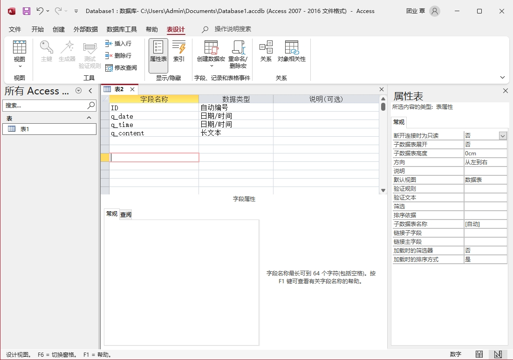

选择 "创建" 选项卡，然后选择 "表设计" ：

这样， “表设计” 视图窗口就会出现。接着，应该按以下步骤进行操作：

（1）通过在 “字段名称” 一列输入名字来定义表中的各个字段。

（2）将光标移到 “数据类型” 一列。选择默认的字段类型，即 “文本” 类型，也可以使用下拉组合框选择其他字段类型。

（3）光标移到 “说明” 一列。当用户为字段输入数据时，在这一列中所输入的文字将在状态栏出现。

（4）继续输入字段。如果要在两个现有的字段之间插入一个字段，应该单击功能区上的 “插入行” 按钮。`Access` 会将新的字段插在当前字段的前面。要想删除一个字段，应该选中它并单击 “删除行” 按钮。

（5）为保存所做的工作，应该单击 “快速访问” 工具栏上的 “保存” 工具。在 “另存为” 对话框中输入一个表名称，然后单击 “确定” 按钮。这时候将出现一个对话框，提示创建一个主键。

表名称的标准命名约定是以标记 `tbl` 做开头。

字段名的长度可达 64 个字符。但是，出于实际应用方面的原因，应该尽量将其限制在 10~15 个字符内。

字段名可以是字母、数字、空格、以及除日期、感叹号、点号和中括号之外的其他字符的任意组合。

字段名不能以空格起始。字段名称还不能包括 `ASCII` 控制符（0 ~ 31 之间的 `ASCII` 值）。

在为字段命名时，尽量不要重复使用属性名、关键字、函数名和其他 `Access` 对象名。

