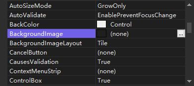
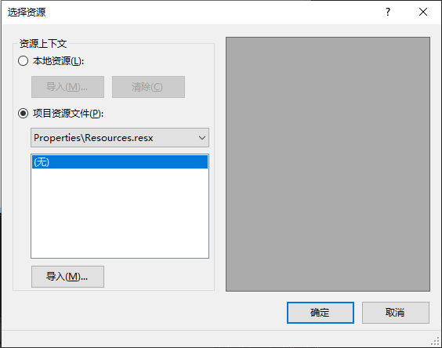

通过设置窗体的 `BackgroundImage` 属性，可以设置窗体的背景图片。

（1）选中窗体 `属性` 面板中的 `BackgroundImage` 属性，会出现  按钮。

（2）单击  按钮，打开 `选择资源` 对话框。

在 `资源选择` 对话框中，有两个单选按钮：一个是 `本地资源`；另一个是 `项目资源文件`。其差别是选中 `本地资源` 单选按钮后，直接选择图片，保存的是图片的路径。而选中 `项目资源文件` 单选按钮后，会将选择的图片保存到项目资源文件 `Resources.resx` 中。无论选择哪种方式，都需要单击 `导入` 按钮选择背景图片，单击 `确定` 按钮完成窗体背景图片的设置。