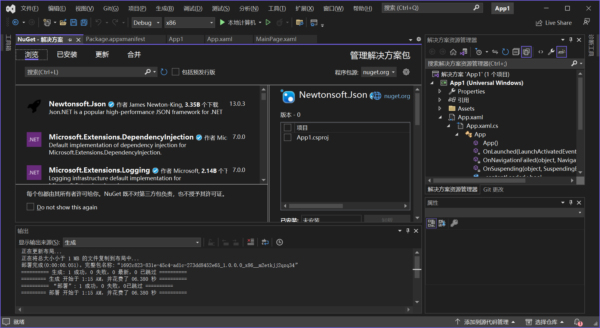

使用库可能不仅意味着添加一个引用并使用它。使用库也意味着一些配置更改，或者可以通过脚本来利用一些特性。目标框架决定了你能够使用什么二进制文件。这是在 `NuGet` 包中打包程序集的一个原因。`NuGet` 包是一个 `zip` 文件，其中包含程序集（或多个程序集）、配置信息和 `PowerShell` 脚本。

使用 `NuGet` 包的另一个原因是，它们很容易找到，它们不仅可以从微软公司找到，也可以从第三方找到。`NuGet` 包很容易在 `NuGet` 服务器 <http://www.nuget.org> 上获得。

可以使用 `.NET CLI` 在应用程序中添加 `NuGet` 包：

```shell
> dotnet add package <package-name>
```

在 `Visual Studio` 项目的引用中，可以通过 `工具` -> `NuGet 包管理器(N)` 菜单打开 `NuGet` 包管理器，在该管理器中可以搜索包，并将其添加到应用程序中。这个工具允许搜索还没有发布的包（包括预发布选项），定义应该在哪个 `NuGet` 服务器中搜索包。搜索包的一个地方是自己的共享目录，其中放置了内部使用的包。

