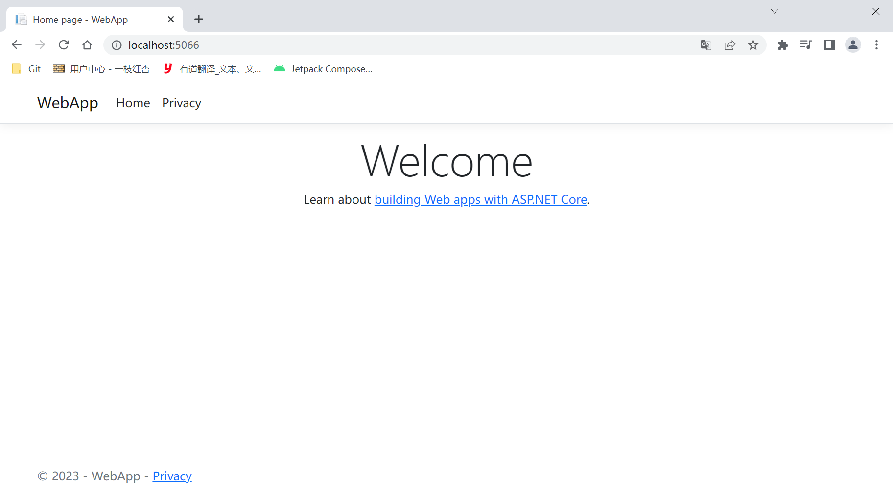

[toc]

安装了 `.NET CLI` 工具后，就有了一个入口点来启动所有这些工具。使用下面的命令：

```shell
> dotnet --help
```

对于上面的命令，也可以输入：

```shell
> dotnet -h
```

### 1. 创建应用程序

`dotnet` 工具提供了一种简单的方法创建 `Hello World!` 应用程序。输入如下命令就可以创建一个控制台应用程序：

```shell
> dotnet new console --output HelloWorld
```

`dotnet new` 命令还包括 `dotnet restore` 的功能，所以所有必要的 `NuGet` 包都会下载。要查看应用程序使用的库的依赖项和版本列表，可以检查 `obj` 子目录中的文件 `project.assets.json`。如果不使用选项 `--output`（或简写形式 `-o`），文件就在当前目录中生成。

生成的源代码如下所示：

```csharp
using System;

namespace HelloWorld
{
    class Program
    {
        static void Main(string[] args)
        {
            Console.WriteLine("Hello World!");
        }
    }
}
```

`Main()` 方法是 `.NET` 应用程序的入口点。`CLR` 在启动时调用静态 `Main()` 方法。`Main()` 方法需要放到一个类中。

### 2. 顶级语句

`C# 9` 让我们能够简化 `Hello World!` 应用程序的代码。使用顶级语句时，可以去掉名称空间、类和 `Main()` 方法声明，而只编写顶级语句。此时，`Hello World!` 应用程序将如下所示：

```csharp
using System;
Console.WriteLine("Hello World!");
```

> 注意：使用顶级语句时，仍然会在后台生成一个类和一个 `Main()` 方法。查看生成的 `IL` 代码可知，生成了一个名为 `<Program>$` 的类，以及一个名为 `<Main>$` 的主方法，其中包含顶级语句。

### 3. 选择框架和语言版本

可以通过修改 `HelloWorld/HelloWorld.csproj` 文件来指定项目使用的 `SDK`：

```xml
<Project Sdk="Microsoft.NET.Sdk">

  <PropertyGroup>
    <OutputType>Exe</OutputType>
    <TargetFramework>net7.0</TargetFramework>
    <ImplicitUsings>enable</ImplicitUsings>
    <Nullable>enable</Nullable>
  </PropertyGroup>

</Project>
```

### 4. 构建应用程序

要构建应用程序，需要将当前目录改为应用程序的目录，并启动 `dotnet build`：

```shell
> dotnet build
MSBuild version 17.5.0+6f08c67f3 for .NET
  正在确定要还原的项目…
  所有项目均是最新的，无法还原。
  HelloWorld -> C:\Users\xiaotuan\Desktop\Dotnet\HelloWorld\bin\Debug\net7.0\HelloWorld.dll

已成功生成。
    0 个警告
    0 个错误

已用时间 00:00:01.48
```

> 注意：命令 `dotnet new` 和 `dotnet build` 会自动恢复 `NuGet` 包，这可以防止忘记恢复包。恢复 `NuGet` 包的操作会从 `NuGet` 服务器或者环境中配置的其他服务器获取项目文件中引用的库。也可以使用 `dotnet restore` 显示地恢复 `NuGet` 包。

要构建发布代码，就需要指定选项 `--configuration Release`（简写为 `-c Release`）：

```shell
> dotnet build -c Release
MSBuild version 17.5.0+6f08c67f3 for .NET
  正在确定要还原的项目…
  所有项目均是最新的，无法还原。
  HelloWorld -> C:\Users\xiaotuan\Desktop\Dotnet\HelloWorld\bin\Release\net7.0\HelloWorld.dll

已成功生成。
    0 个警告
    0 个错误

已用时间 00:00:01.40
```

### 5. 运行应用程序

要运行应用程序，可以使用 `dotnet run` 命令：

```shell
> dotnet run
Hello, World!
```

如果项目文件面向多个框架，就需要通过 `--framework` 选项告诉 `dotnet run` 命令，使用哪个框架来运行应用程序。这个框架必须通过 `csproj` 文件来配置。

```shell
> dotnet run --framework net7.0
Hello, World!
```

在生产系统中，不使用 `dotnet run` 运行应用程序，而是使用 `dotnet` 和库的名称：

```shell
> dotnet run --framework net7.0
Hello, World!
```

### 6. 创建 Web 应用程序

可以使用 `.NET CLI` 创建 `Web` 应用程序。输入 `dotnet new` 时，可以看到可用的模板列表。下面的命令：

```shell
> dotnet new webapp -o WebApp
已成功创建模板“ASP.NET Core Web 应用”。
此模板包含除 Microsoft 以外其他方的技术，请参阅 https://aka.ms/aspnetcore/7.0-third-party-notices 以获取详细信息。

正在处理创建后操作...
正在还原 C:\Users\xiaotuan\Desktop\Dotnet\WebApp\WebApp.csproj:
  正在确定要还原的项目…
  已还原 C:\Users\xiaotuan\Desktop\Dotnet\WebApp\WebApp.csproj (用时 218 ms)。
已成功还原。
```

现在使用下述命令编译运行程序：

```shell
> dotnet build
MSBuild version 17.5.0+6f08c67f3 for .NET
  正在确定要还原的项目…
  所有项目均是最新的，无法还原。
  WebApp -> C:\Users\xiaotuan\Desktop\Dotnet\WebApp\bin\Debug\net7.0\WebApp.dll

已成功生成。
    0 个警告
    0 个错误

已用时间 00:00:05.91
PS C:\Users\xiaotuan\Desktop\Dotnet\WebApp> dotnet run
正在生成...
info: Microsoft.Hosting.Lifetime[14]
      Now listening on: http://localhost:5066
info: Microsoft.Hosting.Lifetime[0]
      Application started. Press Ctrl+C to shut down.
info: Microsoft.Hosting.Lifetime[0]
      Hosting environment: Development
info: Microsoft.Hosting.Lifetime[0]
      Content root path: C:\Users\xiaotuan\Desktop\Dotnet\WebApp
warn: Microsoft.AspNetCore.HttpsPolicy.HttpsRedirectionMiddleware[3]
      Failed to determine the https port for redirect.
```

可以查看 `WebApp/Properties/launchSettings.json` 文件查看网站的具体端口。可以打开浏览器访问 <http://localhost:5066/> ：



要停止应用程序，只需按 <kbd>Ctrl</kbd> + <kbd>C</kbd> 来发出取消命令。

### 7. 发布应用程序

使用 `dotnet` 工具，可以创建一个 `NuGet` 包并发布应用程序来进行部署。使用上面创建的控制台应用程序，只需要运行以下命令来创建发布所需的文件。使用 `-f` 选择框架，使用 `-c` 选择发布配置：

```shell
> dotnet publish -f net7.0 -c Release
MSBuild version 17.5.0+6f08c67f3 for .NET
  正在确定要还原的项目…
  所有项目均是最新的，无法还原。
  HelloWorld -> C:\Users\xiaotuan\Desktop\Dotnet\HelloWorld\bin\Release\net7.0\HelloWorld.dll
  HelloWorld -> C:\Users\xiaotuan\Desktop\Dotnet\HelloWorld\bin\Release\net7.0\publish\
```

在目标系统上使用这些文件进行发布时，也需要运行库。在 <https://www.microsoft.com/net/download> 上可以找到运行库的下载和安装说明。

> 注意：如果应用程序使用了额外的 `NuGet` 包，这些包需要在 `csproj` 文件中引用，并且库需要与应用程序一起交付。

### 8. 自包含部署

也可以不在目标系统上安装运行库，而是在交付应用程序时一起交付运行库。这就是所谓的自包含部署。

安装应用程序的平台不同，运行库就不同。因此，对于自包含部署，需要通过在项目文件中指定 `RuntimeIdentifiers` ，来指定支持的平台，如下面的项目文件所示。这里，指定了 `Windows 10`、`macOS` 和 `Ubuntu Linux` 的运行库标识符（项目文件 `HelloWorld/HelloWorld.csproj`）：

```xml
<Project Sdk="Microsoft.NET.Sdk">

  <PropertyGroup>
    <OutputType>Exe</OutputType>
    <TargetFramework>net7.0</TargetFramework>
    <ImplicitUsings>enable</ImplicitUsings>
    <Nullable>enable</Nullable>
	<RuntimeIdentifiers>win10-x64;ubuntu-x64;osx.10.11-x64;</RuntimeIdentifiers>
  </PropertyGroup>

</Project>
```

> 注意：在 <https://docs.microsoft.com/en-us/dotnet/core/rid-catalog> 的 `.NET Core Runtime Identifier(RID)` 类别中，可以获取不同平台和版本的所有运行库标识符。

现在可以为所有不同的平台创建发布文件：

```shell
> dotnet publish -c Release -r win10-x64
> dotnet publish -c Release -r osx.10.11-x64
> dotnet publish -c Release -r ubuntu-x64
```

在运行这些命令之后，可以在 `Release/[win-x64|osx.10.11-x64|ubuntu-x64]/publish` 目录中找到发布所需的文件。

### 9. 创建单个可执行文件

除了发布大量文件，也可以创建单个可执行文件。添加 `-p:PublishSingleFile=true` 选项，会把整个运行库添加到一个二进制文件中，然后可以将文件用于部署。运行下面的命令，将在输出目录 `singlefile` 中创建一个文件。该目录还包含一个带有 `.pdb` 扩展名的文件。可以部署该文件来获取符号信息，以便在应用程序崩溃时能够进行分析。

```shell
> dotnet publish -r win10-x64 -p:PublishSingleFile=true --self-contained -o singlefile
MSBuild version 17.5.0+6f08c67f3 for .NET
  正在确定要还原的项目…
  已还原 C:\Users\xiaotuan\Desktop\Dotnet\HelloWorld\HelloWorld.csproj (用时 20.68 sec)。
  HelloWorld -> C:\Users\xiaotuan\Desktop\Dotnet\HelloWorld\bin\Debug\net7.0\win10-x64\HelloWorld.dll
  HelloWorld -> C:\Users\xiaotuan\Desktop\Dotnet\HelloWorld\singlefile\
```

### 10. readytorun

为了提高应用程序的启动性能，可以将应用程序的一部分预编译为原生代码。这样一来，在运行应用程序的时候，`IL` 编译器要做的工作就减少了。无论有没有使用 `PublishReadyToRun`，都可以使用这个选项。

```shell
> dotnet publish -r win10-x64 -p:PublishReadyToRun=true --self-contained -o readytorun
MSBuild version 17.5.0+6f08c67f3 for .NET
  正在确定要还原的项目…
  已还原 C:\Users\xiaotuan\Desktop\Dotnet\HelloWorld\HelloWorld.csproj (用时 7.01 sec)。
  HelloWorld -> C:\Users\xiaotuan\Desktop\Dotnet\HelloWorld\bin\Debug\net7.0\win10-x64\HelloWorld.dll
  HelloWorld -> C:\Users\xiaotuan\Desktop\Dotnet\HelloWorld\readytorun\
```

除了使用命令行传递此配置，还可以在项目文件中指定 `<PublishReadyToRun>` 元素。

### 11. 剪裁

当然，发布应用程序时，在一个可执行文件中包含完整的运行库会导致文件太大。可以通过这种方法解决：剪裁掉应用程序不需要的类和方法，使二进制文件变得更小。

通过在项目文件中指定 `PublishTrimmed` 元素，可以启用剪裁。`TrimMode` 指定了剪裁的程度。值 `link` 基于成员进行裁剪，删除掉未使用的成员。当把这个值设置为 `copyused` 的时候，如果应用程序使用了一个程序集中的任何成员，就完整保留该程序集：

```xml
<Project Sdk="Microsoft.NET.Sdk">

  <PropertyGroup>
    <OutputType>Exe</OutputType>
    <TargetFramework>net7.0</TargetFramework>
    <ImplicitUsings>enable</ImplicitUsings>
    <Nullable>enable</Nullable>
	<RuntimeIdentifiers>win10-x64;ubuntu-x64;osx.10.11-x64;</RuntimeIdentifiers>
	<PublishTrimmed>true</PublishTrimmed>
	<TrimMode>link</TrimMode>
  </PropertyGroup>

</Project>
```

通过使用下面的命令和上面的项目配置，可以创建一个应用了剪裁的可执行文件。

```shell
> dotnet publish -o publishtrimmed -p:PublishSingleFile=true --self-contained -r win10-x64
MSBuild version 17.5.0+6f08c67f3 for .NET
  正在确定要还原的项目…
  已还原 C:\Users\xiaotuan\Desktop\Dotnet\HelloWorld\HelloWorld.csproj (用时 24.8 sec)。
  HelloWorld -> C:\Users\xiaotuan\Desktop\Dotnet\HelloWorld\bin\Debug\net7.0\win10-x64\HelloWorld.dll
  正在优化程序集以调整大小。此过程可能需要一段时间。
  HelloWorld -> C:\Users\xiaotuan\Desktop\Dotnet\HelloWorld\publishtrimmed\
```

裁剪存在风险。例如，如果应用程序使用了反射，那么剪裁器不知道运行时需要反射成员。为了应对这种问题，可以指定不剪裁哪些程序集、类型和类型成员。要配置这些选项，请在以下网址阅读详细的文档：<https://docs.microsoft.com/dotnet/core/deploying/trimming-options>。