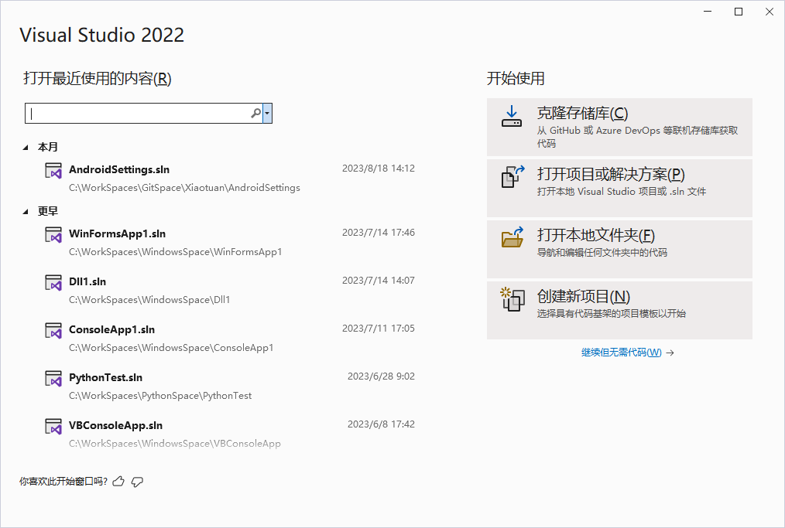
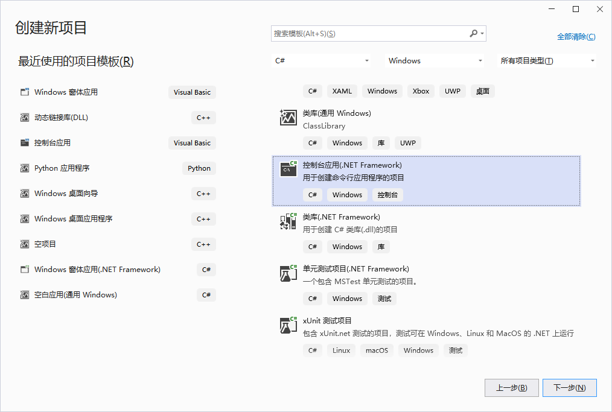
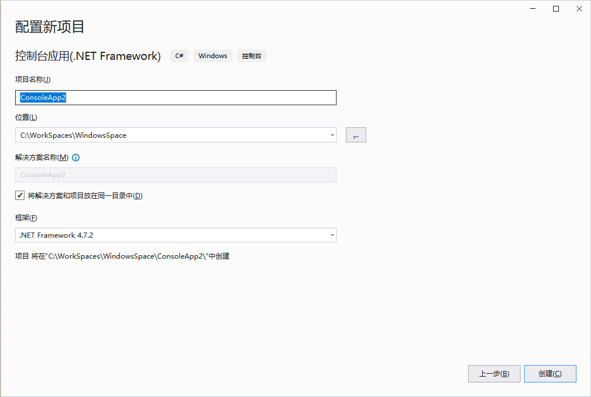

1. 在 `Windows` 操作系统的 `开始` 菜单界面中找到 `Visual Studio 2021` ，单击打开。

2. 在 `Visual Studio 2021` 的开始使用窗口中单击 ` 创建新项目`，打开 `创建新项目` 对话框，选择 `控制台应用（.NET Framework)`。

   

   

3. 单击 `下一步` 按钮，打开 `配置新项目` 对话框，该对话框中将项目名称命名为 `HelloWorld`，选择保存路径和要使用的框架，然后单击 `创建` 按钮，创建一个控制台应用程序。

   

4. `Visual Studio 2021` 将自动生成一个 `Program.cs` 文件，其内容如下：

   ```C#
   using System;
   using System.Collections.Generic;
   using System.Linq;
   using System.Text;
   using System.Threading.Tasks;
   
   namespace HelloWord
   {
       internal class Program
       {
           static void Main(string[] args)
           {
           }
       }
   }
   ```

   

   