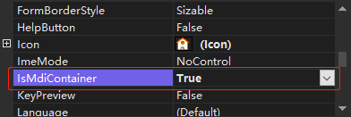

[toc]

在 `MDI` 窗体中，起到容器作用的窗体被称为 "父窗体"，可放在父窗体中的其他窗体被称为 "子窗体"，也称为 "MDI 子窗体"。当 MDI 应用程序启动时，首先会显示父窗体。所有的子窗体都在父窗体中打开，在父窗体中可以在任何时候打开多个子窗体。每个应用程序只能有一个父窗体，其他子窗体不能移出父窗体的框架区域。

### 1. 设置父窗体

如果要将某个窗体设置为父窗体，只要在窗体的属性面板中，将 `IsMdiContainer` 属性设置为 True 即可。



> 提示：在设置 MDI 窗体的主窗体时，要尽可能用项目的启动窗体进行设置。

### 2. 设置子窗体

通过设置某个窗体的 `MdiParent` 属性值来确定子窗体。语法如下：

```csharp
public Form MdiParent { get; set; }
```

例如：

```csharp
Form2 frm2 = new Form2();
frm2.MdiParent = this;	// 设置 MdiParent 属性，将当前窗体作为父窗体
frm2.Show();
```

### 3. 排列 MDI 子窗体

可以通过 `LayoutMdi()` 方法来排列多文档界面父窗体中的子窗体。语法如下：

```csharp
public void LayoutMdi(MdiLayout value)
```

<center><b>MdiLayout 的枚举成员及说明</b></center>

| 枚举成员       | 说明                                                       |
| -------------- | ---------------------------------------------------------- |
| Casade         | 所有 MDI 子窗体均层叠在 MDI 父窗体的工作区内               |
| TileHorizontal | 所有 MDI 子窗体均水平平铺在 MDI 父窗体的工作区内           |
| TileVertical   | 所有 MDI 子窗体均垂直平铺在 MDI 父窗体的工作区内           |
| ArrangeIcons   | 所有 MDI 子图标都排列在 MDI 父窗体的工作区域内。（无效果） |

例如：

```csharp
private void Form2_Load(object sender, EventArgs e)
{
    Form1 frm1 = new Form1();
    frm1.MdiParent = this;
    frm1.Show();
    Form3 frm3 = new Form3();
    frm3.MdiParent = this;
    frm3.Show();
    Form4 frm4 = new Form4();
    frm4.MdiParent = this;
    frm4.Show();
    LayoutMdi(MdiLayout.TileHorizontal);
}
```

