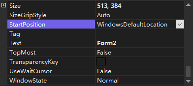

可以通过窗体的 `StartPosition` 属性，设置加载窗体时窗体在显示器中的位置。

<b>StartPosition 属性的属性值及说明</b>

| 属性值                 | 说明                                                   |
| ---------------------- | ------------------------------------------------------ |
| CenterParent           | 窗体在其父窗体中居中                                   |
| CenterScreen           | 窗体在当前显示窗口中居中显示，其尺寸在窗体大小中指定   |
| Manual                 | 窗体的位置由 Location 属性指定                         |
| WindowsDefaultBounds   | 窗体定位在 Windows 默认值，其边界也由 Windows 默认决定 |
| WindowsDefaultLocation | 窗体定位在 Windows 默认位置，其尺寸在窗体大小中指定    |

