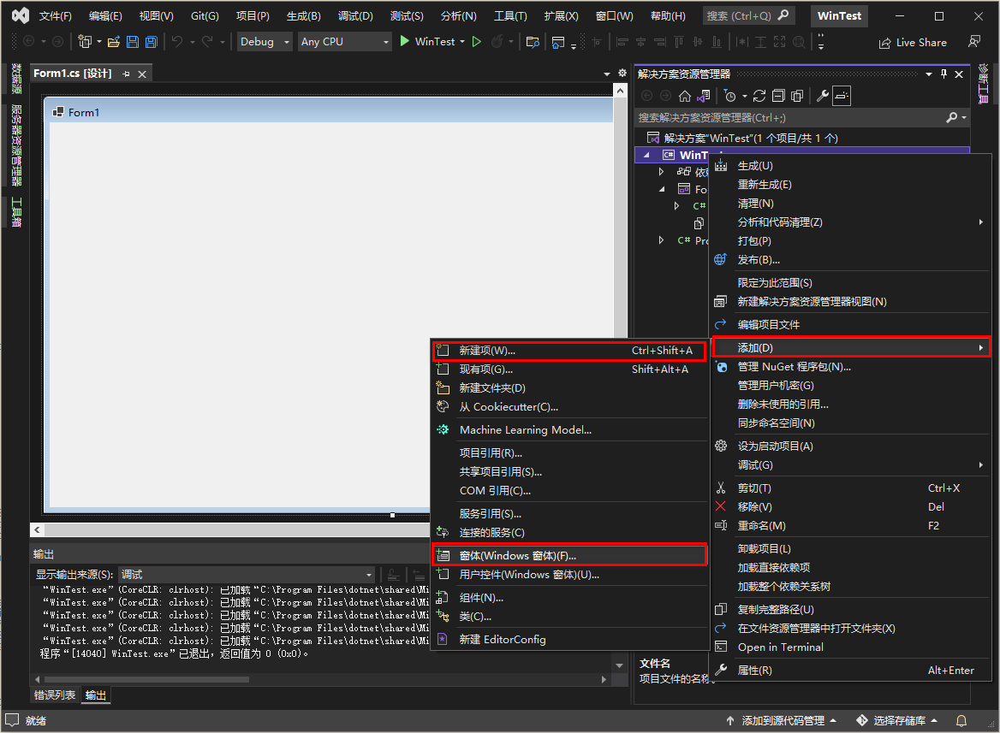
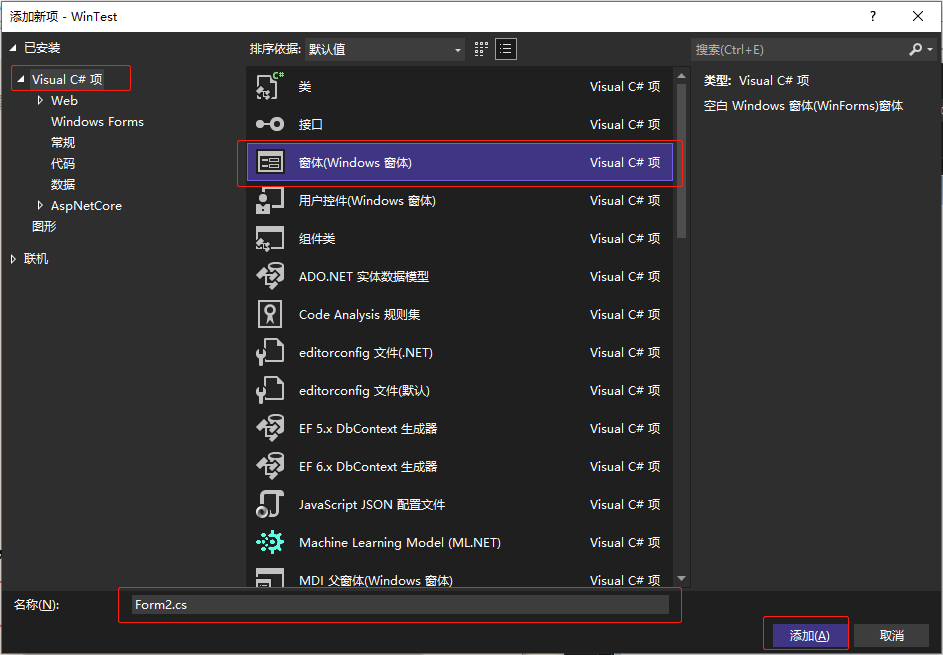
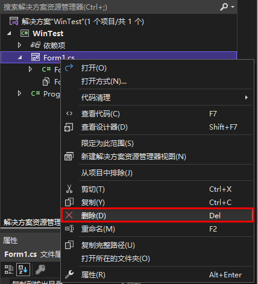

[toc]

### 1. 添加窗体

如果要想项目中添加一个新窗体，可以在项目名称上右击，在弹出的快捷菜单中选择 `添加` -> `Windows 窗体` 或者 `添加` -> `新建项` 命令。

在弹出的 `添加新项` 对话框中，选择 `Windows 窗体` 选项，输入窗体名称后，单击 `添加` 按钮，即可向项目中添加一个新的窗体。

### 2. 删除窗体

只需在要删除的窗体名称上右击，在弹出的快捷菜单中选择 `删除` 命令，即可将窗体删除。

