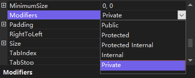

> 注意：为了从一个窗体继承，包含该窗体的文件或命名空间必须已编译成可执行文件或 `DLL`。

### 1. 创建继承窗体

（1）创建一个 Windows 应用程序，默认窗体为 Form1.cs。

（2）在 Form1 窗体上添加一个 TextBox 空间、一个 Button 控件和一个 Label 控件。在 Button 控件的 Click 事件中添加代码，实现 Label 控件显示 TextBox 控件中输入的内容。

（3）向项目中添加一个新的 Windows 窗体，命名为 Form2.

（4）修改 Form2 窗体代码文件中 Form2 类所继承的基类。

Form2 窗体的原始代码如下：

```csharp
namespace Test03
{
    public partial class Form2 : Form	// 表示当前窗体继承于 Form 类
    {
        
    }
}
```

修改后的代码如下：

```csharp
namespace Test03
{
    public partial class Form2 : Form1	// 表示当前窗体继承于 Form 类
    {
        
    }
}
```

### 2. 在继承窗体中修改继承的控件属性

在向窗体中添加控件时，其 `Modifiers` 属性默认为 `private`。因此，如果继承这样的窗体，在继承窗体中，控件的属性全部为不可编辑状态。如果希望在继承窗体中编辑各个控件的属性，首先要将基窗体中控件的 `Modifiers` 属性全部设置为 `public`。

