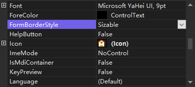

通过设置窗体的 `FormBorderStyle` 属性的属性值设置为 `None` ，即可隐藏窗体的标题栏。

<b>FormBorderStyle 属性的属性值及说明</b>

| 属性值            | 说明                       |
| ----------------- | -------------------------- |
| Fixed3D           | 固定的三维边框             |
| FixedDialog       | 固定的对话框样式的粗边框   |
| FixedSingle       | 固定的单行边框             |
| FixedToolWindow   | 不可调整大小的工具窗口边框 |
| None              | 无边框                     |
| Sizable           | 可调整大小的边框           |
| SizableToolWindow | 可调整大小的工具窗口边框   |

