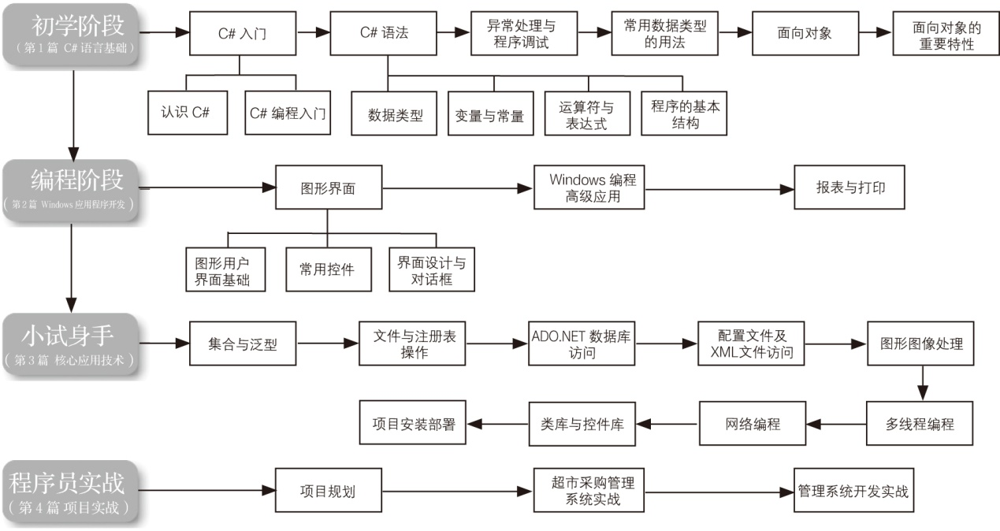
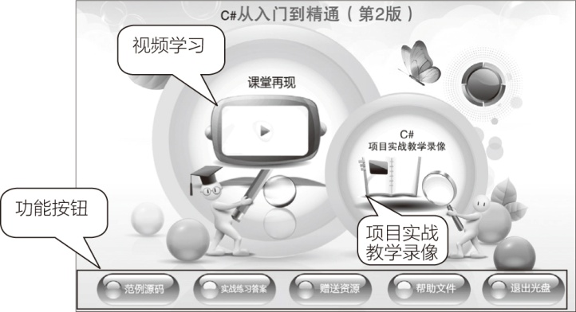
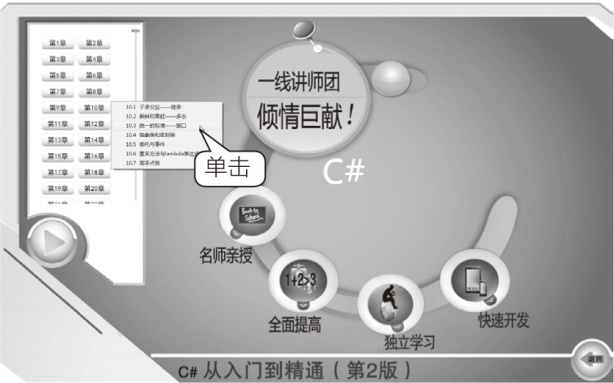
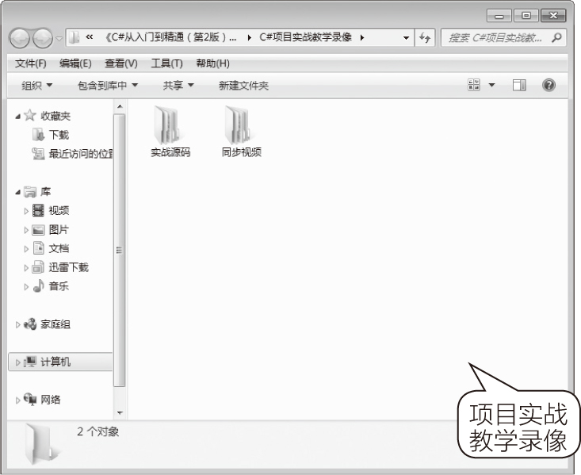

# 前言

“从入门到精通”系列是专为初学者量身打造的一套编程学习用书，由知名计算机图书策划机构“龙马高新教育”精心策划而成。

本书主要面向C#初学者和爱好者，旨在帮助读者掌握C#基础知识、了解开发技巧并积累一定的项目实战经验。当读者系统地学习完本书内容之后，就可以骄傲地宣布——“我是一名真正的C#程序员了！”。

## 
 为什么要写这样一本书

荀子曰：不闻不若闻之，闻之不若见之，见之不若知之，知之不若行之。

实践对于学习的重要性由此可见一斑。纵观当前编程图书市场，理论知识与实践经验的脱节，是很多C#图书的写照。为了杜绝这一现象，本书立足于实战，从项目开发的实际需求入手，将理论知识与实际应用相结合。目标就是让初学者能够快速成长为初级程序员，并拥有一定的项目开发经验，从而在职场中拥有一个高起点。

## 
 C#的最佳学习路线

本书总结了作者多年的教学实践经验，为读者设计了最佳的学习路线。

## 
 本书特色

►　 **零基础、入门级的讲解**

无论读者是否从事计算机相关行业，是否接触过C#，是否使用C#开发过项目，都能从本书中找到最佳起点。

►　 **超多、实用、专业的范例和项目**

本书结合实际工作中的范例，逐一讲解C#的各种知识和技术。最后，还以实际开发项目来总结本书所学内容，帮助读者在实战中掌握知识，轻松拥有项目经验。

►　 **随时检测自己的学习成果**

每章首页罗列了“本章要点”，以便读者明确学习方向。每章最后的“实战练习”则根据所在章的知识点精心设计而成，读者可以随时自我检测，巩固所学知识。

►　 **细致入微、贴心提示**

本书在讲解过程中使用了“提示”、“注意”、 “技巧”等小栏目，帮助读者在学习过程中更清楚地理解基本概念、掌握相关操作，并轻松获取实战技巧。

## 
 超值光盘

►　 **17小时全程同步教学录像**

涵盖本书所有知识点，详细讲解每个范例及项目的开发过程及关键点。帮助读者更轻松地掌握书中所有的C#程序设计知识。

►　 **超多王牌资源大放送**

赠送大量王牌资源，包括38小时C#项目实战教学录像、799页C#类库查询手册、52页C#控件查询手册、10套超值完整源代码、56个C#常见面试题及解析电子书、123个C#常见错误及解决方案电子书、50个C#高效编程技巧、C#程序员职业规划、C#程序员面试技巧等。

## 
 读者对象

+ 没有任何C#基础的初学者
+ 有一定的C#基础，想精通C#的人员
+ 有一定的C#基础，缺乏C#实战经验的人员
+ 大专院校及培训学校的老师和学生

## 
 光盘使用说明

01．光盘运行后首先播放片头动画，之后进入光盘的主界面。其中包括【课堂再现】、【C#项目实战教学录像】两个学习通道，和【范例源码】、【实战练习答案】、【赠送资源】、【帮助文件】、【退出光盘】五个功能按钮。

02．单击【课堂再现】按钮，进入多媒体同步教学录像界面。在左侧的章号按钮上单击鼠标左键，在弹出的快捷菜单上单击要播放的节名，即可开始播放相应的教学录像。

03．单击【C#项目实战教学录像】按钮，可以查看相关视频文件，在打开的文件夹中包含了教学录像及其实战源码，在【同步视频】文件夹下进入子文件夹，双击要播放的视频，即可使用电脑中的播放器进行播放。

04．单击【范例源码】按钮，可打开本书范例源码文件夹。

05．单击【实战练习答案】按钮，可在打开的文件夹中看到实战练习答案。

06．单击【赠送资源】按钮可以查看随本书赠送的资源。

07．单击【帮助文件】按钮，可以打开“光盘使用说明.pdf”文档，该说明文档详细介绍了光盘在电脑上的运行环境及运行方法等。

08．单击【退出光盘】按钮，即可退出本光盘系统。

## 
 网站支持

更多学习资料，请访问<a class="my_markdown" href="['http://www.51pcbook.cn']">www.51pcbook.cn</a>。

## 
 创作团队

本书由龙马高新教育策划，国家863中部软件孵化器组织编写，邹东尧任主编，朱会东、王治国任副主编。参加编写的人员分工如下：第6~8章由张启坤编写，第9章和第10章由吴怀广编写，第11~15章由王治国编写，第16~20章由朱会东编写，第21~24章由黄燕编写，第0~5章及第25~27章由邹东尧、李晨编写。参加资料整理的人员有韩腾飞、薛枫、孔万里、李震、赵源源、乔娜、周奎奎、王果、陈小杰、左琨、邓艳丽、崔姝怡、侯蕾、左花苹、刘锦源、普宁、王常吉、师鸣若、钟宏伟、陈川、刘子威、徐永俊、朱涛和张允等。

在编写过程中，我们竭尽所能地将最准确的C#理解和感悟呈现给读者，但也难免有疏漏和不妥之处，敬请不吝指正。若您在学习过程中遇到困难或疑问，或有任何建议，可发送电子邮件至zhangyi@ptpress.com.cn。

**编者**

