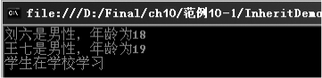
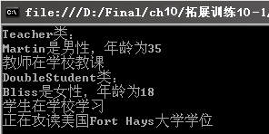

### 10.1.1　继承的定义和使用

在现有类（称为直接基类、父类）上建立新类（称为派生类、子类）的处理过程称为继承。派生类能自动获得基类的除了构造函数和析构函数以外的所有成员，可以在派生类中添加新的属性和方法扩展其功能。通过继承创建派生类的语法如下。

```c
<访问修饰符> class 派生类名：基类名
{
    //类的代码
}
```

在实际中，一个类的对象也是另一个类的对象。例如，一个Rectangle（矩形）类“属于”四边形(正方形、平行四边形和梯形等都是四边形)。也可以说，Rectangle类是从Quadrilateral(四边形)类继承而来的。 Quadrilateral类是基类， Rectangle类是派生类。再如，教师类和学生类都可以从人这个类派生，讲师、教授可以从教师类派生，研究生和本科生可以从学生类派生而得到。

**【范例10-1】 定义基类Person，然后通过继承创建派生类Student。**

（1）启动Visual Studio 2013，新建一个控制台应用程序，项目名称为“InheritDemo”。选择【项目】
【添加类】菜单命令，在弹出的对话框中输入类的【名称】“Person”，然后单击【确定】按钮，在“Person.cs”中输入以下代码（代码10-1-1.txt）。

```c
01  public class Person
02  {
03          //定义基类Person中的共有属性
04          private string _id;            //声明身份证号码字段_id
05          public string Id               //声明身份证号码属性ID
06          {
07                  get { return _id; }    //get访问器，得到身份证号码字段的值
08                  set { _id = value; }   //set访问器，设置身份证号码字段的值
09          }
10          private string _name;          //声明姓名字段
11          public string Name             //声明姓名属性
12          {
13                  get { return _name; }
14                  set { _name = value; }
15          }
16          private int _age;              //声明年龄字段
17          public int Age                 //声明年龄属性
18          {
19                  get { return _age; }
20                  set { _age = value; }
21          }
22          private string _gender;        //声明性别字段
23          public string Gender           //声明性别属性
24          {
25                  get { return _gender; }
26                  set { _gender = value; }
27          }
28          public Person()                //定义无参数的构造函数
29          { }
30          public Person(string name, int age, string gender)         //定义有3个参数的构造函数
31          { 
32                  _name = name;          //通过参数name对字段_name赋值
33                  _age = age;            //通过参数age对字段_age赋值
34                  _gender = gender;      //通过参数gender对字段_gender赋值
35           } 
36                  //基类的共有方法
37           public void Display()         //Display方法用于输出Person对象的姓名、性别和年龄信息
38          {
39                  Console.WriteLine("{0}是{1}性，年龄为{2}", this._name, this._gender, this._age);
40          }
41  }
```

（2）在Person.cs文件的最后添加下面的代码，通过继承创建派生类Student（代码10-1-2.txt）。

```c
01  public class Student : Person            //创建派生类，派生自Person类
02  {
03          //定义派生类自己的属性
04          private string _class;           //定义表示学生所在班级的字段_class
05          public string  Class             //定义获取或设置班级信息的属性Class
06          {
07                  get { return _class; }
08                  set { _class = value; }
09          }
10          private string _department;       //定义学生所属系的字段
11          public string Department          //定义学生所属系的属性
12          {
13                  get { return _department; }
14                  set { _department = value; }
15          }
16          private string _no;              //定义表示学生学号的字段
17          public string No                 //定义学号的属性
18          {
19                  get { return _no; }
20                  set { _no = value; }
21          }
22          public Student()                 //无参数构造函数
23          {
24          }
25          //定义派生类独有的方法 Study，表示学生负有学习的任务
26          public void Study()
27          {
28                  Console.WriteLine("学生在学校学习");
29          }
30  }
```

（3）在Program.cs中的Main方法中添加以下代码（拓展代码10-1-3.txt），并进行测试。

```c
01  static void Main(string[] args)
02  {
03          Person objPerson = new Person("刘六", 18, "男");  //创建Person的对象objPerson
04          objPerson.Display();                             //调用Display方法显示对象信息
05          Student objStudent = new Student();              //创建Student的对象objStudent
06          objStudent.Name ="王七";
07          objStudent.Age = 19;
08          objStudent.Gender = "男";
09          objStudent.Class = "2006软件工程专业1班";
10          objStudent.Display ();                           //访问基类Display方法
11          objStudent.Study();                              //调用派生类方法
12          Console.ReadKey();
13  }
```

**【运行结果】**

选择【调试】
【启用调试】菜单命令或单击按钮，即可在控制台中输出结果，如下图所示。


**【范例分析】**

在步骤（1）中，第4~27行是定义Person类中的身份证号码、姓名、年龄和性别等4个字段和其对应的属性；第30~35行是一个有3个参数的构造函数，用于创建对象；第36~39行定义了一个Display方法用于显示对象的相关信息。在步骤（2）中创建了一个派生类Student，第4~21行是定义Student类中的班级、系别、学号字段和其对应的属性；第26~28行定义一个派生类方法Study。在步骤（3）中，在Program.cs中创建对象，并对对象的成员赋值，然后利用控制台输出结果。

**【拓展训练】**

创建Person类的派生类Teacher 和Student类的派生类DoubleStudent（攻读双学位的学生）。在“InheritDemo”项目中添加类文件Teacher.cs，输入代码如下（拓展代码10-1-1.txt）。

```c
01  class Teacher :Person                       //定义Teacher类，派生于Person类
02  {
03          private string _tid;                //声明教师编号字段
04          public string Tid                   //定义教师编号属性
05          {
06                  get { return _tid; }
07                  set { _tid = value; }
08          }
09          private string _course;              //声明所教课程字段
10          public string Course                 //定义所教课程属性
11          {
12                  get { return _course; }
13                  set { _course = value; }
14          }
15                                               //教师派生类的方法
16          public void Teaching()
17          {
18                  Console.WriteLine("教师在学校教课");
19          }
20  }
21  public class DoubleStudent : Student   //定义DoubleStudent类，派生自Student类
22          {
23          private string _sndBachelor;         //声明第二学位名称字段
24          public string SndBachelor            //定义第二学位名称属性
25          {
26                  get { return _sndBachelor; }
27                  set { _sndBachelor = value; }
28          }
29          public DoubleStudent()              //无参构造函数
30          {
31          }
32          public void UsaBachelor()           //定义方法
33          {
34                  Console.WriteLine("正在攻读美国Fort Hays大学学位");
35          }
36  }
```

在Program.cs中的Main方法中添加以下代码（拓展代码10-1-2.txt），并进行测试。

```c
01  Teacher  objTeacher = new Teacher();               //创建Teacher类的对象
02  objTeacher.Name = "Martin";                        //对对象成员.Name赋值
03  objTeacher.Age = 35;                               //对对象成员.Age赋值
04  objTeacher.Gender = "男";                          //对对象成员.Gender赋值
05  objTeacher.Display();                              //访问Person类方法
06  objTeacher.Teaching ();                            //访问Teacher类方法
07  Console.WriteLine("DoubleStudent类：");
08  //创建DoubleStudent对象
09  DoubleStudent objspecial = new DoubleStudent();;  //创建类DoubleStudent的对象
10  objspecial .Name ="Bliss";                        //对对象成员.Name赋值
11  objspecial.Age = 18;                              //对对象成员.Age赋值
12  objspecial.Gender = "女";                         //对对象成员.Gender赋值
13  objspecial.Display ();                            //访问Person类方法显示信息
14  objspecial.Study();                               //访问Student类的方法
15  objspecial.UsaBachelor();                         //调用DoubleStudent类的方法
```

**【运行结果】**

运行结果如下图所示。


**【范例分析】**

在Teacher.cs中，第1~20行是定义Teacher类，其中第16~19行是Teacher中添加的新方法Teaching；第21~35行定义了一个派生自Student类的DoubleStudent类，其中第31~34行定义了DoubleStudent类中的新方法UsaBachelor。

在Program.cs中，分别创建了Teacher类和DoubleStudent类的对象，并对对象的成员赋值，调用相应的方法，最后在控制台输出结果。

