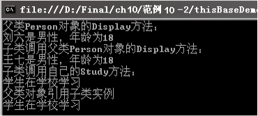

### 10.1.3　base和this关键字

从上面的介绍可以知道，基类中只有被public、protected、internal修饰的成员才可以被访问，这些成员包括任何基类的字段、属性、方法和索引器，但是基类的构造函数和析构函数是不能被继承的。如果要继承基类的构造函数，必须使用base关键字来实现。C#中的base关键字代表基类，使用base关键字可以调用基类的构造函数、属性和方法。使用base关键字调用基类构造函数的语法如下。

```c
派生类构造函数:base(参数列表)
```

例如，给【范例10-1】中的Student添加一个构造函数如下。

```c
01  public Student(string name, int age, string gender):base(name,age,gender)     //构造函数
02  {
03          //通过base(name,age,gender)调用基类的构造函数
04  }
```

使用base关键字调用基类方法的语法如下。

```c
base:基类方法();
```

相对于base来说，this关键字是引用类的当前实例。例如，在【范例10-1】的构造函数中添加this，可以写成如下的形式。

```c
01  public Person(string name, int age, string gender)  //构造函数
02  {
03          this. _name = name;                         //原来是_name = name
04          this._age = age;                            //原来是_age = age
05          this._gender = gender;                      //原来是_ gender = gender
06  }
```

> 
> **提示**
> this 关键字引用类的当前实例，还可用做扩展方法的第1个参数的修饰符，this关键字还可以调用自己的构造方法。使用this关键字可以使代码的编写简单化，不容易出错。在类的方法里输入this关键字，在后面输入一个“.”符号后，系统就会把本类所能调用的非静态方法和变量都显示出来供选择，这样可以提高编码的效率。

派生类继承基类的属性和方法，从而使创建派生类变得简单，可实现代码的重用。继承还有一个重要的特性，即基类对象可以引用派生类对象，也就是派生类对象可以赋值给基类对象变量。对这个特性可以这样理解：儿子继承于父亲，父亲也可以代表儿子处理事务，这就实现了基类对象引用派生类对象。在实际中这样的例子很多，如父母可以代表儿子处理事务，总公司可以代表子公司行使权利等。【范例10-2】演示了这个特性的用法，从中可以看出这个特性的优点。

**【范例10-2】 使用this和base关键字改进【范例10-1】中的Person、Student类，以熟悉利用基类构造函数创建派生类的构造函数和基类对象引用派生类对象的操作。**

（1）新建C#控制台程序，项目名为“thisBaseDemo”，然后在Program.cs中添加Person类，代码如下（代码10-2-1.txt）。

```c
01  public class Person
02  {
03          //基类的共有属性
04          private string _id;                //定义身份证号码字段
05          public string Id                   //定义身份证号码属性
06          {
07                  get { return this._id; }
08                  set { this._id = value; }
09          }
10          private string _name;             //定义姓名字段
11          public string Name                //定义姓名属性
12          {
13                  get { return this._name; }
14                  set { this._name = value; }
15          }
16          private int _age;                 //定义年龄字段
17          public int Age                    //定义年龄属性
18          {
19                  get { return this._age; }
20                  set { this._age = value; }
21          }
22          private string _gender;          //定义性别字段
23          public string Gender             //定义性别属性
24          {
25                  get { return this._gender; }
26                  set { this._gender = value; }
27          }
28          public Person()                  //构造函数
29          { }
30          public Person(string name, int age, string gender)         //构造函数
31          {
32                  this. _name = name;      //利用参数name对_name赋值
33                  this._age = age;         //利用参数age对_age赋值
34                  this._gender = gender;   //利用参数gender对_gender赋值
35          }
36          //基类的共有方法
37          public void Display()            //显示this._name, this._gender, this._age的值
38          {
39                  Console.WriteLine("{0}是{1}性，年龄为{2}", this._name, this._gender, this.
                     _age);
40          }
41  }
```

（2）在Program.cs中添加Student类，代码如下（代码10-2-2.txt）。

```c
01  public class Student : Person             //创建派生类，派生自Person类
02  {
03          //派生类自己的属性
04          private string _class;            //定义表示学生所在班级的字段
05          public string Class               //定义班级属性
06          {        get { return _class; }
07                   set { _class = value; }
08          }
09          private string _department;       //定义所属系
10          public string Department          //定义所属系属性
11          {        get { return _department; }
12                   set { _department = value; }
13          }
14          private string _no;               //定义学号字段
15          public string No                  //定义学号属性
16          {        get { return _no; }
17                   set { _no = value; }
18          }
19          public Student() {  }             //定义无参构造函数
20          public Student(string name, int age, string gender):base(name,age,gender)
21          {                                //调用基类的构造函数 
22          }
23          public void Study()              //自己独有的方法
24          {        Console.WriteLine("学生在学校学习");
25          }
26  }
```

（3）在Program.cs中的Main方法中添加以下测试代码（代码10-2-3.txt）并测试。

```c
01  Person objPerson1 = new Person("刘六", 18, "男");   //利用有参构造函数创建对象
02  Console.WriteLine("基类Person对象的Display方法：");
03  objPerson1.Display();                        //调用Display方法显示对象的信息
04  Student objStudent = new Student("王七", 18, "男"); //利用有参构造函数创建对象
05  objStudent.Class = "2006软件工程专业1班";
06  Console.WriteLine("派生类调用基类Person对象的Display方法：");
07  objStudent.Display();                        //访问基类方法Display，显示对象信息
08  Console.WriteLine("派生类调用自己的Study方法：");
09  objStudent.Study();                          //调用派生类方法
10  Console.WriteLine("基类对象引用派生类实例");
11  Person objPerson2 = new Person();            //创建Person类对象
12  objPerson2 = objStudent;                     //把派生类对象objStudent赋给基类对象objPerson2
13  ((Student )objPerson2).Study ();             //基类对象调用派生类的Study方法
```

**【运行结果】**

单击工具栏中的
按钮，即可在控制台中输出如下图所示的结果。


**【范例分析】**

在这个范例中多次使用了this关键字表示本类。步骤（2）中的第20~22行定义了派生类Student的一个构造函数，使用base关键字调用基类的构造函数。步骤（3）中的第13行基类对象引用了派生类对象的Study方法。

> 
> **技巧**
> 父类对象引用子类实例时，注意要把父类型转为子类型，否则就会出错。

**【拓展训练】**

修改【范例10-2】，给Teacher类也添加构造函数，调用基类的构造函数，这样Teacher类就可以使用基类Person的有参构造函数了（拓展代码10-2.txt）。

```c
01  public Teacher(string name, int age, string gender):base(name,age,gender)     //构造函数
02  {       //调用基类的方法 
03          base.Display();        
04  }
```

在Program.cs中添加如下的测试代码，结果如下图所示。

```c
Teacher objTea = new Teacher("刘老师", 48, "男");
```


