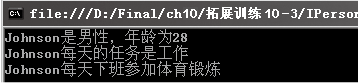

### 10.3.2　接口的实现

定义了接口后，就要在类或结构中实现。C#中通常把派生类和基类的关系称为继承，类和接口的关系称为实现。实现接口的语法和继承类一样，都有“：”，接口中的方法在类中实现时不是重载，不需要使用override关键字。

接口中不能定义构造函数，所以接口不能实例化。

**【范例10-3】 声明接口IPoint描述一个点的坐标并实现该接口。**

（1）在Visual Studio 2013中新建C#控制台程序，项目名为“interfaceDemo”，添加一个【新建项】，模板选择【接口】，输入接口名IPoint，声明接口如下（代码10-3-1.txt）。

```c
01  interface IPoint
02  {                //定义属性成员x，它含有读/写抽象访问
03          int x {  get; set; }
04                  //定义属性成员y，它含有读/写抽象访问
05          int y {  get; set; }        
06  }
```

> 
> **提示**
> 对接口名称建议以“I”开头，如Ipoint；对接口的访问修饰符可以选择使用，但是接口的方法前面不能添加任何访问修饰符，它是隐式公开的；接口不能包含构造函数，接口不能实现任何方法、属性和索引器。

（2）实现接口代码，从接口IPoint派生一个类Point（代码10-3-2.txt）。

```c
01  //从接口IPoint派生一个新类Point，这个类用来实现Point接口成员
02  class Point : IPoint
03  {
04          //定义两个类内部访问的私有成员变量
05                  private int px;
06                  private int py;
07          //构造函数实现类的初始化，为私有变量赋值
08          public Point(int x, int y)          //构造函数
09          {
10                  px = x;
11                  py = y;
12          }
13          //接口属性实现
14          public int x
15          {
16                  get                        //实现读访问
17                  { return px;  }
18                  set                        //实现写访问
19                  {px = value; }
20          }
21          public int y                       //接口属性实现
22          {
23                  get                        //实现读访问
24                  {return py;  }
25                  set                        //实现写访问
26                  {py = value; }
27          }
28  }
```

（3）在Program.cs的Main方法中输入代码测试接口（代码10-3-3.txt）。

```c
01  Point p=new Point(5,30);        //应用接口的派生类Point实例化一个新的对象并进行初始化赋值
02  Console.Write("新创建的Point点的坐标是:");
03  Console.WriteLine("x={0},y={1}",p.x,p.y);        //实现点数据输出
```

**【运行结果】**

单击工具栏中的
按钮，即可在控制台中输出如下图所示的结果。


**【范例分析】**

在这个范例中，步骤（1）是声明一个IPoint接口，接口内部声明了两个属性成员x和y，x和y一起组成了一个点的坐标。属性成员x和y包含抽象的读/写访问，分别表示属性成员可以对坐标进行读和写。在步骤（2）中定义类Point来实现IPoint接口，它包含了对接口成员的具体实现。

**【拓展训练】**

定义一个IPerson接口，接口包含DoWork和DoExercise两个抽象方法，并用Person类实现接口。

（1）定义IPerson接口，代码如下（拓展代码10-3-1.txt）。

```c
01  interface Iperson           //声明接口IPerson
02    {
03        void DoWork();        //声明方法DoWork，表示Person做工作
04        void DoExercise();    //声明方法DoExercise，表示Person锻炼身体
05    }
```

（2）定义Person类实现IPerson接口，代码如下（拓展代码10-3-2.txt）。

```c
01  public class Person:IPerson 
02  {//定义基类的共有属性
03          private string _id;              //声明身份证号码字段
04          public string Id                 //定义身份证号码属性
05          {
06                  get { return this._id; }
07                  set { _id = value; }
08          }
09          private string _name;           //声明姓名字段
10          public string Name              //定义姓名属性
11          {
12                  get { return _name; }
13                  set { _name = value; }
14          }
15          private int _age;               //声明年龄字段
16          public int Age                  //定义年龄属性
17          {
18                  get { return _age; }
19                  set { _age = value; }
20          }
21          private string _gender;        //声明性别字段
22          public string Gender           //定义性别属性
23          {
24                  get { return _gender; }
25                  set { _gender = value; }
26          }
27          public Person()               //声明构造函数
28          { }
29          public Person(string name, int age, string gender)  //声明构造函数
30          {
31                  this._name = name;
32                  this._age = age;
33                  this._gender = gender;
34          }
35          public void DoWork()                  //定义方法
36          {        
37                  Console.WriteLine("{0}每天的任务是工作", this._name);
38          }
39          public void DoExercise()             //定义方法
40          {
41                  Console.WriteLine("{0}每天下班参加体育锻炼", this._name);
42          }
43          public void Display()               //基类的共有方法
44          {//用于显示姓名、性别和年龄等对象的信息
45                  Console.WriteLine("{0}是{1}性，年龄为{2}", this._name, this._gender, this._age);
46          }
47  }
```

（3）在Program.cs中输入以下代码进行测试。

```c
01  Person objPerson = new Person("Johnson", 28, "男");   //创建Person对象
02  objPerson.Display();       //调用方法显示
03  objPerson.DoWork();        //调用方法DoWork()
04  objPerson.DoExercise();    //调用方法DoExercise()
```

**【运行结果】**

运行结果如下图所示。


**【范例分析】**

在这个范例中，先声明一个Iperson包含两个抽象方法的接口，然后通过类Person实现接口中的两个抽象方法。

