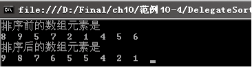

### 10.5.1　委托

委托也叫代理，就是把事情交付给别人去办，如委托律师代理打官司，委托同学代买火车票等。C#中如果将一个方法委托给一个对象，这个对象就可以全权代理这个方法的执行。使用委托时首先要定义委托，声明委托能代理什么类型的方法，就像房产中介能代理抵押贷款业务而不能代理打官司一样。定义委托的语法如下。

```c
<访问修饰符> delegate 返回类型 委托名();
```

从上面可以看出定义委托和定义方法相似。委托没有具体的实现体，委托能够代表什么样的方法由它的返回值类型和参数列表决定。如果定义如下的委托：

```c
public delegate void stuDelegate(string name);
```

那么使用stuDelegate委托代表的只可以是没有返回值，且参数为一个字符串的方法。

定义了委托之后要使用委托，首先要实例化委托。实例化委托就是将其指向某个方法，即调用委托的构造函数，并将相关联的方法作为参数传递。然后通过调用委托，执行相关方法的代码，实现委托。

**【范例10-4】 使用委托对数组元素按降序排列。**

（1）在Visual Studio 2013中新建C#控制台程序，项目名为“DelegateSort”，然后在Program.cs中添加一个名为Test的类，代码如下（代码10-4-1.txt）。

```c
01  class Test
02  {
03          public static bool  SortArray(int[] array)
04          {  //定义方法SortArray用于按照降序排序
05                  for (int i = array.GetUpperBound(0); i >= 0; i--)//循环从后向前分别取出数组中的一个元素
06                  { //冒泡排序，将数值小的元素移到后面，直到所有的元素按照降序排列
07                          for (int j = 0; j <= i; j++) 
08                                  if (array[j] <= array[i])  //如果前面的某个元素值小于后面的元素值
09                                  Swap(ref array[j], ref array[i]);     //交换二者的位置
10                  }
11                  return true;
12          }
13          static void Swap(ref int x, ref int y)    //交换两个数的方法
14          {
15                  int temp = x;
16                  x = y;
17                  y = temp;
18          }
19  }
```

（2）在Program.cs中定义委托，实现委托排序，代码如下（代码10-4-2.txt）。

```c
01  public delegate bool SortDelegate(int[] x);            //定义委托SortDelegate
02  static void Main(string[] args)
03  {
04          int[] arr = new int[] { 8, 9, 5, 7, 2, 1, 4, 5, 6 };  //定义一个整型数组用于委托排序
05          Console.WriteLine("排序前的数组元素是");
06          foreach (int i in arr)                         //遍历数组按顺序输出排序前各个元素的值
07                  { Console.Write("{0}  ", i); }
08          SortDelegate myDelegate;                       //声明委托变量
09          myDelegate = new SortDelegate(Test.SortArray );//实例化委托，委托Test的SortArray排序
10          myDelegate(arr);        //传递参数，调用委托排序
11          Console.WriteLine("\n排序后的数组元素是");
12                  foreach (int i in arr)                //遍历数组按顺序输出排序后各个元素的值
13                  { Console.Write("{0}  ", i);  }       //输出排序后的数组元素
14          Console.ReadKey();
15  }
```

**【运行结果】**

单击工具栏中的
按钮，即可在控制台中输出如下图所示的结果。


**【范例分析】**

在【范例10-4】中，步骤（1）定义了类Test，在Test中SortArray方法实现了对数组元素按降序排列的操作。在步骤（2）中，第1行定义委托SortDelegate，第8~9行是声明委托变量并实例化，第10行调用委托实现数组元素排序。

