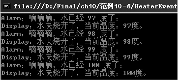

### 10.5.2　事件

事件是C#中的一个高级概念，是操作发生时允许执行特定应用程序的代码的机制。事件要么在相关联的操作发生前发生（事前事件），要么在操作发生后发生（事后事件）。例如，当用户单击窗口中的按钮时，将引发一个事后事件，以允许执行特定于应用程序的方法。类或对象可以通过事件向其他类或对象通知发生的相关事情。发送（或引发）事件的类称为“发行者”，接收（或处理）事件的类称为“订户”。在典型的 C# Windows 窗体或 Web 应用程序中，可以订阅由控件（如按钮和列表框）引发的事件。如在考场上老师说“开始考试”，学生就开始答卷，其中老师说的“开始考试”是事件，“学生开始答卷”是这个事件引发的动作。老师是事件的发行者，学生是事件的订户。

在C#类中定义和使用事件一般有下面几个步骤。

（1）在一个类中声明关于事件的委托。

```c
public delegate void  事件类型名称(object serder, EventArgs e);
```

事件类型名称建议用EventHandler结尾。如果想自定义事件的参数EventArgs，可以用EventArgs类派生自己的事件参数类，也可以没有参数。

（2）在类中声明事件，使用步骤（1）的delegate作为事件的类型。

```c
public event 事件类型名称 事件名称；
```

（3）在类中需要引发事件的方法中，编写引发事件的方法。

```c
事件名称(this, new EventArgs());
```

或者：

```c
if(事件名称!=null)   事件名称(this, new EventArgs());
```

（4）订阅事件，当事件发生时通知订户。

```c
带有事件的类实例.事件名称+= new 事件名称( 事件处理方法名称);
```

（5）编写事件处理方法。

```c
public void 事件处理方法名称（object sender, EventArgs e)  
{           //添加你的代码   }
```

（6）在适当的条件下触发事件，即需要调用步骤（3）中的引发事件的方法。

**【范例10-5】 事件的定义和使用。**

假设设计一个高档热水器，通电加热到水温超过96℃的时候，扬声器会发出语音告诉你水的温度，液晶屏显示水温的变化，提示水快烧开了。定义一个类来代表热水器的类Heater，它有代表水温的字段temperature，有给水加热的BoilWater()方法，发出语音警报的MakeAlert()方法，显示水温的ShowMsg()方法。

（1）在Visual Studio 2013中新建C#控制台程序，项目名为“HeaterEvent”，然后在Program.cs中添加Heater类，代码如下（代码10-5-1.txt）。

```c
01  public class Heater                                   //热水器类Heater
02  {
03          private int temperature;                      //声明表示水温的字段
04          public delegate void BoilHandler(int param);  //声明关于事件的委托
05          public event BoilHandler BoilEvent;           //声明水要烧开的事件
06          public void BoilWater()                       //烧水的方法
07          {   //烧水的方法
08                  for (int i = 0; i <= 100; i++)        //用循环代表水温的变化
09                  {
10                          temperature = i;              //设置水的温度
11                          if (temperature > 96) {       //如果水温超过96℃，引发事件BoilEvent
12                                  if (BoilEvent != null)
13                                  {  //如果有对象订阅
14                                          BoilEvent(temperature);   //调用所有订阅对象的方法
15                                  }
16                  }
17          }
18  }
```

（2）在Program.cs中添加警报器类Alarm和显示水温的类Display，代码如下（代码10-5-2.txt）。

```c
01  public class Alarm                        //定义警报器类
02  {
03          public void MakeAlert(int param) 
04          {  //水快开时报警的方法
05          Console.WriteLine("Alarm：嘀嘀嘀，水已经 {0} 度了：", param);
06          }
07  }
08  public class Display                      //显示水温的显示类
09  {        //静态方法ShowMsg用于显示水温
10          public static void ShowMsg(int param) 
11          {
12          Console.WriteLine("Display：水快烧开了，当前温度：{0}度。", param);
13          }
14  }
```

（3）在Program.cs中的Main方法中添加以下测试代码（代码10-5-3.txt）测试。

```c
01  Heater heater = new Heater();             //创建热水器对象heater
02  Alarm alarm = new Alarm();                //创建报警器对象alarm
03  heater.BoilEvent += alarm.MakeAlert;      //给alarm的MakeAlert方法订阅事件
04  heater.BoilEvent += Display.ShowMsg;      //订阅静态方法
05  heater.BoilWater();                       //烧水，会自动调用订阅过的对象方法
```

**【运行结果】**

单击工具栏中的
按钮，即可在控制台中输出如下图所示的结果。


**【范例分析】**

在【范例10-5】的步骤（1）中定义了类Heater；第4行定义关于事件的委托BoilHandler；第5行声明事件BoilEvent；在第6~17行定义引发事件的方法BoilWater中，编写引发事件的代码。在步骤（2）中定义了警报器类Alarm和显示水温的类Display，MakeAlert方法和Display方法是事件发生后执行的事件处理方法。在步骤（3）中，第3~4行是订阅事件，第5行执行BoilWater方法以引发事件BoilEvent。

