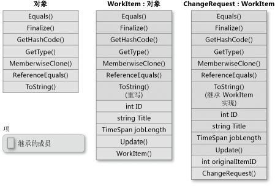

### 10.7　高手点拨


**本节视频教学录像：1分钟**

#### 1．多态性编程在给出Shape基类后，利用提供的虚方法创建Rectangle、Circle 和 Triangle等派生类。

```c
01 public class Shape
02 {
03                 // 示例
04                 public int X { get; private set; }
05                 public int Y { get; private set; }
06                 public int Height { get; set; }
07                 public int Width { get; set; }
08                  // 方法
09                  public virtual void Draw()
10                  {
11                          Console.WriteLine("Performing base class drawing tasks");
12                  }
13 }
```

#### 2．类的继承

下图演示一个 WorkItem 类，该类表示某业务流程中的一个工作项。 和所有的类一样，该类派生自 System.Object 并继承其所有方法。 WorkItem 添加了自己的五个成员。 其中包括一个构造函数，因为构造函数不能继承。 类ChangeRequest 继承自 WorkItem 并表示特定种类的工作项。ChangeRequest 在它从 WorkItem 和 Object 继承的成员中另外添加了两个成员。它必须添加其自己的构造函数，还添加 originalItemID。利用属性 originalItemID，可将 ChangeRequest 实例与更改请求将应用到的原始 WorkItem 相关联。


试用C# 实现上图所示的类关系。

