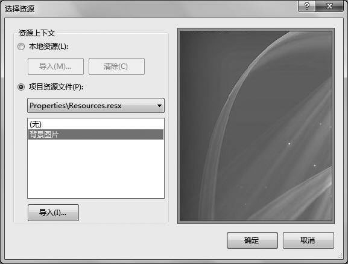
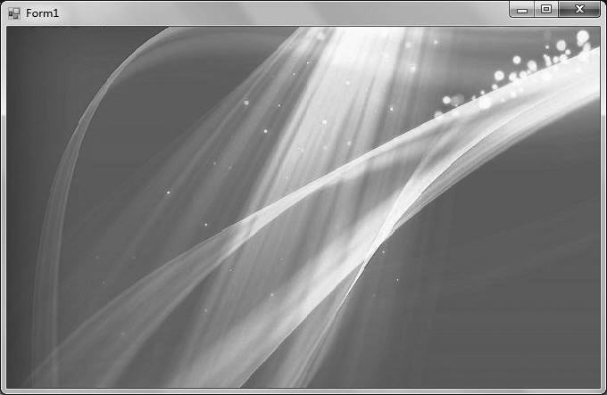

### 11.2.1　Windows窗体的基本属性

Windows窗体的属性决定了窗体的布局、样式、外观、行为等可视化特征。通过代码可以对这些属性进行设置和修改，但更方便、常用的做法是在Visual Studio的 “属性”编辑器窗口中直接设置和修改，如下图所示。下面按照分类顺序对常用的窗体属性进行说明。

#### 1．布局属性

常用的布局属性介绍如下。

（1）StartPosition属性：用来获取或设置程序运行时窗体的初始显示位置，该属性有5个可选属性值，如下表所示，默认值为WindowsDefaultLocation。

| 属性值 | 说明 |
| :-----  | :-----  | :-----  | :-----  |
| Manual | 窗体的初始显示位置由Location属性决定 |
| CenterScreen | 窗体在当前显示屏幕窗口中居中，其尺寸在窗体大小Size中指定 |
| WindowsDefaultLocation | 窗体定位在Windows默认位置，其尺寸在窗体大小Size中指定 |
| WindowsDefaultBounds | 窗体定位在Windows默认位置，其边界也由Windows默认指定 |
| CenterParent | 窗体在其父窗体中居中显示 |

（2）Location属性：获取或设置窗体显示时其左上角在桌面上的坐标，默认值为（0,0）。

（3）三个与窗体尺寸有关的属性：Size、MaximizeSize、MinimizeSize，分别表示窗体正常显示、最大化、最小化时的尺寸，它们分别都包含窗体宽度Width和高度Height两个子项。

（4）WindowState属性： 用来获取或设置窗体显示时的初始状态。 可选属性取值有三种： Normal表示窗体正常显示，Minimized、Maximized分别表示窗体以最小化和最大化形式显示，默认为Normal。

（5）AutoScroll 属性：用来获取或设置一个值，该值指示当任何控件位于窗体工作区之外时，是否会在该窗体上自动显示滚动条，默认值为False。

（6）AutoSize属性：当无法全部显示窗体中的控件时是否自动调整窗体大小，默认值为False。

#### 2．样式属性

窗体中有多个与标题栏有关的样式属性，它们大多为布尔类型。

（1）ControlBox属性：用来获取或设置一个值，该值指示在该窗体的标题栏中、窗口左角处是否显示控制菜单，值为True 时将显示该控制菜单，为False时不显示，默认值为True。

（2）MaximizeBox属性：用来获取或设置一个值，该值指示是否在窗体的标题栏中显示最大化按钮，值为True 时将显示该按钮，为False时不显示，默认值为True。

（3）MinimizeBox 属性：用来获取或设置一个值，该值指示是否在窗体的标题栏中显示最小化按钮，值为True 时将显示该按钮，为False时不显示，默认值为True。

（4）HelpButton属性：用来获取或设置一个值，该值指示是否在窗体的标题栏中显示帮助按钮，值为True 时将显示该按钮，为False时不显示，默认值为False。

（5）ShowIcon属性：用来获取或设置一个值，该值指示在该窗体的标题栏中是否显示图标，值为True 时将显示图标，为False时不显示，默认值为True。

（6）Icon属性：获取或设置窗体标题栏中的图标。

（7）ShowInTaskbar属性：用来获取或设置一个值，该值指示是否在Windows任务栏中显示窗体，默认值为True。

（8）TopMost属性：获取或设置一个值，指示该窗体是否为最顶层窗体。最顶层窗体始终显示在桌面的最上层，即使该窗体不是当前活动窗体，默认值为False。

（9）IsMdiContainer 属性：获取或设置一个值，该值指示窗体是否为多文档界面（MDI）中的子窗体的容器。值为True时，窗体是子窗体的容器，值为False时，不是子窗体的容器，默认值为False。

（10）Opacity属性：获取或设置窗体的不透明度，默认为100%，实际应用中，可以通过该属性给窗体增加一些类似半透明等的特殊效果。

（11）MainMenuStrip属性：设置窗体的主菜单，在窗体中添加MenuStrip控件时，Visual Studio .NET会自动完成该属性设置。

#### 3．外观属性

常用外观属性介绍如下。

（1）Text属性：该属性是一个字符串属性，用来设置或返回在窗口标题栏中显示的文字。

（2）BackColor属性：用来获取或设置窗体的背景色。

（3）BackgroundImage属性：用来获取或设置窗体的背景图像。

（4）BackgroundImageLayout属性：设置背景图的显示布局，可选属性值为平铺（Tile）、居中（Center）、拉伸（Stretch）和放大（Zoom），默认为Tile。

（5）ForeColor属性：用来获取或设置控件的前景色。

（6）Font属性：获取或设置窗体中显示的文字的字体。

（7）Cursor属性：获取或设置当鼠标指针位于窗体上时显示的光标。

（8）FormBorderStyle属性：获取或设置窗体的边框样式，该属性有7个可选属性值，如下表所示，默认值为Sizable。开发人员可以通过设置该属性为None，实现隐藏窗体标题栏的功能。

| 属性值 | 说明 |
| :-----  | :-----  | :-----  | :-----  |
| None | 窗体无边框 |
| FixedSingle | 固定的单行边框 |
| Fixed3D | 固定的三维边框 |
| FixedDialog | 固定的对话框样式的粗边框 |
| Sizable | 可调整大小的边框 |
| FixedToolWindow | 固定大小的工具窗口边框 |
| SizableToolWindow | 可调整大小的工具窗口边框 |

**【范例11-1】 设置窗体的背景图片。**

功能实现：将窗体的背景设置为一幅图片。

设计流程：创建一个空白的Windows窗体应用程序，为了设置窗体的背景，在窗体的“属性窗口”中找到BackgroundImage属性，用鼠标单击其右侧的省略号按钮
，出现“选择资源”对话框，单击“导入”按钮，在出现的“打开”对话框中选择一个背景图像文件“背景图片.jpg”，如下图所示，单击“确定”按钮。

之后将BackgroundImageLayout属性更改为拉伸模式（Stretch），此时窗体的背景设置为所选择的图片，程序运行结果如下图所示。

#### 4．行为属性

常见行为属性介绍如下。

（1）Enabled 属性：用来获取或设置一个值，该值指示窗体是否可用，即是否可以对用户交互作出响应。默认值为True。

（2）ContextMenuStrip属性：设置窗体的右键快捷菜单，需要先添加ContextMenuStrip控件，才能设置该属性。

（3）AllowDrop属性：获取或设置一个值，该值指示窗体是否可以接受用户拖放到它上面的数据，默认为False。

（4）ImeMode属性：获取或设置控件的输入法编辑器IME模式。

#### 5．其他属性

其他常用属性介绍如下。

（1）AcceptButton 属性：该属性用来获取或设置一个值，该值是一个按钮的名称，当按【Enter】键时就相当于单击了窗体上的该按钮。

（2）CancelButton 属性：该属性用来获取或设置一个值，该值是一个按钮的名称，当按【Esc】键时就相当于单击了窗体上的该按钮。

（3）KeyPreview属性：用来获取或设置一个值，该值指示在将按键事件传递到具有焦点的控件前，窗体是否接收该事件。值为True时，窗体将接收按键事件，值为False时，窗体不接收按键事件。

