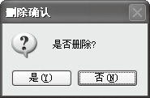

### 11.2.3　常用的输入/输出方法

在Windows应用程序中，用户经常需要输入信息和输出信息。在前面已经介绍了如何使用控制台输入/输出信息，下面简单地介绍一下使用Windows窗体和控件输入/输出信息的方法。

常用的可接受信息的控件有Lable控件、TextBox控件等。

常用的输出方法有MessageBox()、Lable控件和TextBox控件等。MessageBox是一个消息框对象。要创建消息框，需要调用MessageBox的Show()方法实现，而Show()方法有很多重载方式，常用的有以下4种类型。

（1）最简单的消息框。

MessageBox.Show(“消息内容”)，如下图所示。

（2）带标题的消息框。

MessageBox.Show(“消息内容”,“消息框标题”)，如下图所示。

（3）带标题、按钮的消息框。

MessageBox.Show（“消息内容”，“消息框标题”，消息框按钮），如下图所示。

（4）带标题、按钮、图标的消息框。

MessageBox.Show（“消息内容”，“消息框标题”，消息框按钮，消息框图标）。

