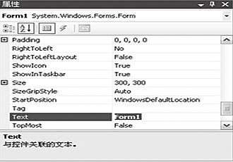
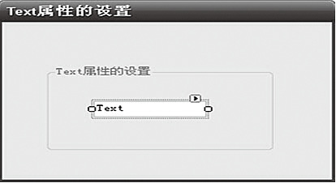
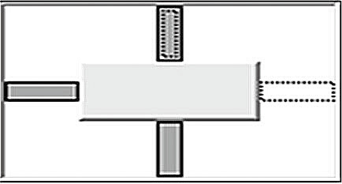
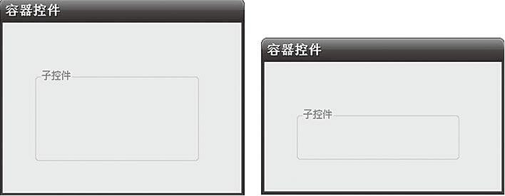
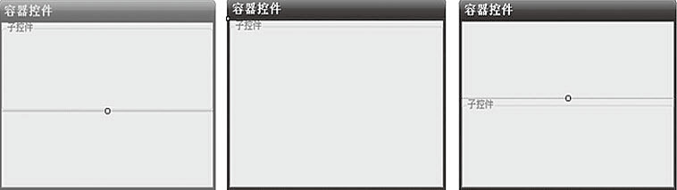

### 11.3.2　Control类的基本属性

Control类的属性描述了一个窗体控件的所有公共属性，可以在属性（Properties）窗口中查看或修改窗体控件的属性。

常用的属性如下。

#### 1．Name属性

每一个控件都有一个Name（名字）属性，在应用程序中，可通过此属性来引用这个控件。

C#会给每个新添加的控件指定一个默认名。在应用程序设计中，可根据需要将控件的默认名字改成更有实际代表意义的名字。

#### 2．Text属性

在C#中，每一个控件对象都有Text属性。Text属性在很多控件中都有重要的意义和作用。

例如，在标签控件中显示的文字、在文本框中用户输入的文字、组合框和窗体中的标题等都是用控件的Text进行设定的。

对于Text属性的设置过程及设置结果如下图所示。

#### 3．Anchor属性

Anchor的意思是“锚”，那么Anchor属性是用来确定此控件与其容器控件的固定关系的。

在此，所谓容器控件是指什么呢？顾名思义，容器控件就是像一般的容器一样可以存放其他控件的控件。例如，窗体控件中会包含很多的控件，像标签控件、文本框等。这时，将包含控件的控件称为容器控件或父控件，而里面的控件为子控件。显然，这必然涉及一个问题，即子控件与父控件的位置关系问题，就是当父控件的位置、大小变化时，子控件按照什么样的原则改变其位置、大小。Anchor属性就用于设置此原则。

对于Anchor属性，可以设定Top、Bottom、Right、Left中任意的几种，设置的方法非常直观，如下图所示。

图中选中变黑的方位即为设定的控件方位，图中所示的方位为Top、Left、Bottom。此时，如果容器控件发生变化，子控件将保证其上边缘与容器上边的距离、左边缘与容器左边的距离、底边与容器底边的距离。其运行效果如下图所示。

#### 4．Dock属性

Dock属性规定了子控件与父控件的边缘依赖关系。Dock的效果如下图所示。

Dock的值有6种，分别是Top、Bottom、Left、Right、Fill，最后还有默认值None。一旦Dock值被设定，子控件就会发生变化，与父控件选定的边缘相融在一起。

