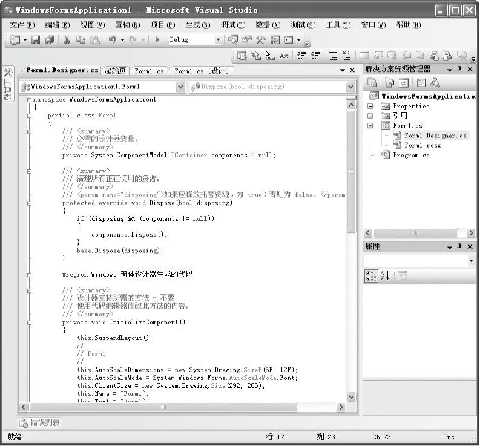

### 11.4　Windows应用程序的结构和开发步骤


**本节视频教学录像：2分钟**

一个标准的Windows窗体应用程序是由窗体、控件及其事件所组成的。

当为应用程序设计用户界面时，通常会创建一个从Form派生的类，然后可以添加控件、设置属性、创建事件处理程序以及向窗体添加编程逻辑。

添加到窗体的每个组件（如文本框、按钮、Timer、标签等）都称为控件。Windows窗体编程的一个重要方面就是控件编程。一般来说，控件都会有自己的属性、方法以及特定的事件。控件编程的关键就是了解这些属性、方法和事件的用法。

事件是Windows应用程序的重要组成部分。Windows应用程序是由事件驱动的，整个程序的运行过程都离不开事件和事件处理。程序编制也以事件处理为核心。

在应用程序结束时，需要调用Dispose()方法释放资源，以充分利用资源。.NET框架类模型在Component类中提供Dispose()方法。当不再需要某个组件时，则调用Dispose()方法。例如,关闭某窗体时，Windows窗体对该窗体以及该窗体内包含的所有控件调用Dispose()方法。通常使用Dispose()方法来及时释放大量资源并移除对其他对象的引用，以便它们可以由回收站进行回收。还调用它以停止与该窗体关联的任何正在执行的程序逻辑。应当使Dispose()方法中的代码尽可能简单和可靠。Component的Dispose()方法如下。

```c
01  /// 清理所有正在使用的资源
02  /// </summary>
03  /// <param name="disposing">如果应释放托管资源，为 true；否则为 false。</param>
04  protected override void Dispose(bool disposing)   //析构函数，释放资源
05  {
06          if (disposing && (components != null))        
07          {
08                  components.Dispose();            //调用Component类中提供Dispose方法
09          }
10          base.Dispose(disposing);                 //调用基类的Dispose方法
11  }
```

该方法用来释放控件可以管理的资源和可选择地释放控件不可管理的资源。参数disposing为True时，释放可管理的资源；参数disposing为False时，释放不可管理的资源。一般来说，在使用向导生成应用程序时，向导会自动添加Dispose()方法。


一般来说，编写一个Windows应用程序包括以下几个步骤。

（1）创建和显示作为应用程序的主入口点的窗体。

（2）向窗体添加所需的控件。

（3）设置控件的属性。

（4）为控件添加事件处理程序。

（5）关闭窗体时，执行Dispose方法。

