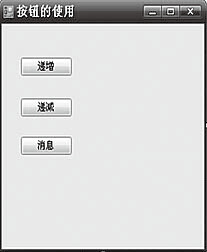
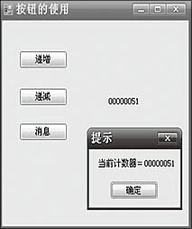

### 12.1.2　按钮类控件响应的事件

如果按钮具有焦点，就可以使用鼠标左键、【Enter】键或空格键触发该按钮的Click事件。当使用ShowDialog方法显示窗体时，可以使用按钮的DialogResult属性指定ShowDialog的返回值。

**【范例12-1】 按钮控件的运用。**

（1）为窗体Form1添加一个计数器nCounter，并添加3个按钮控件，分别完成递增计数器、递减计数器、通过消息框提示计数器的值的功能，再添加1个Label控件来显示每次运算后的计数器值。完成的窗体界面如下图所示。


（2）设置窗体和各控件的属性，如下表所示。

| 对象 | 属性 | 属性值 |
| :-----  | :-----  | :-----  | :-----  | :-----  |
| 窗体 | Name Text | Forml 按钮的使用 |
| 按钮1 | Name Text | btnlnc 递增 |
| 按钮2 | Name Text | btnDes 递减 |
| 按钮3 | Name Text | btnMsg 消息 |
| 标签 | Name Text | lblResult |

（3）切换到代码窗口，创建事件过程（代码12-1.txt）。

```c
private int nCounter;
//第一次加载时，进行计数器和lblResult的初始化
private void Form1_Load(object sender, EventArgs e)
{
        this.nCounter = 50;
        this.ShowCounter();
}
//进行递增操作，并提示新值
private void btnInc_Click(object sender, EventArgs e)
{
        this.nCounter++;
        this.ShowCounter();
}
//进行递减操作，并提示新值
private void btnDes_Click(object sender, EventArgs e)
{
        this.nCounter--;
        this.ShowCounter();
}
//通过MessageBox提示当前的值
private void btnMsg_Click(object sender, EventArgs e)
{
        string strMsg = "当前计数器＝" + this.nCounter.ToString("D8");
        MessageBox.Show(strMsg, "提示");
}
//显示计数器值到Label控件lblResult
private void ShowCounter()
{
        string strMsg = this.nCounter.ToString("D8");
        this.lblResult.Text = strMsg;
}
```

程序运行结果如下图所示。


