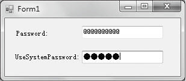

### 12.2.1　文本框控件Textbox

TextBox文本框控件用于获取用户输入的文本或显示文本，其应用很广。用TextBox 控件可编辑文本，不过也可使其成为只读控件。文本框可以显示多行，这时它对文本换行，使其符合控件的大小。TextBox 控件只能对显示或输入的文本提供单一格式化样式。若要显示多种类型的带格式文本，可以使用 RichTextBox 控件。控件显示的文本包含在 Text 属性中。默认情况下，最多可在一个文本框中输入2048个字符。如果将 MultiLine 属性设置为 true，则最多可输入32 KB的文本。Text 属性可以在设计时的“属性”窗口设置，也可在运行时用代码设置，或者在运行时通过用户输入来设置。在运行时通过读取 Text 属性得到文本框的当前内容。TextBox文本框控件支持密码输入模式，当指定了PasswordChar属性时，文本框为密码输入模式，此时无论用户输入什么文本，系统只显示密码字符。

文本框控件TextBox的主要属性、方法和事件如下。

#### 1．主要属性

（1）Text属性：Text属性是文本框最重要的属性，因为要显示的文本就包含在Text属性中。默认情况下，最多可在一个文本框中输入2048个字符。如果将MultiLine属性设置为true，则最多可输入32KB 的文本。

（2）MaxLength 属性：用来设置文本框允许输入字符的最大长度，该属性值为 0 时，不限制输入的字符数。如果超过了最大长度，系统会发出声响，且文本框不再接受任何字符。注意，用户可能不想设置此属性，因为黑客可能会利用密码的最大长度来试图猜测密码。

（3）MultiLine 属性：用来设置文本框中的文本是否可以输入多行并以多行显示。值为 true 时，允许多行显示。值为false时不允许多行显示，一旦文本超过文本框宽度时，超过部分不显示。

（4）HideSelection属性：用来决定当焦点离开文本框后，选中的文本是否还以选中的方式显示，值为true，则不以选中的方式显示，值为 false将依旧以选中的方式显示。

（5）ReadOnly属性：用来获取或设置一个值，该值指示文本框中的文本是否为只读。值为 true时为只读，值为 false时可读可写。

（6）PasswordChar 属性：是一个字符串类型，允许设置一个字符，运行程序时，将输入到 Text 的内容全部显示为该属性值，从而起到保密作用，通常用来输入口令或密码。例如，如果希望在密码文本框中显示星号，则在“属性”窗口中将PasswordChar属性指定为 “*”。运行时，无论用户在文本框中输入什么字符，都显示为星号。

（7）ScrollBars属性： 用来设置滚动条模式， 有四种选择，即ScrollBars.None （无滚动条）， ScrollBars.Horizontal（水平滚动条），ScrollBars.Vertical（垂直滚动条），ScrollBars.Both（水平和垂直滚动条）。注意：只有当MultiLine属性为true时，该属性值才有效。

（8）SelectionLength属性：用来获取或设置文本框中选定的字符数，只能在代码中使用，值为0 时，表示未选中任何字符。

（9）SelectionStart属性：用来获取或设置文本框中选定的文本起始点，只能在代码中使用，第一个字符的位置为0，第二个字符的位置为1，依此类推。

（10）SelectedText 属性：用来获取或设置一个字符串，该字符串指示控件中当前选定的文本，只能在代码中使用。

（11）Lines属性：该属性是一个数组属性，用来获取或设置文本框控件中的文本行，即文本框中的每一行存放在 Lines数组的一个元素中。

（12）Modified属性：用来获取或设置一个值，该值指示自创建文本框控件或上次设置该控件的内容后，用户是否修改了该控件的内容。值为true表示修改过，值为 false表示没有修改过。

（13）TextLength属性：用来获取控件中文本的长度。

#### 2．常用方法

（1）AppendText方法：把一个字符串添加到文本框中文本的后面，调用的一般格式为文本框对象.AppendText(str) ，参数 str是要添加的字符串。

（2）Clear方法：从文本框控件中清除所有文本。调用的一般格式为文本框对象.Clear( )，该方法无参数。

（3）Focus方法：为文本框设置焦点。如果焦点设置成功，值为 true，否则为false。调用的一般格式为文本框对象.Focus( )，该方法无参数。

（4）Copy方法：将文本框中的当前选定内容复制到剪贴板上。调用的一般格式为文本框对象.Copy( )，该方法无参数。

（5）Cut方法：将文本框中的当前选定内容移动到剪贴板上。调用的一般格式为文本框对象.Cut( )，该方法无参数。

（6）Paste方法：用剪贴板的内容替换文本框中的当前选定内容。调用的一般格式为文本框对象.Paste( )，该方法无参数。

（7）Undo 方法：撤销文本框中的上一个编辑操作。调用的一般格式为文本框对象.Undo( )，该方法无参数。

（8）ClearUndo方法：从该文本框的撤销缓冲区中清除关于最近操作的信息，根据应用程序的状态，可以使用此方法防止重复执行撤销操作。调用的一般格式为文本框对象.ClearUndo( )，该方法无参数。

（9）Select方法：用来在文本框中设置选定文本。调用的一般格式为文本框对象.Select(start, length) ，该方法有两个参数，第一个参数start用来设定文本框中当前选定文本的第一个字符的位置，第二个参数length用来设定要选择的字符数。

（10）SelectAll方法：用来选定文本框中的所有文本。调用的一般格式为文本框对象.SelectAll( )，该方法无参数。

#### 3．常用事件

（1）GotFocus事件：该事件在文本框接收焦点时发生。

（2）LostFocus事件：该事件在文本框失去焦点时发生。

（3）TextChanged事件：该事件在Text属性值更改时发生。无论是通过编程修改还是用户交互更改文本框的 Text属性值，均会引发此事件。

**【范例12-2】 创建密码文本框。**

功能实现：创建1个Windows窗体应用程序，使用PasswordChar属性将密码文本框中的字符自定义显示为“@”，同时将UseSystem PasswordChar 属性设置为true，使第二个密码文本框的字符显示为“*”。关键代码如下（代码12-2.txt），运行结果如下图所示。

```c
/**********************************************************/
01  private void Form1_Load(object sender, EventArgs e)
02  {
03          textBox1.PasswordChar = '@';      //设置文本框的PasswordChar属性为字符“@”
04          //设置文本框的UseSystemPasswordChar属性为true
05          textBox2.UseSystemPasswordChar = true; 
06  }
/*----------------------------------------------------------------------------------------------*/
```


