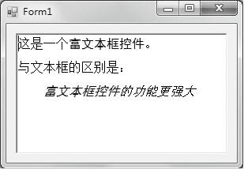

### 12.2.2　富文本框控件RichTextbox

RichTextBox控件类似Microsoft Word，能够输入、显示或处理多种类型的带格式文本， 与TextBox控件相比， RichTextBox控件的文字处理功能更加丰富， 不仅可以设定文字的颜色、 字体， 还具有字符串检索功能。 另外， RichTextBox控件还可以打开、编辑和存储.rtf格式文件、ASCII文本格式文件及Unicode编码格式的文件。 与TextBox控件相同，RichTextBox控件可以显示滚动条，但不同的是，RichTextBox控件的默认设置是水平和垂直滚动条均根据需要显示，并且拥有更多的滚动条设置。

#### 1．常用属性

上面介绍的 TextBox 控件所具有的属性，RichTextBox 控件基本上都具有，除此之外，该控件还具有一些其他属性。

（1）RightMargin属性：用来设置或获取右侧空白的大小，单位是像素。通过该属性可以设置右侧空白，如希望右侧空白为50像素，可使用如下语句。

```c
RichTextBox1.RightMargin=RichTextBox1.Width-50;
```

（2）Rtf属性：用来获取或设置RichTextBox控件中的文本，包括所有RTF格式代码。可以使用此属性将RTF格式文本放到控件中以进行显示，或提取控件中的RTF格式文本。此属性通常用于在RichTextBox控件和其他RTF源（如 Microsoft Word或 Windows写字板）之间交换信息。

（3）SelectedRtf 属性：用来获取或设置控件中当前选定的 RTF 格式的格式文本。此属性使用户得以获取控件中的选定文本，包括RTF格式代码。如果当前未选定任何文本，给该属性赋值将把所赋的文本插入到插入点处。如果选定了文本，则给该属性所赋的文本值将替换掉选定文本。

（4）SelectionColor属性：用来获取或设置当前选定文本或插入点处的文本颜色。

（5）SelectionFont属性：用来获取或设置当前选定文本或插入点处的字体。

（6）SelectionProtected 属性：使用户得以保护控件内的文本不被用户操作。当控件中有受保护的文本时，可以处理Protected 事件以确定用户何时曾试图修改受保护的文本，并提醒用户该文本是受保护的，或向用户提供标准方式供其操作受保护的文本。

还可以通过设置SelectionIndent、SelectionRightIndent 和 SelectionHangingIndent 属性调整段落格式设置。

#### 2．常用方法

前面介绍的 TextBox 控件所具有的方法，RichTextBox 控件基本上都具有，除此之外，该控件还具有一些其他方法。

（1）Redo方法：用来重做上次被撤销的操作。调用的一般格式为RichTextBox对象.Redo( )，该方法无参数。

（2）Find方法：用来从RichTextBox控件中查找指定的字符串。经常使用的基本调用格式为RichTextBox对象.Find(str) ，其功能是在指定的RichTextBox控件中查找字符串str，并返回搜索文本的第一个字符在控件内的位置。如果未找到str或者str参数指定的搜索字符串为空，则返回值为1。

（3）LoadFile方法：使用LoadFile方法可以将文本文件、RTF文件装入RichTextBox控件。常用的调用格式有两种，一种为RichTextBox对象名.LoadFile(文件名)，功能是将RTF格式文件或标准ASCII文本文件加载到RichTextBox控件中。 另一种为RichTextBox对象名.LoadFile(文件名,文件类型)，功能是将特定类型的文件加载到RichTextBox控件中。

文件类型格式取值如下。

（1）PlainText：用空格代替对象链接与嵌入（OLE）对象的纯文本流。

（2）RichNoOleObjs：用空格代替对象链接与嵌入（OLE）对象的RTF格式流，该值只在用于RichtextBox控件的SaveFile方法时有效。

（3）RichText：RTF格式流。

（4）TextOleObjs：具有OLE对象的文本表示形式的纯文本流，该值只在用于RichtextBox控件的SaveFile方法时有效。

（5）UnicodePlainText：用空格代替对象链接与嵌入（OLE）对象的文本流，该文本采用Unicode编码。

（6）SaveFile方法：用来把RichTextBox中的信息保存到指定的文件中，常用的调用格式也有两种，其一为RichTextBox对象名.SaveFile(文件名)，功能是将 RichTextBox控件中的内容保存为RTF格式文件。其二为RichTextBox对象名.SaveFile(文件名,文件类型)，功能是将 RichTextBox控件中的内容保存为“文件类型”指定的格式文件。

（7）Clear方法：将富文本框内的文本清空。

#### 3．常用事件

（1）SelectionChanged事件： 控件内的选定文本更改时发生。

（2）TextChanged事件：控件内的内容有任何改变都会引发该事件。

**【范例12-3】 富文本框RichTextBox的使用。**

功能实现：设计一个窗体，在其中添加1个富文本框控件，并加载1个文件到该控件中。关键代码如下（代码12-3.txt），运行结果如下图所示。

```c
/**********************************************************/
01  private void Form1_Load(object sender, EventArgs e)
02  {
03          richTextBox1.LoadFile("E:\\file.RTF", RichTextBoxStreamType.RichText);
04  }
/*----------------------------------------------------------------------------------------------*/
```


