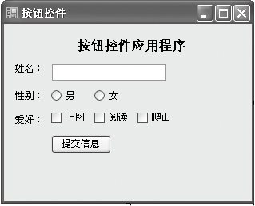
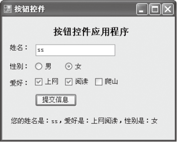

### 12.3　选择类控件


**本节视频教学录像：4分钟**

选择类控件可以分为单选按钮控件和复选按钮控件。

RadioButton控件是一个单选按钮。在同一个容器控件中，有两个或两个以上的RadioButton控件将产生互斥，也就是说只能选择一个。下表中列出了RadioButton类的主要成员及其说明。

| 成员名称 | 类别 | 说明 |
| :-----  | :-----  | :-----  | :-----  | :-----  |
| Name | 属性 | 指示代码中用来显示该对象的名称 |
| Checked | 属性 | 指示单选按钮是否处于选中状态 |
| Enabled | 属性 | 指示是否已启用该控件 |
| Text | 属性 | 与控件关联的文本 |
| Visible | 属性 | 确定控件是可见还是隐藏 |
| Click | 事件 | 单击组件时发生 |
| CheckedChanged | 事件 | 每当Check属性更改时发生 |
| CheckStateChanged | 事件 | 每当更改CheckState属性时发生 |
| Equals | 方法 | 确定指定的System.object是否等于当前的System.Object |
| SelectNextControl() | 方法 | 激活下一个控件 |

下面的代码演示了单选按钮如果未被选中，则给出提示信息。

```c
01  if (radioButton1.Checked == false && radioButton2.Checked == false)
02  {        //如radioButton1和radioButton2的Checked为false，提示选择性别
03  MessageBox.Show("请选择性别");
04  }
```

CheckBox控件是一个复选框。该控件默认用于向用户提供两种状态选择：True和False。当其TreeState属性为True时，可以设置3种状态，第3种状态为不确定状态（Indeterminate）。下表中列出了CheckBox类的主要成员及其说明。

| 成员名称 | 类别 | 说明 |
| :-----  | :-----  | :-----  | :-----  | :-----  |
| Checked | 属性 | 指示组件是否处于选中状态 |
| Enabled | 属性 | 指示是否已启用该控件 |
| ThreeState | 属性 | 指示CheckBox允许3种选中状态，而不是两种状态 |
| Click | 事件 | 单击组件时发生 |
| CheckedChanged | 事件 | 每当Check属性更改时发生 |
| CheckStateChanged | 事件 | 每当更改CheckState属性时发生 |
| Focus | 方法 | 为控件输入焦点 |

> 
> **提示**
> 只要Checked属性的值改变，就会引发CheckChanged事件，这样就可以根据控件的新值执行其他动作。

下面的代码演示了使用Checked属性判断复选框是否选中，并给出提示信息。

```c
01  if (this.checkBox1.Checked == false && this.checkBox2.Checked ==false && checkBox3.
        Checked == false)    //如radioButton1、 radioButton2和radioButton3的Checked为false，
                               提示选择一项
02  {
03          MessageBox.Show("请至少选一项，谢谢！");
04          return;
05  }
```

下面的代码演示了通过在CheckedChanged事件处理程序中编写代码，给出提示信息。

```c
01  private void checkBox1_CheckedChanged(object sender, EventArgs e)
02  {
03          if (this.checkBox1.Checked == true)       //判断是否选择了checkBox1
04          {
05          MessageBox.Show("你选择的是checkBox1");    //显示选择的内容
06          }
07  }
```

**【范例12-4】 Button控件示例。**

（1）新建一个C# Windows窗体应用程序，项目名称为“ButtonControl”。

（2）向Windows窗体中添加四个Lable控件、一个TextBox控件、两个RadioButton控件、三个CheckBox控件和一个Button控件，设计如下图所示的界面。


（3）切换到代码视图，在提交信息按钮的Click事件中编写如下代码（代码12-4.txt）。

```c
01  private String strGender = "";   //定义变量strGender，初值为空
02  private String strLike = "";     //定义变量strLike，初值为空
03  //单击Button事件
04  private void button1_Click(object sender, EventArgs e)
05  {
06  label4.Text = "您的姓名是："+textBox1.Text+"，"+"爱好是："+strLike+"，"+"性别是："+strGender;
    //单击提交信息按钮，在下方通过lable4控件显示对应信息
07    }
08  //Radio1的CheckedChanged事件
09  private void radioButton1_CheckedChanged(object sender, EventArgs e)
10  {
11          strGender = "男";        //选择radioButton1后strGender 赋值为"男"
12  }
13  //Radio2的CheckedChanged事件
14  private void radioButton2_CheckedChanged(object sender, EventArgs e)
15  {
16          strGender = "女";       //选择radioButton2后strGender 赋值为"女"
17  }
18  //上网
19  pivate void checkBox1_CheckedChanged(object sender, EventArgs e)
20  {
21          if (checkBox1.Checked) //选择checkBox1，执行如下代码
22          {
23                  strLike = strLike + checkBox1.Text;   //为strLike添加"上网"
24          }
25          else                  //否则为strLike添加换行符
26          {
27                  strLike.Replace(checkBox1.Text + "  </br>", "");
28                  strLike.Trim(); //删除strLike前后的空格
29          }
30  
31  }
32  //阅读
33  private void checkBox2_CheckedChanged(object sender, EventArgs e)
34  {
35          if (checkBox2.Checked)     //选择checkBox2，执行如下代码
36          {
37                  strLike = strLike +checkBox2.Text;   //为strLike添加"阅读"
38          }
39          else                      //否则为strLike添加换行符
40          {
41                  strLike.Replace(checkBox2.Text + "  </br>", "");
42                  strLike.Trim();   //删除strLike前后的空格
43          }
44  
45  }
46  //爬山
47  private void checkBox3_CheckedChanged(object sender, EventArgs e)
48  {
49          if (checkBox3.Checked)   //选择checkBox3，执行如下代码
50          {
51                  strLike = strLike + checkBox3.Text;    //为strLike添加"爬山"
52          }
53          else                     //否则为strLike添加换行符
54          {
55                  strLike.Replace(checkBox3.Text + "  </br>", "");
56                  strLike.Trim();  //删除strLike前后的空格
57          }
58  }
```

**【运行结果】**

单击工具栏中的【启用调试】按钮
，在输出窗体界面单击【提交信息】按钮，在窗体的下方就可以看到填写的相关信息，如下图所示。


**【范例分析】**

本范例综合运用了RadioButton、CheckBox和Button等控件，在程序的第1行、第2行定义了两个全局变量，在下面的各个过程中进行调用，并更改其值。从程序的第8行开始一直到程序的最后一行，定义了RadioButton和CheckBox控件的CheckChanged事件，判断选择的是什么，将结果赋值给全局变量，在程序的第6行输出结果。因为爱好是可以多项选择的，故使用语句“strLike ="strLike + checkBox1.Text;”保留每次选中的项的值。

