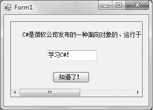

### 12.4.2　Panel控件

Panel控件用于在Windows窗体中以面板的形式为其他控件提供分组。通常，使用面板按功能细分窗体。在设计时，所有控件都可以轻松移动。当移动Panel控件式时，它包含的所有控件也将随之移动。分组在一个面板中的控件可以通过面板的Controls属性进行访问。此属性返回一批Control实例，因此，通常需要将该方式检索得到的控件强制转换为它的特定类型。

面板控件（Panel）用Panel类封装，用于为其他控件提供组合容器。Panel 控件类似于 GroupBox 控件，但GroupBox 控件可以显示标题，而Panel 控件有滚动条。如下情况下经常使用面板控件Panel：子控件要以可见的方式分开，或提供不同的BackColor属性，或使用滚动条以允许多个控件放置在同一个有限空间。如果 Panel 控件的Enabled 属性设置为 false，则也会禁用包含在 Panel 中的控件。

面板控件Panel的常用属性如下表所示。

| 属性 | 说明 |
| :-----  | :-----  | :-----  | :-----  |
| AutoScroll | 设置为 true 时，启用 Panel 控件中的滚动条，可以滚动显示 Panel 中（但不在其可视区域内）的所有控件 |
| BackColor | 此属性获取或设置控件的背景色 |
| BackgroundImage | 此属性获取或设置在控件中显示的背景图像 |
| BorderStyle | 此属性指示控件的边框样式，有None（默认，无边框），FixedSingle（标准边框），Fixed3D（三维边框）三种。用标准或三维边框可将面板区与窗体上的其他区域区分开 |

**【范例12-5】 面板控件Panel的应用。**

功能实现：创建一个Windows应用程序，在默认窗体中添加1个Panel控件，用来作为容器控件，然后向该Panel控件中分别添加1个Label控件、1个Button控件和1个TextBox控件，最后在窗体加载事件中设置容器控件的边框样式以及滚动条显示。添加的关键代码如下（代码12-5.txt），运行结果如下图所示。

```c
/**********************************************************/
01  private void Form1_Load(object sender, EventArgs e)
02  {
03          panel1.BorderStyle = BorderStyle.FixedSingle;   //设置panel1控件的边框样式
04          panel1.AutoScroll = true;                       //设置panel1控件自动显示滚动条
05  }
/*----------------------------------------------------------------------------------------------*/
```


