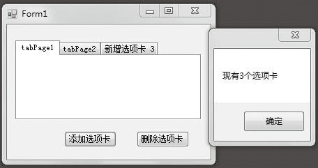

### 12.4.3　Tabcontrol控件

TabControl控件用于在Windows窗体中显示多个选项卡，选项卡中可包含图片和其他控件。我们可以使用该选项卡控件来生成多页对话框，这种对话框在Windows操作系统中的许多地方（例如，控制面板中的“显示”属性中）都可以找到。此外，TabControl控件还可以用来创建用于设置一组相关属性的属性页。

选项卡控件（TabControl）使用TabControl类封装。在这类控件中，通常在上部有一些标签供选择，每个标签对应一个选项卡页面，这些选项卡页面由通过TabPages 属性添加的 TabPage 对象表示。选中一个标签就会显示相应的页面而隐藏其他页面。要为添加后的特定页面添加控件，通过选项卡控件的标签切换到相应页面，再选中该页面，然后把控件拖动到页面中即可。通过这个方式，可以把大量的控件放在多个页面中，通过选项卡标签迅速切换。

选项卡控件TabControl的常用属性、方法和事件如下表所示。

| 常用属性 | 说明 |
| :-----  | :-----  | :-----  | :-----  |
| Alignment | 控制选项卡TabPage在选项卡控件的什么位置显示，是一个TabAlignment枚举类型，有Top （默认），Bottom，Left，Right四个值。默认的位置为控件的顶部 |
| Multiline | 如果这个属性设置为true，就可以有几行选项卡，默认情况为单行显示，在标签超出选项卡控件可视范围时自动使用箭头按钮来滚动标签 |
| RowCount | 返回当前显示的选项卡行数 |
| SelectedIndex | 返回或设置选中选项卡的索引，若没有选中项，返回-1 |
| SelectedTab | 返回或设置选中的选项卡。注意这个属性在TabPages的实例上使用。若没有选中项，返回null |
| TabCount | 返回选项卡的总数 |
| TabPages | 这是控件中的选项卡TabPage对象集合，可以通过它对选项卡页面进行管理，可以添加和删除TabPage对象 |
| Appearance | 控制选项卡的显示方式，有三种风格：Buttons（一般的按钮）、FlatButtons（带有平面样式）、Normal（默认）。只有当标签位于顶部时，才可以设置FlatButtons风格；位于其他位置时，将显示为Buttons |
| HotTrack | 如果这个属性设置为true，则当鼠标指针滑过控件上的选项卡时，其外观就会改变 |
| SizeMode | 指定标签是否自动调整大小来填充标签行。枚举类型TabSizeMode定义了三种取值 |
| Normal | 根据每个标签内容调整标签的宽度 |
| Fixed | 所有标签宽度相同 |
| FillToRight | 调整标签宽度，使其填充标签行（只有在多行标签的情况下进行调整） |

| 方法和事件 | 说明 |
| :-----  | :-----  | :-----  | :-----  |
| SelectTab方法 | 使指定的选项卡成为当前选项卡 |
| DeselectTab方法 | 使指定的选项卡后面的选项卡成为当前选项卡 |
| RemoveAll方法 | 从该选项卡控件中移除所有的选项卡页和附加的控件 |
| SelectedIndexChanged事件 | 改变当前选择的标签时触发这个事件，可以在这个事件的处理中根据程序状态来激活或禁止相应页面的某些控件 |

此外，就选项卡页面集合TabPages属性而言，有如下几种常用方法对其进行管理。

① 通过提供索引访问，可以访问某一选项卡页面，如：

```c
tabControl1.TabPages[0].Text = “选项卡1”
```

② 添加TabPage对象，通过TabPages的Add或者AddRange方法。

③ 删除TabPage对象，通过TabPages的Remove方法（参数为TabPage引用）或RemoveAt方法（参数为索引值）。

④ 清除所有的TabPage对象，通过TabPages的Clear方法。

**【范例12-6】 选项卡控件TabControl的应用。**

功能实现：创建一个Windows应用程序，在默认窗体中添加1个TabControl控件和2个Button控件，其中TabControl控件用来作为选项卡控件，Button控件分别用来执行添加和删除选项卡操作。添加的关键代码如下（代码12-6.txt），运行结果如下图所示。

```c
/**********************************************************/
01  private void Form1_Load(object sender, EventArgs e)
02  {
03          tabControl1.Appearance = TabAppearance.Normal;   //设置选项卡的外观样式
04  }
05  private void button1_Click(object sender, EventArgs e)
06  {     
07          listBox1.Items.Clear();
08          //声明一个字符串变量，用于生成新增选项卡的名称
09          string Title = "新增选项卡 " + (tabControl1.TabCount + 1).ToString();
10          TabPage MyTabPage = new TabPage(Title);    //实例化TabPage
11          //使用TabControl控件的TabPages 属性的Add方法添加新的选项卡
12          tabControl1.TabPages.Add(MyTabPage);
13          MessageBox.Show("现有" + tabControl1.TabCount + "个选项卡");  //获取选项卡个数
14  }
15  private void button2_Click(object sender, EventArgs e)
16  {     
17          listBox1.Items.Clear();
18          if (tabControl1.SelectedIndex == 0)                        //判断是否选择了要移除的选项卡
19                  MessageBox.Show("请选择要移除的选项卡");//如果没有选择，弹出提示
20          else
21                  //使用TabControl控件的TabPages属性的Remove方法移除指定的选项卡
22                  tabControl1.TabPages.Remove(tabControl1.SelectedTab);
23  }
/*----------------------------------------------------------------------------------------------*/
```


