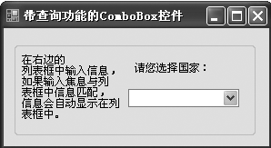
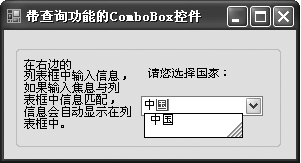

### 12.5.1　列表框控件和组合框控件

ListBox是一个列表框控件，该控件可以显示较长的选项列表，用户可从中选择一项或多项。该控件默认显示一列选项。当ListBox控件的MultiColumn属性为True时，列表以多列形式显示项。如果项总数超出可以显示的项数，则自动向ListBox控件添加滚动条。ListBox控件列表中的每个元素称为项。下表中列出了ListBox类的常用成员及其说明。

| 成员名称 | 类别 | 说明 |
| :-----  | :-----  | :-----  | :-----  | :-----  |
| DataSource | 属性 | 指示此控件将用来获取其项的列表 |
| Items | 属性 | 列表框中的项 |
| SelectedItem | 属性 | 指定控件中当前选定内容的对象 |
| SelectedIndexChanged | 事件 | SelectedIndex属性值更改时发生 |
| SelectedValueChanged | 事件 | 在ListControl上更改SelectedValue属性的值时引发的事件 |
| Add() | 方法 | 向ListBox的项列表添加项 |
| AddRange() | 方法 | 向ListBox的项列表添加项的数组 |
| Clear() | 方法 | 向ListBox中移除所有项 |
| Insert() | 方法 | 将一项插入集合中指定索引处 |
| Remove() | 方法 | 向ListBox中移除指定项 |
| RemoveAt() | 方法 | 向ListBox中指定索引处的项 |

在这里说明一下Items属性。该属性使用户可以获取对当前存储在ListBox中的项列表的应用。通过此引用，可以在集合中添加项、移除项和获得项的数目。

下面的代码演示了如何使用ListBox类的方法实现向列表中添加项目以及修改项目。

```c
01  //单击添加按钮事件
02  private void btnAdd_Click(object sender, EventArgs e)
03  {
04          if (this.txtInput.Text != "")         //如果文本框非空，则进行添加
05          {
06                  this.listBox1.Items.Add(this.txtInput.Text);
07                  this.txtInput.Text = "";      //添加完毕，文本框置空
08          }
09  }
10  //单击修改按钮事件
11  private void btnUpd_Click(object sender, EventArgs e)
12  {
13          if (nSelectedIndex < listBox1.Items.Count && nSelectedIndex > -1)
14          {
15                  this.listBox1.Items[nSelectedIndex] = this.txtInput.Text;
16                  //对选中的那一条的内容进行修改
17          }
18  }
```

组合框（ComboBox）是一个组合框控件。该控件可让用户输入或在下拉列表中选择内容。它结合了TextBox控件和ListBox控件的功能。ComboBox控件几乎支持列表框控件的所有属性。

下表列出了ComboBox类的常用成员及其说明。

| 成员名称 | 类别 | 说明 |
| :-----  | :-----  | :-----  | :-----  | :-----  |
| DropDownStyle | 属性 | 此属性表示ComboBox的样式 |
| Items | 属性 | 组合框中的项 |
| MaxDropDownItems | 属性 | 在下拉列表框中显示的最多项数 |
| Click | 事件 | 单击组件时发生 |
| SelectedIndexChanged | 事件 | SelectedIndex属性值更改时发生 |
| SelectedValueChanged | 事件 | 在ListControl上更改SelectedValue属性的值时引发 |

其中DropDownStyle属性取值可以为Simple、DropdownList和Dropdown等。取值为DropDown时，文本部分可编辑，用户必须单击箭头按钮来显示列表部分，这是默认值；取值为DropDownList时，用户不能直接编辑文本部分，必须单击箭头按钮来显示列表部分；取值为Simple时，文本部分可编辑，而且列表部分可见。例如，将ComboBox控件的DropDownStyle属性设置为“DropDownList”的代码如下。

```c
   comboBox1.DropDownStyle = ComboBoxStyle.DropDownList;
```

ComboBox最重要的事件是SelectedIndexChanged，该事件主要在SelectedIndex属性值更改时发生。

**【范例12-7】 带查询功能的ComboBox控件。**

（1）启动Visual Studio 2013，新建一个C# Windows窗体应用程序，项目名称为“ComboBoxSample”。

（2）向Windows窗体中添加两个Lable控件、一个GroupBox控件和一个ComboBox控件，设计如下图所示的界面。


（3）切换到代码视图，在窗体的Form_Load事件中编写以下代码（代码12-7.txt）。

```c
01  comboBox1.Items.Clear();            //窗体载入时初始化ComboBox控件
02  comboBox1.Items.Add("美国");        //向comboBox1的Items集合属性中添加新项
03  comboBox1.Items.Add("英国");        //向comboBox1的Items集合属性中添加新项
04  comboBox1.Items.Add("日本");        //向comboBox1的Items集合属性中添加新项
05  comboBox1.Items.Add("中国");        //向comboBox1的Items集合属性中添加新项
06  comboBox1.Items.Add("澳大利亚");    //向comboBox1的Items集合属性中添加新项
07  comboBox1.Items.Add("加拿大");      //向comboBox1的Items集合属性中添加新项
08  comboBox1.Items.Add("法国");        //向comboBox1的Items集合属性中添加新项
09  comboBox1.Items.Add("韩国");        //向comboBox1的Items集合属性中添加新项
10  comboBox1.Items.Add("俄罗斯");      //向comboBox1的Items集合属性中添加新项
11  comboBox1.Items.Add("新西兰");      //向comboBox1的Items集合属性中添加新项
12  comboBox1.Items.Add("泰国");        //向comboBox1的Items集合属性中添加新项
13  comboBox1.Items.Add("意大利");      //向comboBox1的Items集合属性中添加新项
14  comboBox1.Items.Add("马来西亚");    //向comboBox1的Items集合属性中添加新项
15  this.comboBox1.AutoCompleteMode =AutoCompleteMode.SuggestAppend;//自动完成模式设置
16  this.comboBox1.AutoCompleteSource =AutoCompleteSource.ListItems;  //自动完成字符串来源
```

**【运行结果】**

单击工具栏中的【启用调试】按钮
，即可在输出窗体界面单击下拉列表的下拉按钮进行选择，也可以输入。如果输入的第1个字符和列表框中有匹配的话就显示匹配项，即实现了查询功能，如下图所示。


**【范例分析】**

本范例代码的前面部分主要是向ComboBox控件中添加项。查询功能主要依赖于AutoCompleteMode属性，该属性可将所输入的字符串前缀与所维护源中的所有字符串的前缀进行比较来自动完成输入字符串的填写。在 AutoCompleteMode 设置为 SuggestAppend，且 AutoCompleteSource 设置为 ListItems 的情况下，行为如下。

（1）如果字符串列表为空，按【Backspace】或【Delete】键将不做任何操作。

（2）如果按【Backspace】键的时间小于一秒，则选中前一项；如果字符串列表为空，则不选中任何内容。

（3）如果按【Backspace】键的时间超过一秒，则选中第1项。

（4）如果按【Delete】键，则选中第1项。

