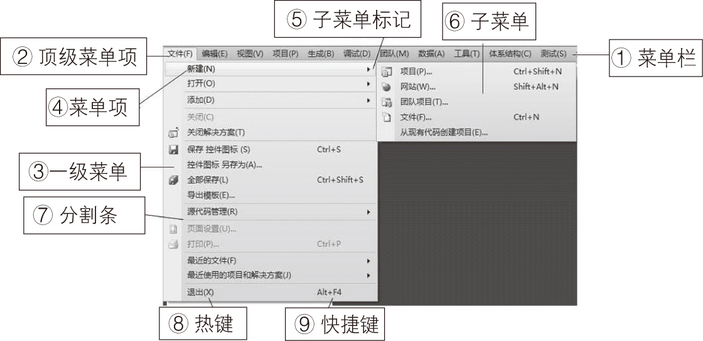

### 13.1.1　菜单的基本结构

下拉式菜单和弹出式菜单的基本结构大致相似，下面以下拉式菜单为例来说明菜单的基本结构。下图所示是典型的菜单结构。

在图中，其中有文字的单个命令称菜单项，顶层菜单项是横着排列的，构成了菜单栏。单击某个顶级菜单项（或菜单项）后弹出的菜单称为一级菜单（或子菜单），它们均包含若干个菜单项，菜单项其实是ToolStripMenuItem 类的一个对象。菜单项有的是变灰显示的，表示该菜单项当前是被禁止使用的。有的菜单项的提示文字中有带下画线的字母，该字母称为热键（或访问键），若是顶层菜单，可通过按“Alt+热键”打开该菜单；若是某个子菜单中的一个选项，则在打开子菜单后直接按热键就会执行相应的菜单命令。有的菜单项后面有一个按键或组合键，称快捷键，在不打开菜单的情况下按快捷键，将执行相应的命令。图中的菜单项“源代码管理”和“页面设置”之间有一个灰色的线条，该线条称为分隔线或分隔符。

