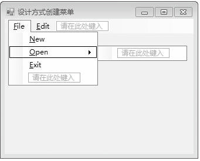
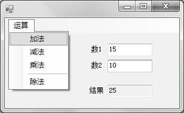

### 13.1.2　下拉式菜单控件MenuStrip

C#的工具箱中提供了一个MenuStrip菜单控件，它是应用程序下拉式菜单的容器。应用程序可以为不同的应用程序状态显示不同的菜单，于是可能会有多个 MenuStrip对象，每个对象向用户显示不同的菜单项。通过包含多个 MenuStrip对象，可以处理用户与应用程序交互时应用程序的不同状态。

MenuStrip菜单控件由MenuStrip类封装，该类派生于ToolStrip类。在建立菜单时，要给MenuStrip菜单控件添加菜单项ToolStripMenuItem对象，这可以通过设计方式或编程方式实现。

#### 1．设计方式创建菜单

设计方式即在Visual Studio.Net的窗体设计器中进行。在“Windows 窗体设计器”中打开需要菜单的窗体。可以把一个MenuStrip控件拖放到窗体设计器的该窗体中，或者，在“工具箱”中找到MenuStrip菜单控件，双击它，即向窗体顶部添加了一个菜单。与此同时，MenuStrip控件也添加到了控件栏。

之后，MenuStrip就允许直接添加菜单项，并在菜单项上输入菜单文本。在菜单设计器中创建两个顶级菜单项，并将Text属性分别设置为 &File、&Edit，然后在顶级菜单项File下创建包含三个菜单项的一级菜单，并将这三个菜单项的Text 属性分别设置为&New、&Open和&Exit。最终的效果如下图所示。


#### 2．编程方式创建菜单

编程方式即以书写代码方式创建菜单及菜单项，如下。

（1）创建一个MenuStrip对象。

```c
MenuStrip menu1 = new MenuStrip( );
```

菜单中的每一个菜单项都是一个ToolStripMenuItem对象，因此先确定要创建哪几个顶级菜单项，这里我们创建File和Edit两个顶级菜单。

```c
ToolStripMenuItem item1 = new ToolStripMenuItem("&File");
ToolStripMenuItem item2 = new ToolStripMenuItem("&Edit");
```

（2）使用MenuStrip的Items集合的AddRange方法一次性将顶级菜单加入到MenuStrip中。此方法要求用一个ToolStripItem数组作为传入参数。

```c
menu1.Items.AddRange(new ToolStripItem[ ] { item1, item2 });
```

（3）创建三个ToolStripMenuItem对象，作为顶级菜单项File的下拉菜单的菜单项。

```c
ToolStripMenuItem item3 = new ToolStripMenuItem("&New");
ToolStripMenuItem item4 = new ToolStripMenuItem("&Open");
ToolStripMenuItem item5 = new ToolStripMenuItem("&Exit");
```

将创建好的三个菜单项添加到顶级菜单项File下。注意，这里不再调用Items属性的AddRange方法，添加下拉菜单需要调用顶级菜单项的DropDownItems属性的AddRange方法。

```c
item1.DropDownItems.AddRange(new ToolStripItem[] { item3, item4, item5 });
```

（4）将创建好的菜单对象添加到窗体的控件集合中。

```c
this.Controls.Add(menu1);
```

此外，编程方式还可实现禁用菜单项，禁用菜单项只要将菜单项的Enabled 属性设置为 false ，以上例创建的菜单为例，禁用Open菜单项代码如下。

```c
item4.Enabled = false;
```

也可以用编程方式删除菜单项。删除菜单项就是将该菜单项从相应的 MenuStrip的 Items 集合中删除。根据应用程序的运行需要，如果此菜单项以后要再次使用，最好是隐藏或暂时禁用该菜单项而不是删除它。在以编程方式删除菜单项时，调用MenuStrip对象的Items集合中的Remove方法可以删除指定的ToolStripMenuItem，一般用于删除顶级菜单项；若要删除（一级）菜单项或子菜单项，请使用父级ToolStripMenuItem对象的DropDownItems集合的Remove方法。

#### 3．菜单项的常用属性与事件

创建好菜单及菜单项之后，接下来就可以给菜单项添加事件处理函数，其中最常用的事件是菜单项Click事件，即单击该菜单项将触发该事件，程序流程转入执行相应的click事件处理函数。在设计阶段，开发人员只需双击某菜单项，Visual Studio.Net环境就可以在代码中自动添加该菜单项对应的Click事件处理函数，初始是空白的，开发人员只需添加功能代码就可以了。菜单项的常用属性与事件如下表所示。

| 属性和事件 | 说明 |
| :-----  | :-----  | :-----  | :-----  |
| Text 属性 | 用来获取或设置一个值，通过该值指示菜单项标题。当使用 Text 属性为菜单项指定标题时，还可以在字符前加一个“&”来指定热键。例如，若要将“File”中的“F”指定为热键，应将菜单项的标题指定为“&File” |
| Enabled属性 | 用来获取或设置一个值，通过该值指示菜单项是否可用。值为true时表示可用，值为false表示当前禁止使用 |
| ShortcutKeys属性 | 用来获取或设置一个值，该值指示与菜单项相关联的快捷键 |
| ShowShortcutKeys 属性 | 用来获取或设置一个值，该值指示与菜单项关联的快捷键是否在菜单项标题的旁边显示。如果快捷键在菜单项标题的旁边显示，该属性值为 true，如果不显示快捷键，该属性值为false。默认值为true |
| Checked属性 | 用来获取或设置一个值，通过该值指示选中标记是否出现在菜单项文本的旁边。如果要放置选中标记在菜单项文本的旁边，属性值为true，否则属性值为false。默认值为false |
| Click事件 | 该事件在用户单击菜单项时发生 |

**【范例13-1】 下拉式菜单的应用。**

功能实现：创建一个Windows应用程序，设计一个下拉式菜单实现两个数的加、减、乘和除运算。添加的关键代码如下（代码13-1.txt）。

```c
/**********************************************************/
01  private void addop_Click(object sender, EventArgs e)
02  {
03          int n;
04          n = Convert.ToInt16(textBox1.Text) + Convert.ToInt16(textBox2.Text);
05          textBox3.Text = n.ToString();  
06  }
07  private void subop_Click(object sender, EventArgs e)
08  {
09          int n;
10          n = Convert.ToInt16(textBox1.Text) - Convert.ToInt16(textBox2.Text);
11          textBox3.Text = n.ToString();  
12  }
13  private void mulop_Click(object sender, EventArgs e)
14  {
15          int n;
16          n = Convert.ToInt16(textBox1.Text) * Convert.ToInt16(textBox2.Text);
17          textBox3.Text = n.ToString(); 
18  }
19  private void divop_Click(object sender, EventArgs e)
20  {
21          int n;
22          n = Convert.ToInt16(textBox1.Text) / Convert.ToInt16(textBox2.Text);
23          textBox3.Text = n.ToString(); 
24  }
25  private void op_Click(object sender, EventArgs e)
26  {
27          if (textBox2.Text == "" || Convert.ToInt16(textBox2.Text) == 0)
28                  divop.Enabled = false;
29          else
30                  divop.Enabled = true;
31  }
/*----------------------------------------------------------------------------------------------*/
```

运行结果如下图所示。


