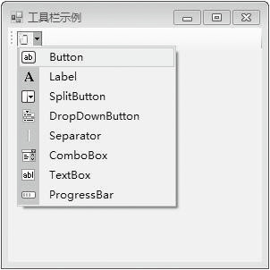

### 13.2.1　工具栏

工具栏控件ToolStrip以其直观、快捷的特点出现在各种应用程序中，例如，Visual Studio.NET系统集成界面中就提供了工具栏，这样不必在一级级的菜单中去搜寻需要的菜单项命令，给用户提供了访问菜单项命令的快捷方式，使用户操作更为方便。这些工具栏可以具有与 Microsoft Windows、Microsoft Office 或Microsoft Internet Explorer 类似的外观和行为。ToolStrip控件使用ToolStrip类封装，该类还用做MenuStrip类和StatusStrip类的基类，因此ToolStrip类实际上是一个用于创建工具栏、菜单结构和状态栏的容器类。不过，ToolStrip控件可直接用于工具栏。工具栏通常出现在窗体的顶部。

工具栏控件的常用属性如下表所示。

| 属性 | 说明 |
| :-----  | :-----  | :-----  | :-----  |
| BackgroundImage | 设置背景图片 |
| BackgroundImageLayout | 设置背景图片的显示对齐方式 |
| Items | 设置工具栏上所显示的子项 |
| TabIndex | 控件名相同时，用来产生一个数组标识号 |
| ShowItemToolTips | 设置是否显示工具栏子项上的提示文本 |
| Text | 设置文本显示内容 |
| TextDirection | 设置文本显示方向 |
| ContextMenuStrip | 设置工具栏所指向的弹出菜单 |
| AllowItemReorder | 是否允许改变子项在工具栏中的顺序 |

工具栏上的子项通常是一个不包含文本的图标，当然它可以既包含图标又包含文本。于是，Image和Text是工具栏要设置的最常见属性。Image可以用Image属性设置，也可以使用ImageList控件，把它设置为ToolStrip控件的ImageList属性，然后就可以设置各个工具栏子项的ImageIndex属性。此外，工具栏子项通常具有提示文本，以显示该按钮的用途信息。

在工具箱中选择ToolStrip控件放置到设计窗体后，默认状态下在最左侧会有一个下拉按钮，有两种方法添加设置工具栏子项。其一是直接单击下拉按钮，在下拉列表中选择需要的子项，然后对该子项进行属性设置；其二是选中工具栏，右击选择属性命令，单击Items后的按钮，弹出“项集合编辑器”对话框，在其中选择子项和设置属性。

工具栏控件ToolStrip可以包含如下类型的子项，如下图所示。

与之对应的子项控件类型为 ToolStripButton、ToolStripComboBox、ToolStripSplitButton、ToolStripLabel、ToolStripSeparator、ToolStripDropDownButton、ToolStripProgressBar 和 ToolStripTextBox等。

工具栏控件ToolStrip的子项常用的属性和事件如下表所示。

| 属性和事件 | 说明 |
| :-----  | :-----  | :-----  | :-----  |
| Name属性 | 子项名称 |
| Text属性 | 子项显示文本 |
| ToolTipText属性 | 将鼠标指针放在子项上时显示的提示文本。要使用这个属性，必须将工具栏的ShowItemToolTips属性设置为true |
| ImageIndex属性 | 子项使用的图标 |
| ItemClicked事件 | 单击工具栏上的一个子项时触发执行 |

