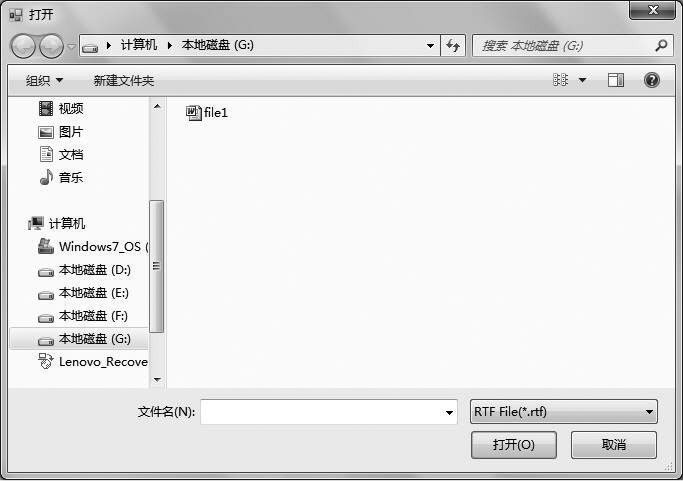
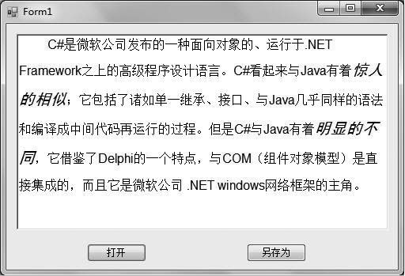
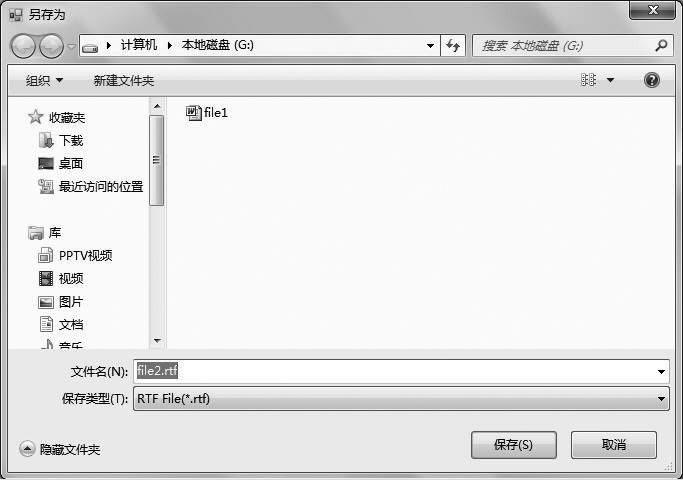
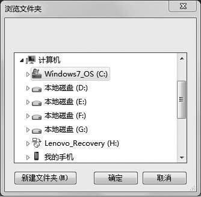
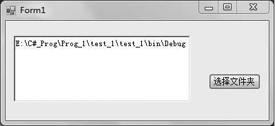
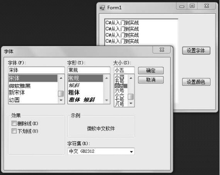
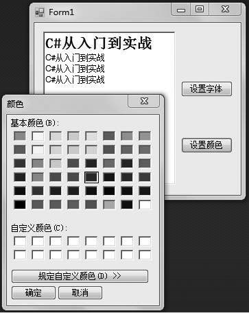
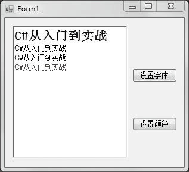

### 13.3.2　通用对话框

通用对话框控件提供了Windows系统的一些通用功能，如打开文件、保存文件、文件夹浏览、选择字体、选择颜色等，这些对话框提供执行相应任务的标准方法，使用它们将赋予应用程序公认的和熟悉的界面。通过设置每个通用对话框控件的相关属性，可以控制它们的内容。这里主要介绍OpenFileDialog、SaveFileDialog、FolderBrowserDialog、FontDialog和ColorDialog通用对话框控件，在C#的工具箱中可以找到这些对话框控件，与它们关联的封装类位于System.Windows.Forms命名空间。

通用对话框常常作为模式对话框使用，需要调用ShowDialog( )方法。

#### 1．打开文件对话框控件OpenFileDialog

打开文件对话框控件OpenFileDialog主要用来弹出Windows中标准的“打开文件”对话框，允许用户定位文件和选择文件，指定要打开文件所在的驱动器、文件夹（目录）及其文件名、文件扩展名等。使用此控件可检查某个文件是否存在并打开该文件。如果要使用户能够选择文件夹而不是文件，请改用 FolderBrowserDialog控件。

打开文件对话框控件OpenFileDialog的常用属性如下表所示。

| 属性 | 说明 |
| :-----  | :-----  | :-----  | :-----  |
| Title | 用来获取或设置对话框标题，默认值为空字符串（""）。如果标题为空字符串，则系统将使用默认标题：“打开” |
| Filter | 用来获取或设置当前文件类型筛选器字符串，该字符串决定对话框的“文件类型”框中出现的选择内容。对于每个筛选选项，筛选器字符串都包含筛选器说明、垂直线条（|）和筛选器模式。不同筛选选项的字符串由垂直线条隔开，例如， “文本文件(*.txt)|*.txt|所有文件(*.*)|*.*”。还可以通过分号来分隔各种文件类型，可以将多个筛选器模式添加到筛选器中，例如，“图像文件(*.BMP;*.JPG;*.GIF)|*.BMP;*.JPG; *.GIF|所有文件(*.*)|*.*” |
| FilterIndex | 用来获取或设置文件对话框中当前选定筛选器的索引。第一个筛选器的索引为1，默认值为1 |
| InitialDirectory | 用来获取或设置文件对话框显示的初始目录，默认值为空字符串（""） |
| FileName | 获取或设置对话框中选定的文件名的字符串。文件名既包含文件路径，也包含扩展名。如果未选定文件，该属性将返回空字符串（""） |
| Multiselect | 用来获取或设置一个值，该值指示对话框是否允许选择多个文件。如果对话框允许同时选定多个文件，则该属性值为true，反之，属性值为false。默认值为false |
| FileNames | 用来获取对话框中所有选定文件的文件名。每个文件名都既包含文件路径，又包含文件扩展名。如果未选定文件，该方法将返回空数组。只有Multiselect为true时，该属性才有效 |
| ShowReadOnly | 用来获取或设置一个值，该值确定是否在对话框中显示只读复选框。如果对话框包含只读复选框，则属性值为true，否则属性值为false。默认值为false |
| ReadOnlyChecked | 用来获取或设置一个值，该值指示是否选中只读复选框。如果选中了只读复选框，则属性值为true，反之，属性值为false。默认值为false |
| RestoreDirectory | 用来获取或设置一个值，该值指示对话框在关闭前是否还原当前目录。假设用户在搜索文件的过程中更改了目录，且该属性值为 true，那么，对话框会将当前目录还原为初始值，若该属性值为 false，则不还原成初始值。默认值为 false |

OpenFileDialog 控件最常用的方法有两个：OpenFile和 ShowDialog方法。OpenFile方法用于打开用户选定的具有只读权限的文件，该文件由FileName属性指定。ShowDialog方法的作用是显示OpenFileDialog等通用对话框，其一般调用形式如下。

```c
通用对话框对象名.ShowDialog( );
```

调用该方法之前，要设置好需要的所有属性。在应用程序运行时，如果单击OpenFileDialog对话框中的【确定】按钮，则返回值为 DialogResult.OK，否则返回值为DialogResult.Cancel。

将OpenFileDialog对话框添加到应用程序中有两种方式。

（1）设计方式：这是最常用的方式，即从工具箱拖放OpenFileDialog控件到应用程序窗体中。

（2）编程方式：用代码实现向应用程序中添加OpenFileDialog控件。先声明一个OpenFileDialog()类的新实例，并设置属性，然后调用ShowDialog()方法将对话框显示出来。代码如下。

```c
OpenFileDialog dlg1 = new OpenFileDialog( );
dlg1.ShowDialog( );
```

#### 2．保存文件对话框控件SaveFileDialog

SaveFileDialog 控件又称保存文件对话框，主要用来显示允许用户保存文件的对话框，提示用户选择文件的保存位置。SaveFileDialog 控件也具有Filter、FilterIndex、InitialDirectory、Filename、Multiselect、FileNames等属性，这些属性的作用与 OpenFileDialog对话框控件基本一致，此处不再赘述。

需注意的是，上述两个对话框只返回要打开或保存的文件名，并没有真正提供打开或保存文件的功能，程序员必须自己编写文件打开或保存程序，才能真正实现文件的打开和保存功能。

与OpenFileDialog相似，将SaveFileDialog对话框添加到应用程序中有两种方式。

（1）设计方式：这是最常用的方式，即从工具箱拖放SaveFileDialog控件到应用程序窗体中。

（2）编程方式：用代码实现向应用程序中添加SaveFileDialog控件。先声明一个SaveFileDialog()类的新实例，并设置属性，然后调用ShowDialog()方法将对话框显示出来。代码如下。

```c
SaveFileDialog dlg2 = new SaveFileDialog();
dlg2.ShowDialog();
```

**【范例13-2】 打开与保存文件对话框的应用。**

功能实现：设计一个窗体，用于打开用户指定类型的文件（RTF和TXT格式），并可以将其存放到另外的同类型文件中。实现时，创建一个Windows应用程序后，需要向默认窗体中添加1个OpenFileDialog控件、1个SaveFileDialog控件、1个RichTextBox控件和2个Button控件。添加的关键代码如下（代码13-2.txt），运行结果如下图所示。

```c
/**********************************************************/
01  private void Form1_Load(object sender, EventArgs e)
02  {
03          button1.Enabled = true;
04          button2.Enabled = false;
05  }
06  private void button1_Click(object sender, EventArgs e)
07  {
08          openFileDialog1.FileName = "";
09          openFileDialog1.Filter = "RTF File(*.rtf)|*.RTF|TXT FILE(*.txt)|*.txt";
10          openFileDialog1.ShowDialog( );
11          if (openFileDialog1.FileName != "")
12                  switch (openFileDialog1.FilterIndex)
13                  {
14                          case 1:  //选择的是.rtf类型
15                          richTextBox1.LoadFile(openFileDialog1.FileName,
                             RichTextBoxStreamType.RichText);
16                          break;
17                  case 2:  //选择的是.txt类型
18                          richTextBox1.LoadFile(openFileDialog1.FileName,
                             RichTextBoxStreamType.PlainText);
19                          break;
20                  }
21          button2.Enabled = true;
22  }
23  private void button2_Click(object sender, EventArgs e)
24  {
25          saveFileDialog1.Filter = "RTF File(*.rtf)|*.RTF|TXT FILE(*.txt)|*.txt";
26          if (saveFileDialog1.ShowDialog() == DialogResult.OK)
27          switch (openFileDialog1.FilterIndex)
28          {
29                  case 1:  //选择的是.rtf类型
30                          richTextBox1.SaveFile(saveFileDialog1.FileName,
                             RichTextBoxStreamType.RichText);
31                          break;
32                  case 2:  //选择的是.txt类型
33                          richTextBox1.SaveFile(saveFileDialog1.FileName,
                             RichTextBoxStreamType.PlainText);
34                          break;
35          }
36  }
/*----------------------------------------------------------------------------------------------*/
```




#### 3．浏览文件夹对话框控件FolderBrowserDialog

FolderBrowserDialog控件显示用来浏览、创建以及最终选择文件夹的对话框，提示用户选择文件夹。如果只允许用户选择文件夹而非文件，则可使用此控件。文件夹的浏览通过树控件完成。只能选择文件系统中的文件夹，不能选择虚拟文件夹。

浏览文件夹对话框控件FolderBrowserDialog的常用属性如下表所示。

| 属性 | 说明 |
| :-----  | :-----  | :-----  | :-----  |
| RootFolder | 获取或设置从其开始的根文件夹 |
| SelectedPath | 获取或设置用户选定的路径 |
| ShowNewFolderButton | 指示“新建文件夹”按钮是否出现在该对话框中 |
| Description | 此属性为用户提供附加说明 |

通常在创建新 FolderBrowserDialog 后，将RootFolder 设置为开始浏览的位置。或者，可将SelectedPath 设置为最初选定的 RootFolder 子文件夹的绝对路径。也可以选择设置Description 属性为用户提供附加说明。最后，调用 ShowDialog 方法将对话框显示给用户。如果该对话框关闭并且 ShowDialog 显示的对话框为 DialogResult.OK，SelectedPath 则是一个包含选定文件夹路径的字符串。如果用户可通过“新建文件夹”按钮创建新文件夹，则可对控件使用ShowNewFolderButton 属性。

FolderBrowserDialog 对话框是模式对话框，因此，在显示时，它会阻止应用程序其余部分的运行，直到用户选定了文件夹。

**【范例13-3】 浏览文件夹对话框的应用。**

功能实现：创建1个Windows应用程序，在默认窗体中添加1个FolderBrowserDialog控件、1个Button控件和1个RichTextBox控件，其中， FolderBrowserDialog控件用来显示“浏览文件夹”对话框，Button控件用来选择文件夹， RichTextBox控件用来显示选择的文件夹路径。添加的关键代码如下（代码13-3.txt）。

```c
/**********************************************************/
01  private void button1_Click(object sender, EventArgs e)
02  {
03          //设置浏览对话框的初始路径为桌面
04          folderBrowserDialog1.RootFolder = Environment.SpecialFolder.Desktop;  
05          if (folderBrowserDialog1.ShowDialog() == DialogResult.OK) //判断是否选择了文件
06          {
07                  //将选择的文件显示在文本框中
08                  richTextBox1.Text += folderBrowserDialog1.SelectedPath; 
09          }
10  }
/*----------------------------------------------------------------------------------------------*/
```

运行结果如下图所示。



#### 4．字体对话框控件FontDialog

FontDialog控件又称字体对话框，用来弹出Windows中标准的“字体”对话框。字体对话框的作用是显示当前安装在系统中的字体列表，提示用户从字体列表中选择一种字体。用户通过“字体”对话框可改变文字的字体、样式、字号等。与其他通用对话框一样，在创建 FontDialog控件的实例后，必须调用ShowDialog方法才能显示此通用对话框。

字体对话框控件FontDialog的常用属性如下表所示。

| 属性 | 说明 |
| :-----  | :-----  | :-----  | :-----  |
| Font | 该属性是字体对话框的最重要属性，通过它可以设定或获取字体信息 |
| Color | 用来设定或获取字符的颜色 |
| MaxSize | 用来获取或设置用户可选择的最大磅值 |
| MinSize | 用来获取或设置用户可选择的最小磅值 |
| ShowColor | 用来获取或设置一个值，该值指示对话框是否显示颜色选择框。如果对话框显示颜色选择框，属性值为true，反之，属性值为false。默认值为false |
| ShowEffects | 用来获取或设置一个值，该值指示对话框是否包含允许用户指定删除线、下画线和文本颜色选项的控件。如果对话框包含设置删除线、下画线和文本颜色选项的控件，属性值为 true，反之，属性值为false。默认值为true |

#### 5．颜色对话框控件ColorDialog

ColorDialog 控件又称颜色对话框，用来弹出 Windows 中标准的“颜色”对话框。颜色对话框的作用是显示允许用户设置界面对象颜色的颜色选择器（或调色板），供用户选择一种颜色或创建自定义颜色，以设置某个界面对象的颜色，并用 Color 属性记录用户选择的颜色值。与其它通用对话框一样，在创建 ColorDialog控件的实例后，必须调用ShowDialog方法才能显示此通用对话框。

颜色对话框控件ColorDialog的常用属性如下表所示。

| 属性 | 说明 |
| :-----  | :-----  | :-----  | :-----  |
| AllowFullOpen | 用来获取或设置一个值，该值指示用户是否可以使用该对话框定义自定义颜色。设置为false时，只显示左半部分的“颜色”对话框，禁用“自定义颜色”按钮。这个属性的默认值是true，允许用户自定义颜色 |
| FullOpen | 用来获取或设置一个值，该值指示用于创建自定义颜色的控件在对话框打开时是否可见。值为true时可见，值为 false时不可见 |
| AnyColor | 把这个属性设置为true，将在基本颜色列表中显示所有可用的颜色，否则不显示所有颜色 |
| Color | 用来获取或设置用户选定的颜色 |
| CustomColors | 使用该属性可以预置一个定制颜色数组，并可以读取用户定义的定制颜色 |
| SolidColorOnly | 把SolidColorOnly属性设置为true，用户就只能选择单色 |

**【范例13-4】 字体与颜色对话框的应用。**

功能实现：创建1个Windows应用程序，在默认窗体中添加1个RichTextBox 控件、1个FontDialog控件、1个ColorDialog控件和2个Button控件。其中， RichTextBox控件用来输入并选择文本， FontDialog控件用来显示“字体”对话框，ColorDialog控件用来显示“颜色”对话框，button1控件用来打开“字体”对话框并对字体进行设置，button2控件用来打开“颜色”对话框并对所选文本设置颜色。添加的关键代码如下（代码13-4.txt）。

```c
/**********************************************************/
01  private void button1_Click(object sender, EventArgs e)
02  {
03          fontDialog1.AllowVectorFonts = true;     //设置用户可以选择矢量字体
04          fontDialog1.AllowVerticalFonts = true;   //设置字体对话框显示水平字体和垂直字体
05          fontDialog1.FixedPitchOnly = false;      //设置用户可以选择不固定间距的字体
06          fontDialog1.MaxSize = 72;                //设置可选择的最大字
07          fontDialog1.MinSize = 5;                 //设置可选择的最小字
08          if (fontDialog1.ShowDialog() == DialogResult.OK)  //判断是否选择了字体
09          {
10                  if (richTextBox1.SelectedText == "")   //判断是否选择了文本
11                  richTextBox1.SelectAll();       //全选文本
12                  richTextBox1.SelectionFont = fontDialog1.Font;  //设置选中的文本字体
13          }
14  }
15  private void button2_Click(object sender, EventArgs e)
16{
17          colorDialog1.AllowFullOpen = true;      //设置允许用户自定义颜色
18          colorDialog1.AnyColor = true;           //设置颜色对话框中显示所有颜色
19          colorDialog1.SolidColorOnly = false;    //设置用户可以在颜色对话框中选择复杂颜色
20          if (colorDialog1.ShowDialog() == DialogResult.OK) //判断是否选择了颜色
21          {
22                  if (richTextBox1.SelectedText == "")     //判断是否选择了文本
23                  richTextBox1.SelectAll();                //全选文本
24                  //将选定的文本颜色设置为颜色对话框中选择的颜色
25                  richTextBox1.SelectionColor = colorDialog1.Color; 
26          }
27  }
/*----------------------------------------------------------------------------------------------*/
```

运行结果如下图所示。




