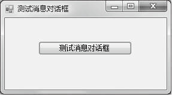
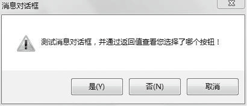
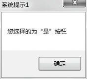
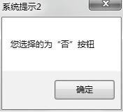
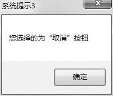

### 13.3.3　消息对话框

消息对话框MessageBox经常用于向用户显示通知信息，如在操作过程中遇到错误或程序异常，经常会使用这种方式给用户以提示，它是特殊类型的对话框。在C#中，MessageBox消息对话框位于System.Windows.Forms命名空间中，一般情况下，一个消息对话框包含消息对话框的标题文字、信息提示文字内容、信息图标及用户响应的按钮等内容。C#中允许开发人员根据自己的需要设置相应的内容，创建符合自己要求的信息对话框。

MessageBox消息对话框只提供了一个方法Show( )，用来把消息对话框显示出来。此方法提供了不同的重载版本，用来根据自己的需要设置不同风格的消息对话框。

#### 1．消息框按钮

在Show方法的参数中使用MessageBoxButtons来设置消息对话框要显示的按钮的个数及内容，此参数是一个枚举值，其成员如下表所示。

| 枚举值 | 说明 |
| :-----  | :-----  | :-----  | :-----  |
| AbortRetryIgnore | 在消息框中提供“中止”、“重试”和“忽略”三个按钮 |
| OK | 在消息框中提供“确定”按钮 |
| OKCancel | 在消息框中提供“确定”和“取消”两个按钮 |
| RetryCancel | 在消息框中提供“重试”和“取消”两个按钮 |
| YesNo | 在消息框中提供“是”和“否”两个按钮 |
| YesNoCancel | 在消息框中提供“是”、“否”和“取消”三个按钮 |

可以看出，一个消息框中最多可显示3个按钮。

#### 2．消息对话框的返回值

单击消息对话框中的按钮时，Show方法将返回一个DialogResult枚举值，指明用户在此消息对话框中所做的操作（点击了什么按钮），其可能的枚举值如下表所示。开发人员可以根据这些返回值判断接下来要做的事情。

| 枚举值 | 说明 |
| :-----  | :-----  | :-----  | :-----  |
| Abort | 消息框的返回值是“中止”(Abort),即单击了“中止”按钮 |
| Cancel | 消息框的返回值是“取消”(Cancel),即单击了“取消”按钮 |
| Ignore | 消息框的返回值是“忽略”(Ignore),即单击了“忽略”按钮 |
| No | 消息框的返回值是“否”(No),即单击了“否”按钮 |
| Ok | 消息框的返回值是“确定”(Ok),即单击了“确定”按钮 |
| Retry | 消息框的返回值是“重试”(Retry),即单击了“重试”按钮 |
| None | 消息框没有任何返回值，即没有单击任何按钮 |
| Yes | 消息框的返回值是“是”(Yes),即单击了“是”按钮 |

#### 3．消息框图标

在Show方法中还可使用MessageBoxIcon枚举类型作为参数定义显示在消息框中的图标，尽管可供选择的图标只有4个，但是在该枚举中共有9个成员，其可能的取值和形式如下表所示。

| 枚举值 | 图标形式 | 说明 |
| :-----  | :-----  | :-----  | :-----  | :-----  |
| Asterisk |  | 圆圈中有一个字母“i”组成的提示符号图标 |
| Error |  | 红色圆圈中有白色“×”所组成的错误警告图标 |
| Exclamation |  | 黄色三角中有一个“!”所组成的符号图标 |
| Hand |  | 红色圆圈中有一个白色“×”所组成的图标符号 |
| Information |  | 信息提示符号 |
| Question |  | 由圆圈中一个问号组成的符号图标 |
| Stop |  | 由背景为红色圆圈中有白色“×”组成的符号 |
| Warning |  | 由背景为黄色的三角形中有个“!”组成的符号图标 |
| None |  | 没有任何图标 |

下面是一个运用消息对话框的例子。

新建一个Windows窗体应用程序，并从工具箱中拖曳一个Button按钮到窗口里，把按钮和窗口的Text属性修改为“测试消息对话框”，双击该按钮，添加如下代码。

```c
01  DialogResult dr;
02  dr=MessageBox.Show("测试消息对话框，并通过返回值查看您选择了哪个按钮！", "消息对话框",
    MessageBoxButtons.YesNoCancel, MessageBoxIcon.Warning);
03  if (dr==DialogResult.Yes)
04          MessageBox.Show("您选择的为“是”按钮","系统提示1");
05  else if (dr==DialogResult.No)
06          MessageBox.Show("您选择的为“否”按钮","系统提示2");
07  else if (dr == DialogResult.Cancel)
08          MessageBox.Show("您选择的为“取消”按钮","系统提示3");
```

程序运行后，将出现如下图所示的执行界面。


单击“测试消息对话框”按钮，将出现如下图所示的消息对话框。


分别单击消息对话框中的三个按钮，将出现3个消息框，指明用户分别单击了消息对话框中的哪个按钮。




