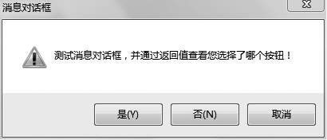

### 13.4　高手点拨


**本节视频教学录像：2分钟**

#### 1．菜单

在Windows开发中，较为单一的菜单样式，会在追求视觉效果时困扰很多开发者，那么大家一般会采用贴图或者自定义组件来实现自己想要的效果。在C#中微软提供了解决方法，Render来对菜单和工具栏进行美化，主要通过调整各部分颜色来达到美化窗体的效果。

```c
01  Color _fontcolor                    // 菜单字体颜色  
02  Color _marginstartcolor             // 下拉菜单坐标图标区域开始颜色  
03  Color _marginendcolor               // 下拉菜单坐标图标区域结束颜色  
04  Color _dropdownitembackcolor        // 下拉项背景颜色  
05  Color _dropdownitemstartcolor       // 下拉项选中时开始颜色  
06  Color _dorpdownitemendcolor         // 下拉项选中时结束颜色  
07  Color _menuitemstartcolor           // 主菜单项选中时的开始颜色  
08  Color _menuitemendcolor             // 主菜单项选中时的结束颜色  
09  Color _separatorcolor               // 分隔线颜色  
10  Color _mainmenustartcolor           // 主菜单背景开始颜色  
11  Color _mainmenuendcolor             // 主菜单背景结束颜色  
12  Color _dropdownborder               // 下拉区域边框颜色
```

#### 2．对话框

对话框是Windows编程中的一种比较有特点的人机交互方式，一般会包括按钮和各种选项或者提示信息等。根据用户不同的选择，给出相应的结果。

例如，做一个简单的“测试消息对话框”。

```c
01  DialogResult dr;
02  dr=MessageBox.Show("测试消息对话框，并通过返回值查看您选择了哪个按钮！", "消息对话框",
    MessageBoxButtons.YesNoCancel, MessageBoxIcon.Warning);
03  if (dr==DialogResult.Yes)
04          MessageBox.Show("您选择的为“是”按钮","系统提示1");
05  else if (dr==DialogResult.No)
06          MessageBox.Show("您选择的为“否”按钮","系统提示2");
07  else if (dr == DialogResult.Cancel)
08          MessageBox.Show(您选择的为“取消”按钮","系统提示3");
```

程序运行后，将出现如下图所示的执行界面。


