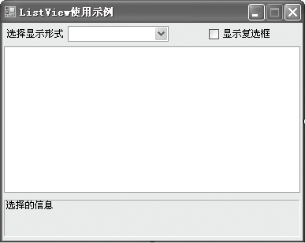
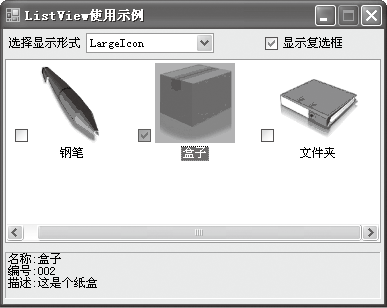
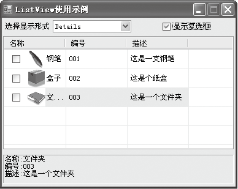

### 14.1　列表视图


**本节视频教学录像：8分钟**

列表视图控件用ListView类封装，与TreeView控件类似，都是用来显示信息，只是TreeView控件以树形式显示信息，而ListView控件以列表形式显示信息，能够用来制作像Windows中“控制面板”或Windows 资源管理器右窗格那样的用户界面。

ListView控件用于显示带图标的项列表，用户可以使用该控件创建类似Windows资源管理器的用户界面。该控件具有4种视图模式：LargeIcon、SmallIcon、List和Details。

下表列出了ListView类的常用成员及其说明。

| 成员名称 | 类别 | 说明 |
| :-----  | :-----  | :-----  | :-----  | :-----  |
| Columns | 属性 | “详细信息”视图中显示的列 |
| FullRowSelect | 属性 | 指示当项被选中时，其所有子项是否同该项一起突出显示 |
| View | 属性 | 选择可以显示项的五种不同视图中的一种 |
| SelectedIndexChanged | 事件 | 每当此ListView的“SelectedIndex”属性更改时发生 |
| Add() | 方法 | 用指定的键、文本和图像创建一个项，并将该项添加到集合中 |
| AddRange() | 方法 | 向集合中添加项的集合 |
| Clear() | 方法 | 从集合中移除所有项 |
| Insert() | 方法 | 创建一个具有指定的键、文本和图像的新项，并将该项插入到集合中指定索引处 |
| Remove() | 方法 | 从集合中移除指定的项 |
| RemoveAt() | 方法 | 移除集合中指定索引处的项 |

其中View属性用于获取或设置项在控件中的显示方式，默认值为LargeIcon。

FullRowSelect属性用于指定只选择某一项，还是选择某一项所在的整行，取值为True表示单击某项会选择该项及所有子项，取值为False表示仅选择该项本身。

下面的代码演示了如何使用FullRowSelect属性。

```c
01  this.lvStudent.View = View.Details;
02  this.lvStudent.FullRowSelect = true;
```

> 
> **技巧**
> 使用FullRowSelect属性时，需要将View属性设置为Details，否则FullRowSelect属性无效。

**【范例14-1】 ListView使用示例。**

（1）新建一个C# Windows窗体应用程序，项目名称为“ListViewDemo”。

（2）在窗体上添加如下图所示的ComboBox、CheckBox和ListView等控件。


（3）切换到代码窗口，输入以下代码（代码14-1.txt）。

```c
01  public Form1()                            //Form1窗体的构造函数
02  {
03          InitializeComponent();            //自动生成的代码完成控件初始化
04          InitListView(this.listView1);     //添加调用InitListView方法语句
05          InitOtherControl();               //添加调用InitOtherControl方法语句
06  }
07  private void InitOtherControl()           //自定义InitOtherControl方法
08  {
09          cboStyle.DropDownStyle = ComboBoxStyle.DropDownList;
10          cboStyle.Items.Add("LargeIcon");  //添加ComboBox控件的项
11          cboStyle.Items.Add("SmallIcon");  //添加ComboBox控件的项
12          cboStyle.Items.Add("List");       //添加ComboBox控件的项
13          cboStyle.Items.Add("Tile");       //添加ComboBox控件的项
14          cboStyle.Items.Add("Details");    //添加ComboBox控件的项
15          cboStyle.SelectedIndexChanged += new EventHandler(cboStyle_Selected IndexChanged);
                //添加cboStyle.SelectedIndexChanged事件
16          this.chkShowCheckBox.CheckedChanged += new EventHandler(ShowCheckBox _Checked Changed);                //添加chkShowCheckBox.CheckedChanged事件
17  }
18  //定义CheckedChanged事件代码
19  private void ShowCheckBox_CheckedChanged(object sender, EventArgs e)
20  {
21          this.listView1.CheckBoxes = this.chkShowCheckBox.Checked;
22  }
23  
24  void cboStyle_SelectedIndexChanged(object sender, EventArgs e)
25  {
26          switch (cboStyle.Text)          //根据ComboBox选项执行不同的分支
27                  {
28                  case "LargeIcon":
29                          this.listView1.View = View.LargeIcon;
30                          break;
31                  case "SmallIcon":
32                          this.listView1.View = View.SmallIcon;
33                          break;
34                  case "List":
35                          this.listView1.View = View.List;
36                          break;
37                  case "Tile":
38                          this.listView1.View = View.Tile;
39                          break;
40                  default :
41                          this.listView1.View = View.Details;
42                          break;
43                  }
44  }
45  private void InitListView(ListView listView)        //编写自定义方法初始化ListView
46  {
47          //添加列头
48          ColumnHeader Header1 = new ColumnHeader();  //定义列头1
49          Header1.Width = 100;
50          Header1.Text = "名称";
51          ColumnHeader Header2 = new ColumnHeader();  //定义列头2
52          Header2.Width = 100;
53          Header2.Text = "编号";
54          ColumnHeader Header3 = new ColumnHeader();  //定义列头3
55          Header3.Width = 100;
56          Header3.Text = "描述";
57          listView.Columns.Add(Header1);        //添加列头1
58          listView.Columns.Add(Header2);        //添加列头2
59          listView.Columns.Add(Header3);        //添加列头3
60          //设置属性
61          listView.GridLines = true;            //显示网格线
62          listView.FullRowSelect = true;
63          listView.HideSelection = false;       //失去焦点时显示选择的项
64          listView.HoverSelection = true;       //当鼠标指针停留数秒时自动选择项
65          listView.MultiSelect = false;         //设置只能单选
66          ImageList LargeImageList = new ImageList();      //创建图像列表对象
67          LargeImageList.ImageSize = new Size(80, 80) ;    //指定图标的大小
68          LargeImageList.Images.Add(Image.FromFile("pen.jpg"));
69          LargeImageList.Images.Add(Image.FromFile("box.jpg"));
70          LargeImageList.Images.Add(Image.FromFile("file.jpg"));
71          listView.LargeImageList = LargeImageList;        //设置大图标的集合
72          ImageList SmallImageList = new ImageList();
73          SmallImageList.ImageSize = new Size(30, 30);     //指定图标的大小
74          SmallImageList.Images.Add(Image.FromFile("pen.jpg"));
75          SmallImageList.Images.Add(Image.FromFile("box.jpg"));
76          SmallImageList.Images.Add(Image.FromFile("file.jpg"));
77          listView.SmallImageList = SmallImageList;        //设置小图标
78          //添加项
79          ListViewItem lv1 = new ListViewItem("钢笔");
80          lv1.SubItems.Add("001");                         //添加第2列(编号)的内容
81          lv1.SubItems.Add("这是一支钢笔");
82          lv1.ImageIndex = 0;                              //指定图像的索引
83          ListViewItem lv2 = new ListViewItem("盒子");
84          lv2.SubItems.Add("002");
85          lv2.SubItems.Add("这是个纸盒");
86          lv2.ImageIndex = 1;
87          ListViewItem lv3 = new ListViewItem("文件夹");
88          lv3.SubItems.Add("003");
89          lv3.SubItems.Add("这是一个文件夹");
90          lv3.ImageIndex = 2;
91          listView.Items.Add(lv1);
92          listView.Items.Add(lv2);
93          listView.Items.Add(lv3);
94          listView.SelectedIndexChanged += new EventHandler(listView_Selected IndexChanged);
95  }
96  //定义了listView控件的SelectedIndexChanged事件
97  void listView_SelectedIndexChanged(object sender, EventArgs e)
98  {
99          if (this.listView1.SelectedItems.Count > 0)
100                {        //通过SubItems来访问其他列的属性
101                        string strMessage ="名称:"+this.listView1.SelectedItems[0].Text+"\n";
102                        strMessage += "编号:" + this.listView1.SelectedItems[0].SubItems[1].Text+"\n";
103                        strMessage += "描述:" + this.listView1.SelectedItems[0].SubItems[2].Text;
104                        this.lblMessage.Text = strMessage;
105                }
106  }
```

**【运行结果】**

单击工具栏中的【启用调试】按钮
，即可看到生成的窗体界面，在下拉列表中可以选择显示的形式；选中【显示复选框】复选框，在列表框中列表项的前面就会出现复选框；将鼠标指针移到列表框中任意一个列表项上，即可显示被选中状态，并在窗体的最下方显示该项的详细信息，如下图所示。



**【范例分析】**

在这个程序中， 第3～5行分别调用了3个过程，初始化程序界面；第18～22行实现了当选中【显示复选框】复选框时，则在ListView中每项的前面显示一个复选框；第24～44行定义了列表的显示形式，有5种情况可供选择；第45～95行定义了一个初始化列表的过程，当显示形式为Details时将显示网格线，如上图所示；第97行到程序结束定义了ListView控件的SelectedIndexChanged事件，即当用户选择列表框中的任意项时，窗体下方的Lable标签上显示相对应的信息。本程序的重点和难点在于如何向列表框中添加项。本范例是用编程的方式实现向列表框中添加项的，也可以通过设置属性窗口的方式添加。

